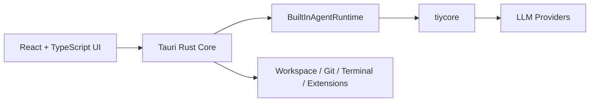

<div align="center">
  
  <h1>TiyCode</h1>
  <p><strong>An open-source, flexible, convenient cross-platform vibe-coding agent.</strong></p>
  <p>TiyCode is a desktop AI workbench built with Tauri, React, TypeScript, and Rust. It combines threaded agent runs, workspace-aware tools, terminal and Git integration, settings management, and an extensible runtime in one local-first desktop app.</p>
  <p>
    <a href="./README_zh.md">简体中文</a>
  </p>
</div>

## Why TiyCode

TiyCode is designed for people who want an AI coding workspace instead of a single chat box. The project focuses on a local desktop experience where agent conversations, tool execution, terminal workflows, Git operations, and extension capabilities live in the same interface.

Today, the repository is best consumed as a **source-first desktop application**. You run it locally from source, inspect the architecture, and build on top of the existing workbench, runtime, and extension host.

## Highlights

- **Desktop-first AI workbench.** The app is built on Tauri 2 with a React + TypeScript frontend and a Rust core, giving the UI direct access to native capabilities such as terminal sessions, repository inspection, and workspace-scoped tools.
- **Built-in agent runtime.** The main execution path is `Frontend -> Rust Core -> BuiltInAgentRuntime -> tiycore -> LLM`, which means agent runs no longer depend on a separate sidecar process.
- **Structured clarification during runs.** The runtime supports a `clarify` step so an agent can pause, ask for missing information, and offer recommended choices before continuing a task.
- **Integrated Git and terminal workflows.** The workbench includes real repository status, diff, and history views, plus terminal tooling for execution-heavy tasks. Git write operations can degrade gracefully when the local Git CLI is unavailable.
- **Unified extensions surface.** The app includes an `Extensions Center` that brings together Plugins, MCP, Skills, Marketplace, and Activity in one place.
- **AI-oriented thread UI.** The frontend already integrates AI Elements-based thread components such as plan, queue, reasoning, tool calls, confirmations, sources, suggestions, and prompt input.

## Tech Stack

- **Desktop shell:** Tauri 2
- **Frontend:** React 19, TypeScript, Vite
- **Backend / native core:** Rust
- **AI runtime:** `tiycore`
- **UI foundation:** Tailwind CSS v4, shadcn/ui, AI Elements-style thread components
- **Persistence:** SQLite

## Quick Start

> [!IMPORTANT]
> TiyCode currently targets a source-first workflow. There is no verified packaged installation path documented in this repository yet.

### Prerequisites

Before running the app, make sure your environment has the toolchain needed for a Tauri 2 project:

- Node.js and npm
- Rust toolchain
- Platform dependencies required by Tauri

### Run in development

```bash
npm install
npm run dev
```

### Run the web UI only

```bash
npm install
npm run dev:web
```

### Build

```bash
npm run build
```

### Type-check the frontend

```bash
npm run typecheck
```

### Run Rust tests

```bash
cargo test --manifest-path src-tauri/Cargo.toml
```

## Architecture at a Glance

TiyCode separates UI rendering, desktop orchestration, and agent execution into distinct layers:



At a high level:

1. The **React UI** handles workbench rendering, thread interactions, and streaming updates.
2. The **Rust core** is the source of truth for system access, policy decisions, persistence, and performance-sensitive local operations.
3. The **built-in runtime** manages agent sessions, helper orchestration, tool profiles, and event folding.
4. The **extension host** integrates plugin, MCP, and skill capabilities into the desktop product model.

## Repository Structure

```text
src/
  app/         app bootstrap, routing, providers, and global styles
  modules/     domain modules such as workbench, settings, marketplace, and extensions center
  features/    platform-facing capabilities such as terminal and system metadata
  shared/      reusable UI, helpers, config, and shared types
  services/    bridge and streaming integrations
src-tauri/
  src/commands/    Rust command modules
  src/extensions/  extension host, registries, and runtime integration
  migrations/      database migrations
  tests/           Rust integration tests
public/            static assets
```

## Development Commands

```bash
npm run dev        # Start the full Tauri desktop app
npm run dev:web    # Start the Vite frontend only
npm run build      # Build the desktop app
npm run build:web  # Type-check and bundle web assets
npm run typecheck  # Run TypeScript validation
cargo test --manifest-path src-tauri/Cargo.toml
cargo fmt --manifest-path src-tauri/Cargo.toml
```

## Extensions Model

TiyCode treats extensibility as a first-class part of the desktop workbench.

- **Plugins** provide locally installed extension packages with hooks, tools, commands, and skill packs.
- **MCP** is modeled as its own extension category and managed by the Rust host.
- **Skills** act as reusable agent capability assets and are indexed from builtin, workspace, or plugin sources.

These capabilities are surfaced through the `Extensions Center`, while runtime access is still governed by the host through tool gateways, policy checks, approvals, and audit boundaries.

## Current Project Status

The repository already contains a substantial desktop shell, workbench UI, settings center, built-in runtime path, Git drawer, and extension architecture. At the same time, it should still be read as an actively evolving project rather than a polished end-user release with a fully documented packaged distribution flow.

That means the best use cases today are:

1. Evaluating the architecture and product direction.
2. Running the desktop app locally from source.
3. Extending the workbench, runtime, or extension system as a contributor.

## License

This project is licensed under the GPL-3.0 License. See `LICENSE` for details.

## Acknowledgements

This project was inspired by the following projects and tools:

- [pi-mono](https://github.com/badlogic/pi-mono)
- [nanobot](https://github.com/HKUDS/nanobot)
- Codex
- ClaudeCode
