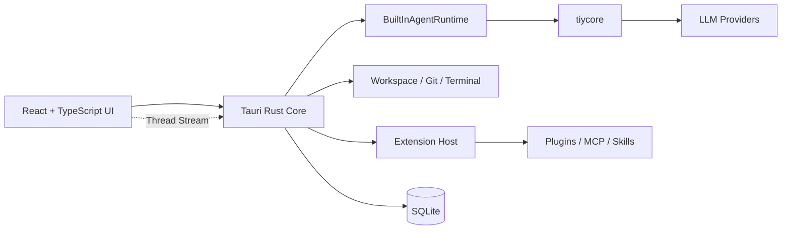

<div align="center">
  
  <h1>TiyCode</h1>
  <p><strong>An AI-first desktop coding agent.</strong></p>
  <p>Designed for a new coding collaboration paradigm. Humans express goals, constraints, and feedback through conversation, while agents take the lead in understanding, execution, and forward progress.</p>
  <p>
    <a href="./README_zh.md">简体中文</a>
  </p>
  <br />
  
</div>

## Why TiyCode

TiyCode <sub>/taɪ koʊd/</sub> is built for people who want coding to feel native to the AI era. Conversation is not a companion to the workflow here, but the starting point of it. You define goals, constraints, and feedback. The agent understands context, uses tools, and drives execution forward inside a real workspace.

Around that collaboration model, TiyCode brings together Agent Profiles, workspace-based threads, code review, version control, terminal workflows, and an extensible runtime in one local-first desktop product.

## Highlights

- **AI-first coding collaboration.** TiyCode is designed around the idea that humans express intent through conversation while agents take the lead in execution.
- **Agent Profiles.** Mix models from different providers, tune response style, language, and custom instructions, and switch profiles flexibly for different kinds of work.
- **Three-tier model architecture.** Each profile supports a Primary model for core reasoning, an Auxiliary model for helper tasks, and a Lightweight model for fast operations — with automatic fallback chains across tiers.
- **Multi-provider support.** Connect to 13+ LLM providers out of the box — OpenAI, Anthropic, Google, Ollama, xAI, Groq, OpenRouter, DeepSeek, MiniMax, Kimi, and more — or add any OpenAI-compatible endpoint as a custom provider.
- **Workspace-centered execution.** Threads stay grounded in the local workspace and connect naturally to code review, version control, repository inspection, and terminal workflows.
- **Real-time execution streaming.** A rich thread stream event system delivers live updates — message deltas, tool calls, reasoning steps, subagent progress, and plan updates — all rendered through purpose-built AI Elements components.
- **Operator-friendly experience.** Slash commands, smart conversation titles, context compression controls, and commit message generation help the product feel fast and practical in day-to-day use.
- **Bilingual interface.** Full i18n coverage with English and Simplified Chinese, switchable at any time.
- **Extensible by design.** Plugins, MCP servers, and Skills are treated as first-class building blocks through the `Extensions Center`.
- **Built-in runtime path.** The main execution flow is `Frontend -> Rust Core -> BuiltInAgentRuntime -> tiycore -> LLM`.

## Tech Stack

- **Desktop shell:** Tauri 2
- **Frontend:** React 19, TypeScript, Vite
- **Backend / native core:** Rust
- **AI runtime:** [`tiycore`](https://github.com/TiyAgents/tiycore)
- **UI foundation:** Tailwind CSS v4, shadcn/ui (Radix UI primitives), Vercel AI SDK (UI types), Lucide React icons, Motion animations
- **Terminal:** xterm.js with addon-fit
- **Code highlighting:** Shiki
- **Persistence:** SQLite

## Quick Start

### Install via Homebrew (macOS)

```bash
brew tap TiyAgents/tap
brew install --cask tiycode
```

To upgrade later:

```bash
brew upgrade tiycode
```

### Download from GitHub Releases

Pre-built binaries for macOS, Windows, and Linux are available on the [Releases](https://github.com/TiyAgents/tiycode/releases) page.

### Build from Source

#### Prerequisites

Before running the app, make sure your environment has the toolchain needed for a Tauri 2 project:

- Node.js and npm
- Rust toolchain
- Platform dependencies required by Tauri

#### Run in development

```bash
npm install
npm run dev
```

#### Run the web UI only

```bash
npm install
npm run dev:web
```

#### Build

```bash
npm run build
```

#### Type-check the frontend

```bash
npm run typecheck
```

#### Run Rust tests

```bash
cargo test --manifest-path src-tauri/Cargo.toml
```

## Architecture at a Glance

TiyCode separates UI rendering, desktop orchestration, and agent execution into distinct layers:



At a high level:

1. The **React UI** handles workbench rendering, thread interactions, and streaming updates. AI Elements components render messages, code blocks, reasoning, tool calls, and plans in a purpose-built thread surface.
2. The **Rust core** is the source of truth for system access, policy decisions, persistence, and performance-sensitive local operations. All settings, threads, and provider configurations are persisted in SQLite.
3. The **built-in runtime** manages agent sessions, helper orchestration, tool profiles, and event folding. The three-tier model plan (Primary / Auxiliary / Lightweight) is resolved from Agent Profiles at run time.
4. The **extension host** integrates plugin, MCP, and skill capabilities into the desktop product model, governed by tool gateways, policy checks, and approval boundaries.

## Repository Structure

```text
src/
  app/           app bootstrap, routing, providers (theme, language), and global styles
  modules/       domain modules: workbench shell, settings center, marketplace, extensions center
  features/      platform-facing capabilities: terminal (xterm.js), system metadata
  components/    AI Elements — message, code-block, reasoning, plan, tool, confirmation, etc.
  shared/        reusable UI primitives (shadcn/ui), helpers, types, and config
  services/
    bridge/      Tauri invoke commands (settings, agents, threads, git, terminal, extensions)
    thread-stream/  real-time event streaming between Rust core and React UI
  i18n/          internationalization — English and Simplified Chinese locale files
src-tauri/
  src/commands/    Rust command modules
  src/extensions/  extension host, registries, and runtime integration
  migrations/      database migrations
  tests/           Rust integration tests
public/            static assets
```

## Development Commands

```bash
npm run dev        # Start the full Tauri desktop app
npm run dev:web    # Start the Vite frontend only
npm run build      # Build the desktop app
npm run build:web  # Type-check and bundle web assets
npm run typecheck  # Run TypeScript validation
cargo test --manifest-path src-tauri/Cargo.toml
cargo fmt --manifest-path src-tauri/Cargo.toml
```

## Extensions Model

TiyCode treats extensibility as a first-class part of the desktop workbench.

- **Plugins** provide locally installed extension packages with hooks, tools, commands, and skill packs.
- **MCP** is modeled as its own extension category and managed by the Rust host.
- **Skills** act as reusable agent capability assets and are indexed from builtin, workspace, or plugin sources.

These capabilities are surfaced through the `Extensions Center`, while runtime access is still governed by the host through tool gateways, policy checks, approvals, and audit boundaries.

## Current Project Status

The repository already contains a substantial desktop shell, workbench UI, settings center, built-in runtime path, Git drawer, and extension architecture. At the same time, it should still be read as an actively evolving project rather than a polished end-user release with a fully documented packaged distribution flow.

That means the best use cases today are:

1. Evaluating the architecture and product direction.
2. Running the desktop app locally from source.
3. Extending the workbench, runtime, or extension system as a contributor.

## License

This project is licensed under the Apache License 2.0. See `LICENSE` for details.

## Acknowledgements

This project was inspired by the following projects and tools:

- [pi-mono](https://github.com/badlogic/pi-mono)
- [nanobot](https://github.com/HKUDS/nanobot)
- [lobe-icons](https://github.com/lobehub/lobe-icons)
- Codex
- ClaudeCode
