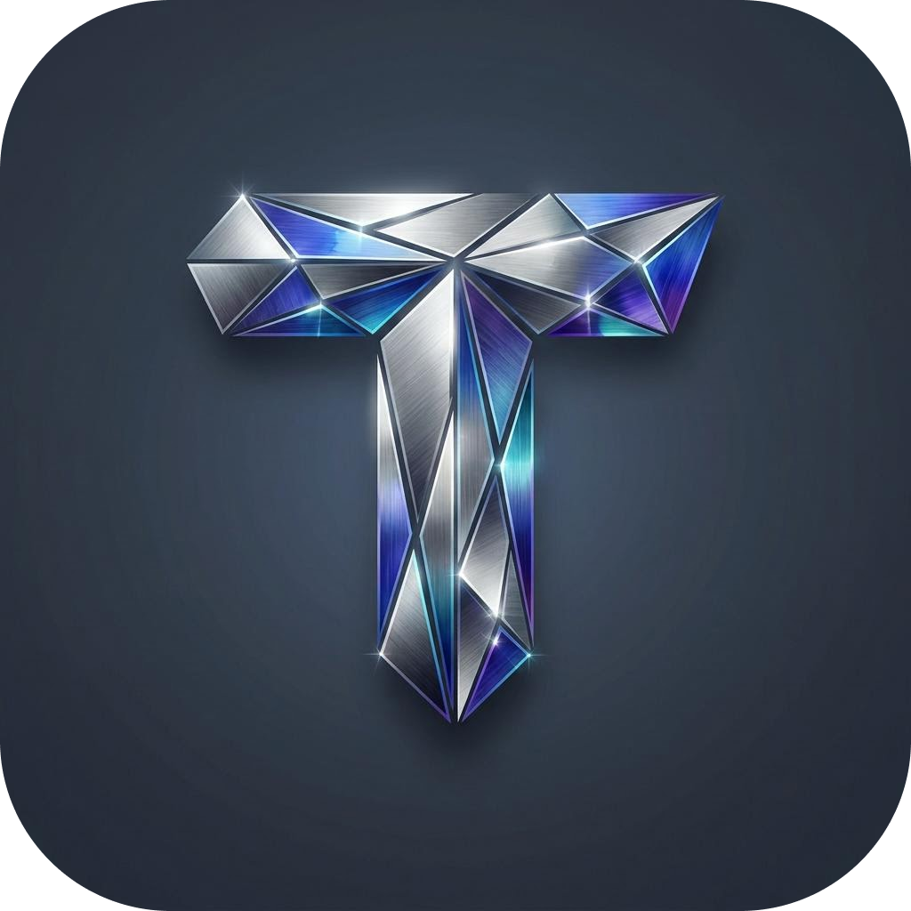
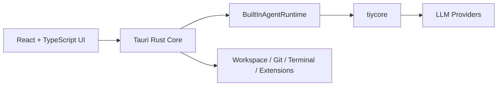

<div align="center">
  
  <h1>TiyCode（钛可）</h1>
  <p><strong>一款践行 AI First 理念的 desktop coding agent。</strong></p>
  <p>面向新一代编码协作范式而设计。人通过对话表达目标、约束与反馈，Agent 主导理解、执行与推进工作。</p>
  <p>
    <a href="./README.md">English</a>
  </p>
</div>

## 为什么是 TiyCode

TiyCode 面向的是希望以 AI 时代的方式进行编码协作的用户。在这里，对话不是工作流的补充，而是工作流的起点。你负责提出目标、约束与反馈，Agent 负责理解上下文、调用工具，并在真实工作区中持续推进执行。

围绕这种协作方式，TiyCode 将 Agent Profile、基于工作区的多会话 Thread、代码审阅、版本控制、Terminal 能力以及可扩展运行时组织为统一的本地优先桌面产品体验。

当前仓库最适合以**源码优先的桌面应用**来理解和使用。也就是说，现阶段的主要使用方式是从源码运行、阅读架构设计，并在现有工作台、运行时和扩展宿主的基础上继续开发。

## 核心亮点

- **AI First 的编码协作。** TiyCode 围绕“人用对话表达意图，Agent 主导执行”这一理念来设计产品形态。
- **Agent Profile。** 支持自由组合不同服务商的模型，并可配置回复风格、回复语言、自定义指令等设定，且能在不同 Profile 之间灵活切换。
- **以工作区为中心的执行体验。** 对话线程扎根本地工作区，并与代码审阅、版本控制、仓库状态读取和 Terminal 工作流自然衔接。
- **更友好的日常体验。** Slash Command、智能会话标题、上下文压缩与 Commit Message 生成等能力，让协作过程更顺手、更连贯。
- **一等公民式扩展能力。** Plugins、MCP 与 Skills 通过 `Extensions Center` 形成统一的扩展入口与产品模型。
- **内置 Runtime 主链路。** 主执行链路已经收敛为 `Frontend -> Rust Core -> BuiltInAgentRuntime -> tiycore -> LLM`，不再依赖单独的 sidecar 进程。

## 技术栈

- **桌面壳层：** Tauri 2
- **前端：** React 19、TypeScript、Vite
- **后端 / 原生核心：** Rust
- **AI Runtime：** `tiycore`
- **UI 基础：** Tailwind CSS v4、shadcn/ui、AI Elements 风格线程组件
- **持久化：** SQLite

## 快速开始

> [!IMPORTANT]
> 当前仓库明确适用于源码运行场景，仓库内尚未提供已验证的打包分发安装路径说明。

### 环境准备

在启动项目前，请先准备好一个可以运行 Tauri 2 工程的开发环境：

- Node.js 和 npm
- Rust toolchain
- Tauri 所需的平台依赖

### 开发模式启动

```bash
npm install
npm run dev
```

### 仅启动 Web 前端

```bash
npm install
npm run dev:web
```

### 构建桌面应用

```bash
npm run build
```

### 前端类型检查

```bash
npm run typecheck
```

### 运行 Rust 测试

```bash
cargo test --manifest-path src-tauri/Cargo.toml
```

## 架构速览

TiyCode 将界面渲染、桌面编排和 Agent 执行拆分为清晰的几层：



可以按下面的方式理解：

1. **React UI** 负责工作台渲染、线程交互和流式事件展示。
2. **Rust Core** 是系统访问、策略裁决、持久化以及本地高性能任务的真源。
3. **Built-in Runtime** 负责 agent session、helper 编排、tool profile 和事件折叠。
4. **Extension Host** 负责把 plugin、MCP 和 skill 能力接入桌面产品模型。

## 仓库结构

```text
src/
  app/         应用启动、路由、Provider 与全局样式
  modules/     工作台、设置、市场、扩展中心等领域模块
  features/    终端、系统元数据等平台侧能力模块
  shared/      可复用 UI、工具函数、配置与共享类型
  services/    bridge 与流式服务集成
src-tauri/
  src/commands/    Rust 命令模块
  src/extensions/  扩展宿主、注册表与运行时接缝
  migrations/      数据库迁移
  tests/           Rust 集成测试
public/            静态资源
```

## 开发命令

```bash
npm run dev        # 启动完整 Tauri 桌面应用
npm run dev:web    # 仅启动 Vite 前端
npm run build      # 构建桌面应用
npm run build:web  # 类型检查并打包 Web 资源
npm run typecheck  # 执行 TypeScript 校验
cargo test --manifest-path src-tauri/Cargo.toml
cargo fmt --manifest-path src-tauri/Cargo.toml
```

## 扩展模型

TiyCode 将可扩展性作为桌面工作台的一等能力来设计。

- **Plugins** 提供本地安装的扩展包，可携带 hooks、tools、commands 和 skill packs。
- **MCP** 在产品层被视为独立扩展类型，并由 Rust 侧宿主管理。
- **Skills** 作为可复用的 Agent 能力资产，可以来自 builtin、workspace 或 plugin。

这些能力会统一呈现在 `Extensions Center` 中，但运行时访问仍然会经过宿主侧的 tool gateway、policy check、approval 和 audit 边界治理。

## 当前项目状态

这个仓库已经具备较完整的桌面壳层、工作台 UI、设置中心、内置运行时主链路、Git Drawer 和扩展体系设计。但与此同时，它更适合被理解为一个持续演进中的开源项目，而不是一个已经完成终端用户打包分发说明的成熟发布版产品。

因此，当前最适合的使用方式是：

1. 评估项目的产品方向与技术架构。
2. 从源码本地运行桌面应用。
3. 作为贡献者继续扩展工作台、运行时或扩展系统。

## License

本项目采用 Apache License 2.0 开源协议。详细信息请见 `LICENSE`。

## 致敬

本项目的诞生受到了以下项目和产品的启发，在此一并致谢：

- [pi-mono](https://github.com/badlogic/pi-mono)
- [nanobot](https://github.com/HKUDS/nanobot)
- Codex
- ClaudeCode
