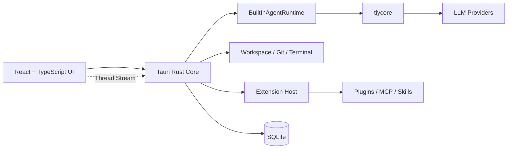

<div align="center">
  
  <h1>TiyCode（钛可）</h1>
  <p><strong>一款践行 AI First 理念的 desktop coding agent。</strong></p>
  <p>面向新一代编码协作范式而设计。人通过对话表达目标、约束与反馈，Agent 主导理解、执行与推进工作。</p>
  <p>
    <a href="./README.md">English</a>
  </p>
  <br />
  
</div>

## 为什么是 TiyCode

TiyCode 面向的是希望以 AI 时代的方式进行编码协作的用户。在这里，对话不是工作流的补充，而是工作流的起点。你负责提出目标、约束与反馈，Agent 负责理解上下文、调用工具，并在真实工作区中持续推进执行。

围绕这种协作方式，TiyCode 将 Agent Profile、基于工作区的多会话 Thread、代码审阅、版本控制、Terminal 能力以及可扩展运行时组织为统一的本地优先桌面产品体验。

## 核心亮点

- **AI First 的编码协作。** TiyCode 围绕"通过对话表达意图，Agent 全面执行"这一理念来设计产品形态。
- **Agent Profile。** 支持自由组合不同服务商的模型，并可配置回复风格、回复语言、自定义指令等设定，且能在不同 Profile 之间灵活切换。
- **三层模型架构。** 每个 Profile 支持配置 Primary 主力模型、Auxiliary 辅助模型和 Lightweight 轻量模型三个层级，层级之间具备自动回退链路。
- **多服务商接入。** 开箱支持 13+ 家 LLM 服务商 —— OpenAI、Anthropic、Google、Ollama、xAI、Groq、OpenRouter、DeepSeek、MiniMax、Kimi 等，也可将任何 OpenAI 兼容端点作为自定义 Provider 接入。
- **以工作区为中心的执行体验。** 对话线程扎根本地工作区，并与代码审阅、版本控制、仓库状态读取和 Terminal 工作流自然衔接。
- **实时执行流式推送。** 丰富的 Thread Stream 事件体系支撑实时更新 —— 消息增量、工具调用、推理步骤、子 Agent 进度与计划更新。
- **更友好的日常体验。** Slash Command、智能会话标题、上下文压缩与 Commit Message 生成等能力，让协作过程更顺手、更连贯。
- **双语界面。** 完整的 i18n 支持，覆盖英文和简体中文，随时可切换。
- **良好的通用扩展能力。** Plugins、MCP Servers 与 Skills 通过 `Extensions Center` 形成统一的扩展入口与产品模型。
- **内置 Runtime。** 主执行链路 `Frontend -> Rust Core -> BuiltInAgentRuntime -> tiycore -> LLM`。

## 技术栈

- **桌面壳层：** Tauri 2
- **前端：** React 19、TypeScript、Vite
- **后端 / 原生核心：** Rust
- **AI Runtime：** [`tiycore`](https://github.com/TiyAgents/tiycore)
- **UI 基础：** Tailwind CSS v4、shadcn/ui（Radix UI 基础组件）、Vercel AI SDK（UI 类型）、Lucide React 图标、Motion 动画
- **终端：** xterm.js + addon-fit
- **代码高亮：** Shiki
- **持久化：** SQLite

## 快速开始

### 通过 Homebrew 安装（macOS）

```bash
brew tap TiyAgents/tap
brew install --cask tiycode
```

后续升级：

```bash
brew upgrade tiycode
```

### 从 GitHub Releases 下载

macOS、Windows 和 Linux 的预编译安装包可在 [Releases](https://github.com/TiyAgents/tiycode/releases) 页面下载。

> **macOS 版本要求：** TiyCode 当前要求 **macOS 10.15 Catalina 及以上版本**。为了获得更好的兼容性，建议使用较新的受支持 macOS 版本。
>
> **Windows 版本要求：** TiyCode 当前要求 **Windows 10 1809（build 17763）及以上版本**。为了获得更好的兼容性，建议使用最新可用的 **Windows 10 或 Windows 11**。桌面应用还依赖 **Microsoft Edge WebView2 Runtime**。在 Windows 11 上它通常已预装；在受支持的 Windows 10 系统上，Tauri 安装器一般会自动完成安装或更新。如果处于离线环境，你可能需要先手动安装 WebView2，随后再启动应用。

### 从源码构建

#### 环境准备

在启动项目前，请先准备好一个可以运行 Tauri 2 工程的开发环境：

- Node.js 和 npm
- Rust toolchain
- Tauri 所需的平台依赖

#### 开发模式启动

```bash
npm install
npm run dev
```

#### 仅启动 Web 前端

```bash
npm install
npm run dev:web
```

#### 构建桌面应用

```bash
npm run build
```

#### 前端类型检查

```bash
npm run typecheck
```

#### 运行 Rust 测试

```bash
cargo test --manifest-path src-tauri/Cargo.toml
```

## Shell 环境配置

TiyCode 内置的 Agent Shell 可能以 **非交互、非登录** 模式启动。在该模式下，只有最基础的系统路径（如 `/usr/bin:/bin`）可用。通过版本管理器安装的工具（如 `node`、`npm`、`bun`、`cargo`、`go`）将无法被识别，需要正确配置 Shell 启动文件才能解决。

### Shell 配置文件加载规则

不同的 Shell 调用模式会加载不同的配置文件。下表列出了各模式下的加载情况：

**Zsh（macOS 默认 / Linux）**

| 文件 | 非交互 | 登录 | 交互 | 交互 + 登录 |
|------|:-:|:-:|:-:|:-:|
| `~/.zshenv` | ✅ | ✅ | ✅ | ✅ |
| `~/.zprofile` | ❌ | ✅ | ❌ | ✅ |
| `~/.zshrc` | ❌ | ❌ | ✅ | ✅ |

**Bash（Linux 默认）**

| 文件 | 非交互 | 登录 | 交互 | 交互 + 登录 |
|------|:-:|:-:|:-:|:-:|
| `~/.bashrc` | ❌ | ❌ | ✅ | ❌ ¹ |
| `~/.bash_profile` | ❌ | ✅ | ❌ | ✅ |
| `$BASH_ENV` | ✅ | ❌ | ❌ | ❌ |

<sub>¹ 大多数发行版会在 `~/.bash_profile` 中 source `~/.bashrc`，因此实际上登录 shell 也会执行它。</sub>

TiyCode 的 Agent Shell 属于 **非交互** 一列 —— 只有 `~/.zshenv`（zsh）或 `$BASH_ENV`（bash）能保证被加载。

### 解决方法：确保所有 Shell 模式都能加载环境变量

<details>
<summary><strong>macOS / Linux（Zsh）</strong></summary>

1. **将所有 `export` 语句和 PATH 修改** 从 `~/.zshrc` 移到 `~/.zprofile`。仅将交互式配置（alias、补全、oh-my-zsh、主题、提示符）留在 `~/.zshrc` 中。

2. **在 `~/.zshenv` 中 source `~/.zprofile`**，使非交互式 shell 也能获取环境变量：

```bash
# ~/.zshenv
if [ -z "$__ZPROFILE_LOADED" ] && [ -f "$HOME/.zprofile" ]; then
  export __ZPROFILE_LOADED=1
  source "$HOME/.zprofile"
fi
```

`__ZPROFILE_LOADED` 守卫变量可防止在「登录 + 交互」模式下重复加载。

常见需要移入 `~/.zprofile` 的内容：

```bash
# ~/.zprofile — 示例
eval "$(/opt/homebrew/bin/brew shellenv)"           # Homebrew（macOS）
export NVM_DIR="$HOME/.nvm"                         # nvm（Node.js）
[ -s "$NVM_DIR/nvm.sh" ] && \. "$NVM_DIR/nvm.sh"
export BUN_INSTALL="$HOME/.bun"                     # Bun
export PATH="$BUN_INSTALL/bin:$PATH"
. "$HOME/.local/bin/env"                            # Rust / Cargo
export PATH="/usr/local/go/bin:$PATH"               # Go
```

</details>

<details>
<summary><strong>Linux（Bash）</strong></summary>

1. 将环境变量保留在 `~/.bash_profile`（或 `~/.profile`）中。
2. 设置 `BASH_ENV` 指向一个会 source 你的 profile 的文件：

```bash
# ~/.bash_profile — 在顶部添加：
export BASH_ENV="$HOME/.bash_env"
```

```bash
# ~/.bash_env — 新文件
if [ -z "$__BASH_PROFILE_LOADED" ] && [ -f "$HOME/.bash_profile" ]; then
  export __BASH_PROFILE_LOADED=1
  source "$HOME/.bash_profile"
fi
```

</details>

<details>
<summary><strong>Windows（PowerShell）</strong></summary>

在 Windows 上，TiyCode 通常会继承通过 **系统设置 > 环境变量** 配置的系统和用户环境变量。如果你通过官方安装器安装了 Node.js、Rust 等工具，它们应该已经在 PATH 中。

如果你使用的是版本管理器（如 **nvm-windows**、**fnm** 或 **volta**），请确保 shim 目录已添加到系统环境变量中的 **用户 PATH**，而不是仅在 PowerShell profile 中设置。

验证当前 PATH：

```powershell
$env:PATH -split ';'
```

</details>

### 配置后验证

更新 Shell 配置文件后，**重启 TiyCode**（完全退出后重新启动，而非仅开启新会话），然后让 Agent 执行：

```
echo $PATH
which <你的工具>   # 例如 node、cargo、go、bun、python ...
```

如果输出中包含预期的路径且工具能被找到，说明环境配置已生效。

## 架构速览

TiyCode 将界面渲染、桌面编排和 Agent 执行拆分为清晰的几层：



可以按下面的方式理解：

1. **React UI** 负责工作台渲染、线程交互和流式事件展示。AI Elements 组件体系负责渲染消息、代码块、推理步骤、工具调用和计划等内容。
2. **Rust Core** 是系统访问、策略裁决、持久化以及本地高性能任务的真源。所有设置、线程和 Provider 配置均通过 SQLite 持久化。
3. **Built-in Runtime** 负责 agent session、helper 编排、tool profile 和事件折叠。三层模型计划（Primary / Auxiliary / Lightweight）在运行时从 Agent Profile 动态解析。
4. **Extension Host** 负责把 plugin、MCP 和 skill 能力接入桌面产品模型，通过 tool gateway、policy check、approval 和 audit 边界进行治理。

## 仓库结构

```text
src/
  app/           应用启动、路由、Provider（主题、语言）与全局样式
  modules/       领域模块：工作台壳层、设置中心、市场、扩展中心
  features/      平台侧能力：终端（xterm.js）、系统元数据
  components/    AI Elements —— 消息、代码块、推理、计划、工具调用、确认等组件
  shared/        可复用 UI 基础组件（shadcn/ui）、工具函数、类型与配置
  services/
    bridge/        Tauri invoke 命令（设置、Agent、线程、Git、终端、扩展）
    thread-stream/ Rust Core 与 React UI 之间的实时事件流
  i18n/          国际化 —— 英文和简体中文语言包
src-tauri/
  src/commands/    Rust 命令模块
  src/extensions/  扩展宿主、注册表与运行时接缝
  migrations/      数据库迁移
  tests/           Rust 集成测试
public/            静态资源
```

## 开发命令

```bash
npm run dev        # 启动完整 Tauri 桌面应用
npm run dev:web    # 仅启动 Vite 前端
npm run build      # 构建桌面应用
npm run build:web  # 类型检查并打包 Web 资源
npm run typecheck  # 执行 TypeScript 校验
cargo test --manifest-path src-tauri/Cargo.toml
cargo fmt --manifest-path src-tauri/Cargo.toml
```

## 扩展模型

TiyCode 将可扩展性作为桌面工作台的一等能力来设计。

- **Plugins** 提供本地安装的扩展包，可携带 hooks、tools、commands 和 skill packs。
- **MCP** 在产品层被视为独立扩展类型，并由 Rust 侧宿主管理。
- **Skills** 作为可复用的 Agent 能力资产，可以来自 builtin、workspace 或 plugin。

这些能力会统一呈现在 `Extensions Center` 中，但运行时访问仍然会经过宿主侧的 tool gateway、policy check、approval 和 audit 边界治理。

## 问题定位与调试

当遇到模型请求未发出、响应未到达或行为与预期不符等问题时，可以通过 `RUST_LOG` 环境变量控制 Rust / tiycore 侧的日志详细程度。

| `RUST_LOG` 取值 | 日志内容 |
|---|---|
| `RUST_LOG=tiycore=debug` | 模型请求元数据与响应内容摘要 —— 适合确认调用了哪个模型、发送了什么 prompt、是否收到了响应。 |
| `RUST_LOG=tiycore=trace` | 完整 SSE 流数据（含每个 chunk） —— 适合检查原始流式负载或定位流级别的问题。 |
| `RUST_LOG=debug` | **所有** crate 的 debug 级别日志（信息量较大，但覆盖全栈）。 |
| `RUST_LOG=info` | 默认级别 —— 仅输出 informational 级别消息。 |

### 设置方式

**从源码运行（开发模式）：**

```bash
# macOS / Linux
RUST_LOG=tiycore=debug npm run dev

# 或先 export 再启动
export RUST_LOG=tiycore=debug
npm run dev
```

**已安装应用（macOS）：**

```bash
RUST_LOG=tiycore=debug /Applications/TiyCode.app/Contents/MacOS/TiyCode
```

**Windows（PowerShell）：**

```powershell
$env:RUST_LOG="tiycore=debug"
npm run dev
```

日志输出到 stderr / 启动应用时的终端。对于已安装版本，也可以查看 TiyCode 数据目录中的日志文件。

### 常见场景

- **模型无响应：** 先用 `RUST_LOG=tiycore=debug` 确认请求是否发出，并在摘要中查看状态码和错误信息。
- **流式输出异常或截断：** 用 `RUST_LOG=tiycore=trace` 检查原始 SSE 事件，定位流在何处中断或偏离预期。
- **Rust Core 更深层问题：** 尝试 `RUST_LOG=debug` 捕获所有 crate 的日志，再逐步缩小关注范围。

## 当前项目状态

这个仓库已经具备较完整的桌面壳层、工作台 UI、设置中心、内置运行时主链路、Git Drawer 和扩展体系设计。但与此同时，它更适合被理解为一个持续演进中的开源项目，而不是一个已经完成终端用户打包分发说明的成熟发布版产品。

因此，当前最适合的使用方式是：

1. 评估项目的产品方向与技术架构。
2. 从源码本地运行桌面应用。
3. 作为贡献者继续扩展工作台、运行时或扩展系统。

## License

本项目采用 Apache License 2.0 开源协议。详细信息请见 `LICENSE`。

## 致敬

本项目的诞生受到了以下项目和产品的启发，在此一并致谢：

- [pi-mono](https://github.com/badlogic/pi-mono)
- [nanobot](https://github.com/HKUDS/nanobot)
- [lobe-icons](https://github.com/lobehub/lobe-icons)
- Codex
- ClaudeCode
