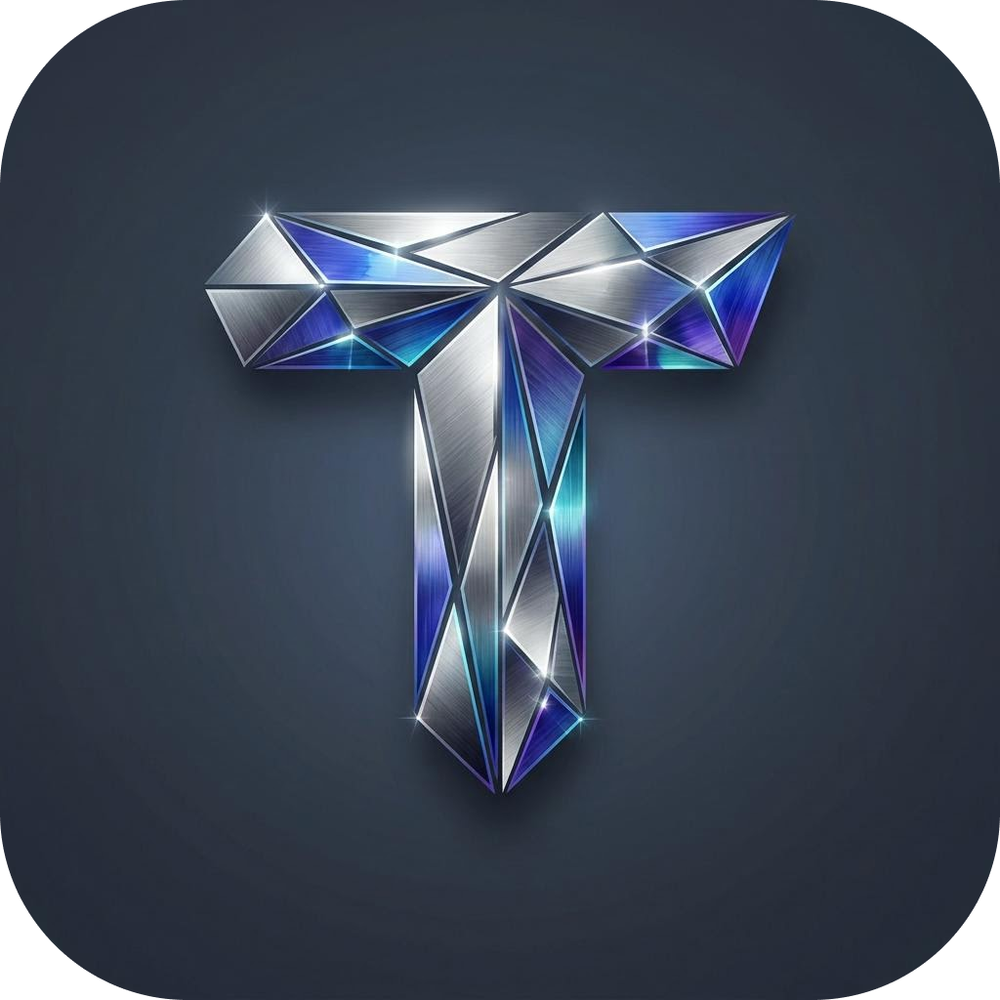
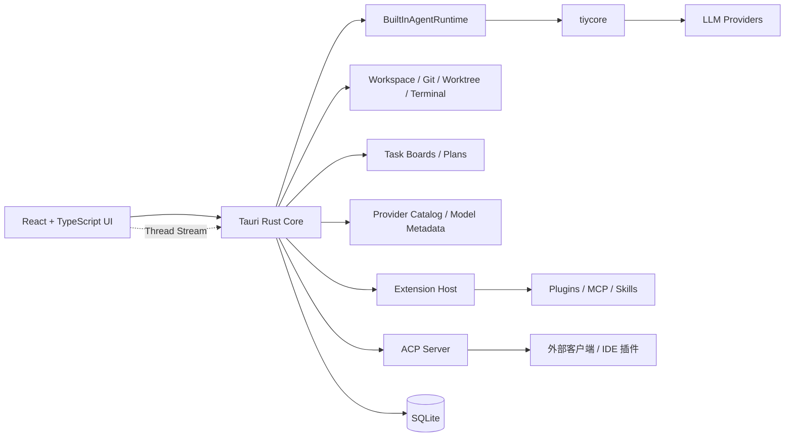

<div align="center">
  
  <h1>TiyCode（钛可）</h1>
  <p><strong>一款践行 AI First 理念的 desktop coding agent。</strong></p>
  <p>面向新一代编码协作范式而设计。人只需通过对话表达目标、约束与反馈，Agent 主导理解、执行与推进工作。</p>
  <p>
    <a href="./README.md">English</a>
  </p>
  <p>
    
    
    
    
    
    
  </p>
  <br />
  
</div>

## 为什么是 TiyCode

TiyCode 面向的是希望以 AI 时代的方式进行编码协作的用户。在这里，对话不是工作流的补充，而是工作流的起点。你负责提出目标、约束与反馈，Agent 负责理解上下文、调用工具，并在真实工作区中持续推进执行。

围绕这种协作方式，TiyCode 将 Agent Profile、基于工作区的多会话 Thread、代码审阅、版本控制、Terminal 能力以及可扩展运行时组织为统一的本地优先桌面产品体验。

## 核心亮点

- **AI First 的编码协作。** TiyCode 围绕"通过对话表达意图，Agent 全面执行"这一理念来设计产品形态。
- **Agent Profile。** 支持自由组合不同服务商的模型，并可配置回复风格、回复语言、自定义指令等设定，且能在不同 Profile 之间灵活切换。
- **持久化目标管理。** 为 Agent 设置跨轮次的长期目标，由独立的 Judge 验收 Agent 基于实际文件变更、命令输出和提交历史进行完成判定——杜绝"自说自话"的信任缺陷。
- **Custom Agents。** 在设置中心创建专用子 Agent——每个拥有独立的名称、系统提示、模型层级和可用工具——按 Profile 授权后即可从 composer 委派任务。
- **三层模型架构。** 每个 Profile 支持配置 Primary 主力模型、Auxiliary 辅助模型和 Lightweight 轻量模型三个层级，层级之间具备自动回退链路。
- **多服务商接入。** 开箱支持 13+ 家 LLM 服务商 —— OpenAI、Anthropic、Google、Ollama、xAI、Groq、OpenRouter、DeepSeek、MiniMax、Kimi 等，也可将任何 OpenAI 兼容端点作为自定义 Provider 接入。
- **以工作区为中心的执行体验。** 对话线程扎根本地工作区，并与代码审阅、版本控制、仓库状态读取、Git worktree 和 Terminal 工作流自然衔接。
- **面向任务的执行可观测性。** Thread 级任务板、Plan checkpoint、工具状态事件和子 Agent 进度让长任务更容易跟踪和复查。
- **实时执行流式推送。** 丰富的 Thread Stream 事件体系支撑实时更新 —— 消息增量、工具调用、requested / active 状态、推理步骤、子 Agent 进度与计划更新。
- **更丰富的输入能力。** Prompt 输入支持文本、文件 / 图片附件、截图、Slash Command 结构化参数插值（`--key=value`、位置参数、`{{placeholder}}` 模板变量）以及大段文本粘贴处理。
- **Steer 与 Queue。** Agent 运行中可选择「引导」即时插入消息调整方向，或「排队」将消息留待当前运行结束后再发起下一轮——无需中断工作流即可保持掌控。
- **良好的通用扩展能力。** Plugins、MCP Servers 与 Skills 通过 `Extensions Center` 形成统一的扩展入口与产品模型。
- **ACP Server 支持。** TiyCode 可作为无头 ACP（Agent Client Protocol）服务器运行，通过 `tiycode acp --stdio` 或 `tiycode acp --http <addr>` 启动，让外部工具和 IDE 插件通过标准 JSON-RPC 协议驱动 Agent 运行时，无需启动桌面 GUI。
- **IM 通道网关。** 将 TiyCode 接入微信或企业微信，扫码登录后即可在聊天应用中直接与 Agent 对话——发送消息和附件、接收流式回复，无需打开桌面 GUI。
- **更友好的日常体验。** 支持结构化参数解析的 Slash Command、智能会话标题、上下文压缩、Commit Message 生成、包含 Ghostty 在内的外部终端衔接以及紧凑工作台控件，让协作过程更顺手、更连贯。
- **线程级别耗时计时器。** 跟踪每个线程的活跃执行时间，排除暂停时间，并支持跨会话持久化跟踪。
- **内置 Runtime。** 主执行链路 `Frontend -> Rust Core -> BuiltInAgentRuntime -> tiycore -> LLM`。
- **双语界面。** 完整的 i18n 支持，覆盖英文和简体中文，随时可切换。

## 技术栈

- **桌面壳层：** Tauri 2
- **前端：** React 19、TypeScript、Vite
- **后端 / 原生核心：** Rust
- **AI Runtime：** [`tiycore`](https://github.com/tiylabs/tiycore)
- **UI 基础：** Tailwind CSS v4、shadcn/ui（Radix UI 基础组件）、Vercel AI SDK（UI 类型）、Lucide React 图标、Motion 动画
- **终端：** xterm.js + addon-fit
- **代码高亮：** Shiki
- **持久化：** SQLite
- **测试：** 前端单元测试使用 Vitest 与 `@vitest/coverage-v8`，Rust 侧使用 Cargo 集成测试
- **桌面集成：** 使用 Tauri updater、autostart、window-state、dialog、opener、process 等插件

## 快速开始

### 通过 Homebrew 安装（macOS）

```bash
brew tap tiylabs/tap
brew install --cask tiycode
```

后续升级：

```bash
brew upgrade tiycode
```

### 从 GitHub Releases 下载

macOS、Windows 和 Linux 的预编译安装包可在 [Releases](https://github.com/tiylabs/tiycode/releases) 页面下载。

> **macOS 版本要求：** TiyCode 当前要求 **macOS 10.15 Catalina 及以上版本**。为了获得更好的兼容性，建议使用较新的受支持 macOS 版本。
>
> **Windows 版本要求：** TiyCode 当前要求 **Windows 10 1809（build 17763）及以上版本**。为了获得更好的兼容性，建议使用最新可用的 **Windows 10 或 Windows 11**。桌面应用还依赖 **Microsoft Edge WebView2 Runtime**。在 Windows 11 上它通常已预装；在受支持的 Windows 10 系统上，Tauri 安装器一般会自动完成安装或更新。如果处于离线环境，你可能需要先手动安装 WebView2，随后再启动应用。

### 从源码构建

#### 环境准备

在启动项目前，请先准备好一个可以运行 Tauri 2 工程的开发环境：

- Node.js 和 npm
- Rust toolchain
- Tauri 所需的平台依赖

#### 开发模式启动

```bash
npm install
npm run dev
```

#### 仅启动 Web 前端

```bash
npm install
npm run dev:web
```

#### 构建桌面应用

```bash
npm run build
```

#### 前端类型检查

```bash
npm run typecheck
```

#### 运行 Rust 测试

```bash
cargo test --manifest-path src-tauri/Cargo.toml
```

## 架构速览

TiyCode 将界面渲染、桌面编排和 Agent 执行拆分为清晰的几层：


```mermaid
flowchart LR
  UI[React + TypeScript UI] --> TAURI[Tauri Rust Core]
  TAURI --> RUNTIME[BuiltInAgentRuntime]
  RUNTIME --> CORE[tiycore]
  TAURI --> TOOLS[Workspace / Git / Worktree / Terminal]
  TAURI --> TASKS[Task Boards / Plans]
  TAURI --> CATALOG[Provider Catalog / Model Metadata]
  TAURI --> EXT[Extension Host]
  EXT --> PLUGINS[Plugins / MCP / Skills]
  TAURI --> ACP[ACP Server]
  ACP --> CLIENT[外部客户端 / IDE 插件]
  CORE --> LLM[LLM Providers]
  TAURI --> DB[(SQLite)]
  UI -.->|Thread Stream| TAURI
```

可以按下面的方式理解：

1. **React UI** 负责工作台渲染、线程交互和流式事件展示。AI Elements 组件体系负责渲染消息、代码块、推理步骤、工具调用和计划等内容。
2. **Rust Core** 是系统访问、策略裁决、持久化以及本地高性能任务的真源。设置、线程、Provider 配置、任务板、附件、工作区与 Git worktree 元数据通过 SQLite 和聚焦的 repository 模块持久化。
3. **Built-in Runtime** 负责 agent session、helper 编排、tool profile、任务板 / 计划事件和事件折叠。三层模型计划（Primary / Auxiliary / Lightweight）在运行时从 Agent Profile 动态解析，并结合 Provider catalog 元数据处理模型能力与归一化。
4. **Extension Host** 负责把 plugin、MCP 和 skill 能力接入桌面产品模型，通过 tool gateway、policy check、approval 和 audit 边界进行治理。

## 仓库结构

```text
src/
  app/           应用启动、路由、Provider（主题、语言）与全局样式
  pages/         路由级页面，如 onboarding 与 workbench 入口
  modules/       领域模块：工作台壳层、onboarding、设置中心、扩展中心
  features/      平台侧能力：终端（xterm.js）、系统元数据
  components/    AI Elements —— 消息、Prompt 输入、代码块、推理、计划、工具调用、确认等组件
  shared/        可复用 UI 基础组件（shadcn/ui）、工具函数、类型与配置
  services/
    bridge/        Tauri invoke 命令（设置、Agent、线程、Git、终端、扩展）
    thread-stream/ Rust Core 与 React UI 之间的实时事件流
  i18n/          国际化 —— 英文和简体中文语言包
src-tauri/
  src/commands/    Rust 命令模块
  src/core/        runtime/session 编排、prompt、subagent、工具、workspace 与 worktree
  src/acp/         ACP 服务器 — 传输层、会话映射、协议处理器、事件/权限桥接
  src/extensions/  扩展宿主、注册表与运行时接缝
  src/ipc/         前端事件 / channel 桥接
  bundled-catalog/ 随应用打包的 Provider 模型目录快照
  migrations/      数据库迁移
  tests/           Rust 集成测试
public/            静态资源
```

## 开发命令

```bash
npm run dev        # 启动完整 Tauri 桌面应用
npm run dev:web    # 仅启动 Vite 前端
npm run build      # 构建桌面应用
npm run build:web  # 类型检查并打包 Web 资源
npm run typecheck  # 执行 TypeScript 校验
npm run test:unit  # 执行 Vitest 单元测试
npm run test:unit -- --coverage
cargo test --locked --manifest-path src-tauri/Cargo.toml
cargo fmt --check --manifest-path src-tauri/Cargo.toml
```

## 持续集成

面向 `master` 的 Pull Request 会通过 GitHub Actions 检查 commit message 格式、前端类型、Vitest 单元测试、Web 资源构建、Rust 格式和 locked Rust 测试。配置好所需 LLM secrets 与 variables 后，可选 PR review workflow 还会运行 `TiyAgents/code-review-agent-action`。

## 扩展模型

TiyCode 将可扩展性作为桌面工作台的一等能力来设计。

- **Plugins** 提供本地安装的扩展包，可携带 hooks、tools、commands 和 skill packs。
- **MCP** 在产品层被视为独立扩展类型，并由 Rust 侧宿主管理，支持 user / workspace 级配置。
- **Skills** 作为可复用的 Agent 能力资产，可以来自 builtin、workspace 或 plugin。
- **Provider catalogs** 会作为快照随应用打包，并可进行归一化或刷新，以保持模型能力与运行时行为一致。

这些能力会统一呈现在 `Extensions Center` 中，但运行时访问仍然会经过宿主侧的 tool gateway、policy check、approval 和 audit 边界治理。

## ACP Server

TiyCode 可将其 Agent 运行时作为 **ACP（Agent Client Protocol）** 服务器对外暴露，允许外部工具和 IDE 插件通过标准 JSON-RPC 协议与 TiyCode 的 Agent 能力交互——无需启动桌面 GUI。

### 传输模式

| 模式 | 命令 | 说明 |
|------|------|------|
| **stdio** | `tiycode acp --stdio` | 通过 stdin/stdout 的无头服务器。stdout 专用于 ACP JSON-RPC 通信；日志输出到 stderr。 |
| **HTTP / WebSocket** | `tiycode acp --http 127.0.0.1:0` | 可选的 HTTP 端点，提供 WebSocket 传输（`GET /acp`）和健康检查（`GET /health`）。 |

> HTTP/WebSocket 模式**默认关闭**，仅监听回环地址。该模式不执行 ACP 认证，仅限本机可信进程使用。请勿将端点绑定到非回环地址或在未添加外部认证层的情况下通过代理暴露。

### CLI 配置

通过 **设置 → 通用 → ACP Server → CLI in PATH** 将 `tiycode` 命令安装到系统 PATH，或手动操作：

```bash
# 安装 TiyCode 桌面应用后
sudo ln -s /Applications/TiyCode.app/Contents/MacOS/TiyCode /usr/local/bin/tiycode
```

在 macOS/Linux 上，还可以在启动桌面应用前设置 `TIY_ACP_HTTP_LISTEN=127.0.0.1:0`，以在 GUI 之外同时启用 HTTP/WebSocket ACP 端点。

### 核心能力

- **本地执行。** 文件操作和终端命令均在 TiyCode 的 Agent 运行时内完成——ACP 客户端无需处理 `fs/*` 或 `terminal/*` 请求。
- **流式推送。** 客户端实时接收助手消息、工具调用状态与结果、计划更新及文件变更元数据。
- **权限委托。** 当策略引擎需要审批时，客户端收到 `session/request_permission` 请求，提供 `allow_once` / `reject_once` 选项。60 秒内未响应的请求将自动拒绝。
- **会话映射。** ACP `SessionId` 映射到 TiyCode 内部 thread ID。创建、加载、列表、提示、取消和关闭会话均桥接到已有的 thread/run 管理器。

完整协议与实现细节请参阅 [`docs/acp-server.md`](./docs/acp-server.md)。

## 问题定位与调试

当遇到模型请求未发出、响应未到达或行为与预期不符等问题时，可以通过 `RUST_LOG` 环境变量控制 Rust / tiycore 侧的日志详细程度。

| `RUST_LOG` 取值 | 日志内容 |
|---|---|
| `RUST_LOG=tiycore=debug` | 模型请求元数据与响应内容摘要 —— 适合确认调用了哪个模型、发送了什么 prompt、是否收到了响应。 |
| `RUST_LOG=tiycore=trace` | 完整 SSE 流数据（含每个 chunk） —— 适合检查原始流式负载或定位流级别的问题。 |
| `RUST_LOG=debug` | **所有** crate 的 debug 级别日志（信息量较大，但覆盖全栈）。 |
| `RUST_LOG=info` | 默认级别 —— 仅输出 informational 级别消息。 |

### 设置方式

**从源码运行（开发模式）：**

```bash
# macOS / Linux
RUST_LOG=tiycore=debug npm run dev

# 或先 export 再启动
export RUST_LOG=tiycore=debug
npm run dev
```

**已安装应用（macOS）：**

```bash
RUST_LOG=tiycore=debug /Applications/TiyCode.app/Contents/MacOS/TiyCode
```

**Windows（PowerShell）：**

```powershell
$env:RUST_LOG="tiycore=debug"
npm run dev
```

日志输出到 stderr / 启动应用时的终端。对于已安装版本，也可以查看 TiyCode 数据目录中的日志文件。

### 常见场景

- **模型无响应：** 先用 `RUST_LOG=tiycore=debug` 确认请求是否发出，并在摘要中查看状态码和错误信息。
- **流式输出异常或截断：** 用 `RUST_LOG=tiycore=trace` 检查原始 SSE 事件，定位流在何处中断或偏离预期。
- **Rust Core 更深层问题：** 尝试 `RUST_LOG=debug` 捕获所有 crate 的日志，再逐步缩小关注范围。

## 当前项目状态

这个仓库已经具备较完整的桌面壳层、工作台 UI、onboarding 流程、设置中心、内置运行时主链路、Git / worktree Drawer、任务板、附件、Provider catalog 处理和扩展体系设计。但与此同时，它更适合被理解为一个持续演进中的开源项目，而不是一个已经具备完整产品文档的成熟终端用户发布版。

因此，当前最适合的使用方式是：

1. 评估项目的产品方向与技术架构。
2. 从源码本地运行桌面应用。
3. 作为贡献者继续扩展工作台、运行时或扩展系统。

## License

本项目采用 Apache License 2.0 开源协议。详细信息请见 `LICENSE`。

## 社区

使用微信扫描下方二维码加入用户群，与作者和用户共同交流！

<div align="center">
  
</div>

## 致敬

本项目的诞生受到了以下项目和产品的启发，在此一并致谢：

- [pi-mono](https://github.com/badlogic/pi-mono)
- [nanobot](https://github.com/HKUDS/nanobot)
- [lobe-icons](https://github.com/lobehub/lobe-icons)
- Codex
- ClaudeCode
