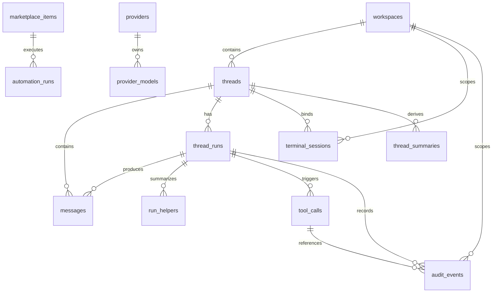

# Tiy Agent 数据库结构设计文档

## 1. 文档信息

- 文档名称：Tiy Agent 数据库结构设计文档
- 日期：2026-03-16
- 状态：Ready for review
- 对应架构文档：`docs/technical-architecture-20260316.md`
- 对应模块文档：`docs/module/*.md`

## 2. 存储选型

### 2.1 数据库引擎：SQLite

**选型结论**：SQLite（WAL 模式）

**理由**：

- 桌面端本地持久化天然适合嵌入式数据库，无需额外进程
- Rust 生态有成熟的 SQLite 绑定，易于集成
- 支持事务、索引、FTS5 全文检索，满足线程消息、工具调用、审计等查询需求
- WAL 模式支持并发读写，适合 Rust 异步 IO + Tokio 架构
- 单文件存储，便于备份、迁移和调试

**关键配置**：

```sql
PRAGMA journal_mode = WAL;
PRAGMA synchronous = NORMAL;
PRAGMA foreign_keys = ON;
PRAGMA busy_timeout = 5000;
PRAGMA cache_size = -8000;  -- 8MB
```

### 2.2 ORM / 数据库组件库推荐

#### 方案推荐：`sqlx`

| 维度 | sqlx | diesel | rusqlite |
|------|------|--------|----------|
| 类型 | 异步查询库（非传统 ORM） | 传统 ORM + Query Builder | 原生 SQLite 绑定 |
| 异步支持 | 原生 async/await | 需 tokio-diesel 适配 | 同步为主 |
| 编译时检查 | 支持（`sqlx::query!` 宏） | 支持（schema DSL） | 不支持 |
| 迁移管理 | 内置 `sqlx migrate` | 内置 `diesel migration` | 无 |
| Tokio 集成 | 原生 | 需适配层 | 需 `spawn_blocking` |
| 学习曲线 | 低（接近原生 SQL） | 中（DSL + schema 约束） | 低 |
| SQLite 支持 | 完整 | 完整 | 完整 |
| 连接池 | 内置 | 需 r2d2 | 无 |

**推荐 `sqlx` 的理由**：

1. **原生异步**：与 Tauri 2 + Tokio 运行时天然契合，无需同步-异步适配层
2. **编译时 SQL 检查**：`sqlx::query!` 宏在编译期验证 SQL 语法和类型映射，减少运行时错误
3. **低抽象开销**：不引入 ORM 映射层，SQL 可读性强，便于性能调优
4. **内置迁移**：`sqlx migrate` 支持版本化迁移脚本，适合桌面应用的增量升级
5. **连接池**：内置连接池管理，适合多线程并发场景（Git 快照、终端会话、Agent 事件写入并发）

**辅助依赖**：

```toml
[dependencies]
sqlx = { version = "0.8", features = ["runtime-tokio", "sqlite", "chrono", "uuid"] }
chrono = { version = "0.4", features = ["serde"] }
uuid = { version = "1", features = ["v7", "serde"] }
```

> 说明：选用 UUID v7（时间排序 + 唯一性），适合消息、工具调用等需要时序排列的场景。

## 3. 数据库文件布局

数据库文件统一存放在 `$HOME/.tiy/db/` 目录下（参见架构文档 §3.6 统一应用数据目录）。

```text
$HOME/.tiy/db/
  tiy-agent.db          -- 主数据库（WAL 模式）
  tiy-agent.db-wal      -- WAL 日志文件
  tiy-agent.db-shm      -- 共享内存文件
  backups/              -- 迁移前自动备份
```

迁移脚本嵌入到 Rust 二进制中，不存放在磁盘上。

## 4. 表结构设计

### 4.1 workspaces — 工作区

```sql
CREATE TABLE workspaces (
    id              TEXT PRIMARY KEY,           -- UUID v7
    name            TEXT NOT NULL,              -- 显示名称
    path            TEXT NOT NULL,              -- 用户输入的原始路径
    canonical_path  TEXT NOT NULL UNIQUE,       -- Rust 规范化后的绝对路径
    display_path    TEXT NOT NULL,              -- UI 展示用的简短路径
    is_default      INTEGER NOT NULL DEFAULT 0, -- 是否为默认工作区
    is_git          INTEGER NOT NULL DEFAULT 0, -- 是否为 Git 仓库
    auto_work_tree  INTEGER NOT NULL DEFAULT 0, -- 是否自动工作树模式
    status          TEXT NOT NULL DEFAULT 'ready', -- ready | missing | inaccessible | invalid
    last_validated_at TEXT,                     -- ISO 8601 最近一次路径校验时间
    created_at      TEXT NOT NULL DEFAULT (strftime('%Y-%m-%dT%H:%M:%fZ', 'now')),
    updated_at      TEXT NOT NULL DEFAULT (strftime('%Y-%m-%dT%H:%M:%fZ', 'now'))
);

CREATE INDEX idx_workspaces_is_default ON workspaces(is_default) WHERE is_default = 1;
CREATE INDEX idx_workspaces_status ON workspaces(status);
```

**设计说明**：

- `canonical_path` 是唯一约束，防止同一目录以不同路径重复注册
- `status` 在应用启动时由 Rust 重新校验并更新
- `is_default` 约束：全局最多一个 `is_default = 1`，由应用层保证

---

### 4.2 threads — 线程

```sql
CREATE TABLE threads (
    id              TEXT PRIMARY KEY,           -- UUID v7
    workspace_id    TEXT NOT NULL REFERENCES workspaces(id),
    title           TEXT NOT NULL DEFAULT '',   -- 线程标题（可由 Agent 生成）
    status          TEXT NOT NULL DEFAULT 'idle', -- idle | running | waiting_approval | interrupted | failed | archived
    summary         TEXT,                       -- 线程摘要（compaction 产物）
    last_active_at  TEXT NOT NULL DEFAULT (strftime('%Y-%m-%dT%H:%M:%fZ', 'now')),
    created_at      TEXT NOT NULL DEFAULT (strftime('%Y-%m-%dT%H:%M:%fZ', 'now')),
    updated_at      TEXT NOT NULL DEFAULT (strftime('%Y-%m-%dT%H:%M:%fZ', 'now'))
);

CREATE INDEX idx_threads_workspace ON threads(workspace_id);
CREATE INDEX idx_threads_workspace_active ON threads(workspace_id, last_active_at DESC);
CREATE INDEX idx_threads_status ON threads(status) WHERE status != 'archived';
```

**设计说明**：

- `status` 是派生字段，由最新 run 的状态推导而来，Rust 在 run 状态变化时同步更新
- `summary` 存储 compaction pipeline 生成的结构化摘要
- 按 `workspace_id + last_active_at DESC` 索引，支持侧边栏线程列表的快速查询

---

### 4.3 messages — 消息

```sql
CREATE TABLE messages (
    id              TEXT PRIMARY KEY,           -- UUID v7（保证时序 + 唯一性）
    thread_id       TEXT NOT NULL REFERENCES threads(id),
    run_id          TEXT REFERENCES thread_runs(id), -- 可空，用户消息无 run
    role            TEXT NOT NULL,              -- user | assistant | system
    content_markdown TEXT NOT NULL DEFAULT '',  -- 消息正文（Markdown 格式）
    message_type    TEXT NOT NULL DEFAULT 'plain_message',
        -- plain_message | plan | reasoning | tool_request | tool_result
        -- | approval_prompt | sources | summary_marker
    status          TEXT NOT NULL DEFAULT 'completed', -- streaming | completed | failed
    metadata_json   TEXT,                       -- 可选的结构化元数据（JSON）
    created_at      TEXT NOT NULL DEFAULT (strftime('%Y-%m-%dT%H:%M:%fZ', 'now'))
);

CREATE INDEX idx_messages_thread ON messages(thread_id, created_at);
CREATE INDEX idx_messages_thread_page ON messages(thread_id, id DESC);
CREATE INDEX idx_messages_run ON messages(run_id) WHERE run_id IS NOT NULL;
CREATE INDEX idx_messages_type ON messages(thread_id, message_type)
    WHERE message_type IN ('plan', 'approval_prompt', 'summary_marker');
```

**设计说明**：

- 历史消息 append-only，不做原地更新
- `message_type` 决定前端渲染方式：`plan` → Plan 组件，`tool_request/tool_result` → Tool 组件，等
- `metadata_json` 存储如 tool_call_id 引用、summary source range、plan artifact ref 等扩展信息
- `status = streaming` 表示 assistant 消息正在流式写入，完成后转为 `completed`
- 分页查询使用 `id DESC`（UUID v7 天然有序）

---

### 4.4 thread_runs — Agent 运行记录

```sql
CREATE TABLE thread_runs (
    id                      TEXT PRIMARY KEY,           -- UUID v7
    thread_id               TEXT NOT NULL REFERENCES threads(id),
    profile_id              TEXT,                       -- Agent Profile ID
    run_mode                TEXT NOT NULL DEFAULT 'default', -- default | plan
    execution_strategy      TEXT,                       -- continue_in_thread | clean_context_from_plan
    source_plan_run_id      TEXT REFERENCES thread_runs(id), -- 来源计划 run（仅 clean_context_from_plan 时有值）
    provider_id             TEXT,                       -- 主模型 Provider ID（快速查询用）
    model_id                TEXT,                       -- 主模型 Model ID（快速查询用）
    effective_model_plan_json TEXT,                     -- 冻结的完整模型路由方案（JSON）
    status                  TEXT NOT NULL DEFAULT 'created',
        -- created | dispatching | running | waiting_approval | waiting_tool_result
        -- | cancelling | completed | failed | denied | interrupted | cancelled
    error_message           TEXT,                       -- 失败时的错误描述
    started_at              TEXT NOT NULL DEFAULT (strftime('%Y-%m-%dT%H:%M:%fZ', 'now')),
    finished_at             TEXT                        -- 终态时间戳
);

CREATE INDEX idx_runs_thread ON thread_runs(thread_id, started_at DESC);
CREATE INDEX idx_runs_thread_active ON thread_runs(thread_id, status)
    WHERE status NOT IN ('completed', 'failed', 'denied', 'interrupted', 'cancelled');
CREATE INDEX idx_runs_status ON thread_runs(status)
    WHERE status NOT IN ('completed', 'failed', 'denied', 'interrupted', 'cancelled');
```

**设计说明**：

- `effective_model_plan_json` 在 run 创建时冻结，包含 primary/helper/lite 三层模型映射以及运行时工具画像
- `execution_strategy` 仅当从 plan run 转入 default run 时有值
- 活跃 run 索引用于快速检测"同一线程是否存在正在运行的 run"
- 应用启动时检查无 `finished_at` 的 run，标记为 `interrupted`

---

### 4.5 run_helpers — HelperAgent 摘要

```sql
CREATE TABLE run_helpers (
    id              TEXT PRIMARY KEY,           -- UUID v7
    run_id          TEXT NOT NULL REFERENCES thread_runs(id),
    thread_id       TEXT NOT NULL REFERENCES threads(id),
    helper_kind     TEXT NOT NULL,              -- scout | planner | reviewer | custom
    parent_tool_call_id TEXT,                   -- 触发该 helper 的父工具调用（可空）
    model_role      TEXT NOT NULL DEFAULT 'assistant', -- assistant | lite
    provider_id     TEXT,
    model_id        TEXT,
    status          TEXT NOT NULL DEFAULT 'created', -- created | running | completed | failed | interrupted | cancelled
    input_summary   TEXT,
    output_summary  TEXT,
    error_summary   TEXT,
    started_at      TEXT NOT NULL DEFAULT (strftime('%Y-%m-%dT%H:%M:%fZ', 'now')),
    finished_at     TEXT
);

CREATE INDEX idx_run_helpers_run ON run_helpers(run_id);
CREATE INDEX idx_run_helpers_thread ON run_helpers(thread_id);
```

**设计说明**：

- `run_helpers` 只记录 helper 执行摘要，不保存完整 helper transcript
- helper 作为 parent run 的内部编排单元存在，不占用新的 thread run
- `parent_tool_call_id` 用于将 helper 与触发它的 orchestration tool 关联

**迁移策略**：

- 若当前环境仅存在开发态或未正式启用的 `run_subtasks` 数据，可采用 destructive migration：
  新增 `run_helpers` 后停止写入 `run_subtasks`
- 若已有需保留的数据，迁移时执行字段映射：
  - `run_subtasks.subtask_type -> run_helpers.helper_kind`
  - `run_subtasks.role -> run_helpers.model_role`
  - `run_subtasks.summary -> run_helpers.output_summary`
  - `run_subtasks.error_message -> run_helpers.error_summary`
- 迁移完成后，`run_subtasks` 仅保留兼容读取窗口，后续版本删除

---

### 4.6 tool_calls — 工具调用

```sql
CREATE TABLE tool_calls (
    id              TEXT PRIMARY KEY,           -- UUID v7
    run_id          TEXT NOT NULL REFERENCES thread_runs(id),
    thread_id       TEXT NOT NULL REFERENCES threads(id),
    tool_name       TEXT NOT NULL,              -- read | write | shell | git_status ...
    tool_input_json TEXT NOT NULL DEFAULT '{}', -- 工具输入参数（JSON）
    tool_output_json TEXT,                      -- 工具输出结果（JSON）
    status          TEXT NOT NULL DEFAULT 'requested',
        -- requested | waiting_approval | approved | denied | running | completed | failed | cancelled
    approval_status TEXT,                       -- pending | approved | denied（仅需审批时有值）
    policy_verdict_json TEXT,                   -- PolicyEngine 判定结果（JSON）
    started_at      TEXT NOT NULL DEFAULT (strftime('%Y-%m-%dT%H:%M:%fZ', 'now')),
    finished_at     TEXT
);

CREATE INDEX idx_tool_calls_run ON tool_calls(run_id);
CREATE INDEX idx_tool_calls_thread ON tool_calls(thread_id);
CREATE INDEX idx_tool_calls_pending ON tool_calls(status)
    WHERE status IN ('requested', 'waiting_approval', 'running');
CREATE INDEX idx_tool_calls_tool ON tool_calls(tool_name, thread_id);
```

**设计说明**：

- `tool_calls` 仅承载 run-bound 的 Agent 工具调用
- 用户从 UI 直接发起的操作（如 Git drawer 的 commit）不强行塞入此表
- `tool_output_json` 对于大输出场景，应存储摘要 + 引用指针，原文可存外部或截断
- `policy_verdict_json` 记录 PolicyEngine 的判定详情，便于审计回溯

---

### 4.7 settings — 全局设置

```sql
CREATE TABLE settings (
    key             TEXT PRIMARY KEY,           -- 配置键（如 'theme', 'language', 'approval_policy'）
    value_json      TEXT NOT NULL,              -- JSON 格式的配置值
    updated_at      TEXT NOT NULL DEFAULT (strftime('%Y-%m-%dT%H:%M:%fZ', 'now'))
);
```

**设计说明**：

- KV 结构，灵活承载各类设置
- 常见 key 包括：

| key | 说明 | 示例值 |
|-----|------|--------|
| `theme` | 主题偏好 | `"system"` / `"light"` / `"dark"` |
| `language` | 语言 | `"zh-CN"` / `"en"` |
| `startup_behavior` | 启动行为 | `{"restore_last_workspace": true}` |
| `default_agent_profile` | 默认 Agent Profile ID | `"profile_xxx"` |

---

### 4.8 agent_profiles — Agent Profile 配置

```sql
CREATE TABLE agent_profiles (
    id              TEXT PRIMARY KEY,           -- UUID v7
    name            TEXT NOT NULL,
    custom_instructions TEXT,                   -- 自定义指令
    response_style  TEXT,                       -- 响应风格描述
    response_language TEXT,                     -- 响应语言
    primary_provider_id   TEXT,                 -- 主模型 Provider
    primary_model_id      TEXT,                 -- 主模型 Model
    auxiliary_provider_id TEXT,                 -- 辅助模型 Provider
    auxiliary_model_id    TEXT,                 -- 辅助模型 Model
    lightweight_provider_id TEXT,               -- 轻量模型 Provider
    lightweight_model_id  TEXT,                 -- 轻量模型 Model
    is_default      INTEGER NOT NULL DEFAULT 0,
    created_at      TEXT NOT NULL DEFAULT (strftime('%Y-%m-%dT%H:%M:%fZ', 'now')),
    updated_at      TEXT NOT NULL DEFAULT (strftime('%Y-%m-%dT%H:%M:%fZ', 'now'))
);
```

**设计说明**：

- PRD 中 Agent Profile 包含模型映射和风格配置，独立建表更清晰
- run 创建时冻结快照存入 `thread_runs.effective_model_plan_json`，不受后续 Profile 编辑影响

---

### 4.9 providers — 模型供应商配置

```sql
CREATE TABLE providers (
    id              TEXT PRIMARY KEY,           -- UUID v7
    name            TEXT NOT NULL,              -- 供应商显示名（如 OpenAI、Anthropic）
    protocol_type   TEXT NOT NULL DEFAULT 'openai', -- openai | anthropic | custom
    base_url        TEXT NOT NULL,
    api_key_encrypted TEXT,                     -- 加密存储的 API Key
    enabled         INTEGER NOT NULL DEFAULT 1,
    custom_headers_json TEXT,                   -- 自定义请求头（JSON）
    created_at      TEXT NOT NULL DEFAULT (strftime('%Y-%m-%dT%H:%M:%fZ', 'now')),
    updated_at      TEXT NOT NULL DEFAULT (strftime('%Y-%m-%dT%H:%M:%fZ', 'now'))
);
```

---

### 4.10 provider_models — Provider 下的可用模型

```sql
CREATE TABLE provider_models (
    id              TEXT PRIMARY KEY,           -- UUID v7
    provider_id     TEXT NOT NULL REFERENCES providers(id) ON DELETE CASCADE,
    model_name      TEXT NOT NULL,              -- 模型名称（如 gpt-4o、claude-sonnet-4-6）
    display_name    TEXT,                       -- UI 显示名
    enabled         INTEGER NOT NULL DEFAULT 1,
    capabilities_json TEXT,                     -- 模型能力标记（JSON，如 tool_use、vision）
    created_at      TEXT NOT NULL DEFAULT (strftime('%Y-%m-%dT%H:%M:%fZ', 'now'))
);

CREATE INDEX idx_provider_models_provider ON provider_models(provider_id);
CREATE UNIQUE INDEX idx_provider_models_unique ON provider_models(provider_id, model_name);
```

---

### 4.11 commands — 命令模板

```sql
CREATE TABLE commands (
    id              TEXT PRIMARY KEY,           -- UUID v7
    name            TEXT NOT NULL UNIQUE,       -- 命令名（如 /review, /test）
    path            TEXT,                       -- 命令文件路径（可选）
    args_hint       TEXT,                       -- 参数提示
    description     TEXT,                       -- 命令描述
    prompt_template TEXT,                       -- 提示词模板
    created_at      TEXT NOT NULL DEFAULT (strftime('%Y-%m-%dT%H:%M:%fZ', 'now')),
    updated_at      TEXT NOT NULL DEFAULT (strftime('%Y-%m-%dT%H:%M:%fZ', 'now'))
);
```

---

### 4.12 policies — 权限策略

```sql
CREATE TABLE policies (
    key             TEXT PRIMARY KEY,           -- 策略键
    value_json      TEXT NOT NULL,              -- JSON 格式的策略值
    updated_at      TEXT NOT NULL DEFAULT (strftime('%Y-%m-%dT%H:%M:%fZ', 'now'))
);
```

**常见策略 key**：

| key | 说明 | 示例值 |
|-----|------|--------|
| `approval_policy` | 审批模式 | `{"mode": "auto"}` / `{"mode": "require_for_mutations"}` |
| `sandbox_policy` | 沙箱模式 | `{"enabled": false}` |
| `network_access` | 网络策略 | `{"allowed": true, "blocked_domains": []}` |
| `allow_list` | 允许规则 | `[{"tool": "read", "pattern": "**/*"}]` |
| `deny_list` | 拒绝规则 | `[{"tool": "shell", "pattern": "rm -rf *"}]` |
| `writable_roots` | 可写目录 | `["/Users/dev/projects"]` |

---

### 4.13 marketplace_items — 扩展市场项

```sql
CREATE TABLE marketplace_items (
    item_id         TEXT PRIMARY KEY,           -- 扩展唯一标识
    category        TEXT NOT NULL,              -- skill | mcp | plugin | automation
    name            TEXT NOT NULL,
    description     TEXT,
    source          TEXT,                       -- 来源（如 registry URL、local path）
    version         TEXT,
    installed       INTEGER NOT NULL DEFAULT 0,
    enabled         INTEGER NOT NULL DEFAULT 0,
    metadata_json   TEXT,                       -- 扩展元数据（JSON）
    updated_at      TEXT NOT NULL DEFAULT (strftime('%Y-%m-%dT%H:%M:%fZ', 'now'))
);

CREATE INDEX idx_marketplace_category ON marketplace_items(category);
CREATE INDEX idx_marketplace_installed ON marketplace_items(installed, enabled);
```

---

### 4.14 audit_events — 统一审计日志

```sql
CREATE TABLE audit_events (
    id              TEXT PRIMARY KEY,           -- UUID v7
    actor_type      TEXT NOT NULL,              -- user | agent | system
    actor_id        TEXT,                       -- 操作者标识（用户 ID / run ID）
    source          TEXT NOT NULL,              -- thread | tool | git | terminal | index | settings | marketplace | sidecar
    workspace_id    TEXT REFERENCES workspaces(id),
    thread_id       TEXT REFERENCES threads(id),
    run_id          TEXT REFERENCES thread_runs(id), -- 可空，用户操作无 run
    tool_call_id    TEXT REFERENCES tool_calls(id),  -- 可空，关联 Agent tool call
    action          TEXT NOT NULL,              -- 操作动作（如 file_write, git_push, tool_approved）
    target_type     TEXT,                       -- 操作目标类型（如 file, branch, marketplace_item）
    target_id       TEXT,                       -- 操作目标标识
    policy_check_json TEXT,                     -- PolicyCheck 评估结果快照（JSON）
    result_json     TEXT,                       -- 操作结果摘要（JSON）
    created_at      TEXT NOT NULL DEFAULT (strftime('%Y-%m-%dT%H:%M:%fZ', 'now'))
);

CREATE INDEX idx_audit_thread ON audit_events(thread_id, created_at DESC);
CREATE INDEX idx_audit_run ON audit_events(run_id) WHERE run_id IS NOT NULL;
CREATE INDEX idx_audit_workspace ON audit_events(workspace_id, created_at DESC);
CREATE INDEX idx_audit_action ON audit_events(action, created_at DESC);
CREATE INDEX idx_audit_tool_call ON audit_events(tool_call_id) WHERE tool_call_id IS NOT NULL;
```

**设计说明**：

- 统一记录用户操作和 Agent 操作的变更审计
- `run_id` 允许为空，覆盖用户从 Git drawer 等直接发起的操作
- `tool_call_id` 允许为空，仅当审计事件对应 Agent tool call 时写入
- `policy_check_json` 存储 PolicyEngine 的评估快照，便于事后审计
- 与 `tool_calls` 通过 `tool_call_id` 建立引用，不混成同一生命周期表

---

### 4.15 automation_runs — 自动化执行记录（Phase 3 预留）

```sql
CREATE TABLE automation_runs (
    id              TEXT PRIMARY KEY,           -- UUID v7
    automation_id   TEXT NOT NULL REFERENCES marketplace_items(item_id),
    status          TEXT NOT NULL DEFAULT 'pending', -- pending | running | completed | failed
    started_at      TEXT NOT NULL DEFAULT (strftime('%Y-%m-%dT%H:%M:%fZ', 'now')),
    finished_at     TEXT,
    result_summary  TEXT
);

CREATE INDEX idx_automation_runs_automation ON automation_runs(automation_id, started_at DESC);
```

**设计说明**：

- Phase 3 Scheduler 预留，Phase 1-2 不要求填充
- schema 预留不反向约束当前实现

---

### 4.16 thread_summaries — 线程摘要缓存

```sql
CREATE TABLE thread_summaries (
    id              TEXT PRIMARY KEY,           -- UUID v7
    thread_id       TEXT NOT NULL REFERENCES threads(id),
    source_range_start TEXT NOT NULL,           -- 原始消息范围起始 ID
    source_range_end   TEXT NOT NULL,           -- 原始消息范围结束 ID
    summary_text    TEXT NOT NULL,              -- 结构化摘要内容
    model_id        TEXT,                       -- 生成摘要的模型
    status          TEXT NOT NULL DEFAULT 'active', -- active | superseded
    created_at      TEXT NOT NULL DEFAULT (strftime('%Y-%m-%dT%H:%M:%fZ', 'now'))
);

CREATE INDEX idx_thread_summaries_thread ON thread_summaries(thread_id, status);
```

**设计说明**：

- 摘要由 Compaction Pipeline 生成，保留源消息范围引用以确保可追溯
- 旧摘要可被新摘要 supersede，但不删除，保持审计完整性

---

### 4.17 terminal_sessions — 终端会话元数据

```sql
CREATE TABLE terminal_sessions (
    id              TEXT PRIMARY KEY,           -- UUID v7
    thread_id       TEXT NOT NULL REFERENCES threads(id),
    workspace_id    TEXT NOT NULL REFERENCES workspaces(id),
    shell_path      TEXT,                       -- shell 路径（如 /bin/zsh）
    cwd             TEXT,                       -- 工作目录
    status          TEXT NOT NULL DEFAULT 'created', -- created | running | exited
    pid             INTEGER,                    -- PTY 进程 PID
    exit_code       INTEGER,                    -- 退出码
    created_at      TEXT NOT NULL DEFAULT (strftime('%Y-%m-%dT%H:%M:%fZ', 'now')),
    exited_at       TEXT
);

CREATE INDEX idx_terminal_sessions_thread ON terminal_sessions(thread_id);
CREATE UNIQUE INDEX idx_terminal_sessions_active ON terminal_sessions(thread_id)
    WHERE status IN ('created', 'running');
```

**设计说明**：

- v1 每线程最多一个活跃终端会话（通过 partial unique index 保证）
- 仅存元数据，终端输出通过 Rust 内存 ring buffer 管理，不写入 SQLite
- 应用重启后 PTY 不保留，记录转为 `exited`

## 5. ER 关系图



## 6. 索引策略总结

### 6.1 高频查询路径与索引映射

| 查询场景 | 使用的索引 |
|----------|-----------|
| 侧边栏线程列表 | `idx_threads_workspace_active` |
| 线程消息分页加载 | `idx_messages_thread_page` |
| 检查活跃 run | `idx_runs_thread_active` |
| 待处理审批查询 | `idx_tool_calls_pending` |
| 审计日志按线程查询 | `idx_audit_thread` |
| 工作区状态校验 | `idx_workspaces_status` |
| 摘要查询 | `idx_thread_summaries_thread` |

### 6.2 FTS5 全文检索（可选增强）

```sql
CREATE VIRTUAL TABLE messages_fts USING fts5(
    content_markdown,
    content='messages',
    content_rowid='rowid'
);

-- 通过触发器同步
CREATE TRIGGER messages_fts_insert AFTER INSERT ON messages BEGIN
    INSERT INTO messages_fts(rowid, content_markdown) VALUES (new.rowid, new.content_markdown);
END;
```

用于线程内消息搜索、跨线程关键词查找等场景。v1 可选，建议在消息量增长后启用。

## 7. 迁移策略

### 7.1 迁移工具

使用 `sqlx migrate`，迁移脚本嵌入到 Rust 二进制中：

```rust
sqlx::migrate!("./migrations").run(&pool).await?;
```

### 7.2 迁移文件命名

```text
migrations/
  20260316000001_initial_schema.sql
  20260316000002_add_fts.sql
  ...
```

### 7.3 版本升级原则

- 只允许前向迁移（additive），不做破坏性 schema 变更
- 列新增使用 `ALTER TABLE ... ADD COLUMN ... DEFAULT ...`
- 列删除推迟到后续版本，先标记废弃
- 数据迁移使用独立的 migration step，不与 DDL 混在同一脚本

## 8. 性能设计

### 8.1 写入优化

- 消息写入使用事务 batch：一次 sidecar 事件批次在单事务中完成
- WAL 模式允许并发读写，不阻塞 Git 快照和 UI 查询
- 大 tool output 截断后存入 `tool_output_json`，原始输出可考虑写入外部文件

### 8.2 读取优化

- 线程消息分页：基于 UUID v7 游标 `WHERE id < ? ORDER BY id DESC LIMIT ?`
- 线程列表：只返回 `threads` 表的轻量字段，不 JOIN messages
- 活跃 run 检测：partial index 避免全表扫描
- 设置读取：小表内存缓存，写入时刷新

### 8.3 数据维护

- 长线程的旧消息：通过 Compaction Pipeline 生成摘要，原始消息保留但不进入热路径
- 审计日志：按月/按量清理策略（v2），v1 保留全量
- 终端会话：应用退出时批量清理 `status != 'exited'` 的记录

## 9. 安全设计

### 9.1 API Key 存储

- `providers.api_key_encrypted` 使用 AES-256-GCM 加密存储
- 密钥派生自系统 keychain（macOS Keychain / Windows Credential Manager）
- 运行时解密到内存，不写入日志或审计

### 9.2 路径安全

- 所有 workspace path 在写入前经过 Rust 规范化（symlink 解析 + 绝对路径化）
- 工具调用的路径参数对照 `canonical_path` 校验，防止路径逃逸

### 9.3 数据库文件权限

- 数据库文件权限设置为 `0600`（仅所有者可读写）
- 不将数据库路径暴露给前端 WebView

## 10. 与架构文档的对照

| 架构文档中的建议核心表 | 本文档对应表 | 说明 |
|----------------------|-------------|------|
| `workspaces` | `workspaces` | 扩展了 `canonical_path`、`display_path`、`status`、`last_validated_at` |
| `threads` | `threads` | 一致 |
| `messages` | `messages` | 扩展了 `run_id` nullable 关联 |
| `thread_runs` | `thread_runs` | 扩展了 `execution_strategy`、`source_plan_run_id` |
| `run_helpers` | `run_helpers` | helper 摘要替代旧 `run_subtasks` |
| `tool_calls` | `tool_calls` | 扩展了 `policy_verdict_json` |
| `settings` | `settings` + `policies` | 拆分为通用设置和权限策略两表 |
| `marketplace_items` | `marketplace_items` | 扩展了 `name`、`description`、`metadata_json` |
| `audit_events` | `audit_events` | 一致 |
| `automation_runs` | `automation_runs` | Phase 3 预留，一致 |
| — | `agent_profiles` | 新增，PRD Agent Profile 对象实体化 |
| — | `providers` | 新增，PRD Provider 对象实体化 |
| — | `provider_models` | 新增，Provider 下的模型列表 |
| — | `commands` | 新增，PRD Command 对象实体化 |
| — | `thread_summaries` | 新增，Compaction Pipeline 产物 |
| — | `terminal_sessions` | 新增，终端会话元数据 |

## 11. 实现建议

### 11.1 Rust 代码组织

```text
src-tauri/src/
  persistence/
    mod.rs              -- 模块入口 + 连接池初始化
    sqlite/
      mod.rs            -- SQLite 特定配置
      migrations.rs     -- 迁移执行
    repo/
      workspace_repo.rs
      thread_repo.rs
      message_repo.rs
      run_repo.rs
      tool_call_repo.rs
      settings_repo.rs
      profile_repo.rs
      provider_repo.rs
      marketplace_repo.rs
      audit_repo.rs
      terminal_repo.rs
      summary_repo.rs
```

### 11.2 连接池配置

```rust
use sqlx::sqlite::{SqlitePool, SqlitePoolOptions, SqliteConnectOptions};

let options = SqliteConnectOptions::new()
    .filename(&db_path)
    .journal_mode(sqlx::sqlite::SqliteJournalMode::Wal)
    .synchronous(sqlx::sqlite::SqliteSynchronous::Normal)
    .foreign_keys(true)
    .busy_timeout(std::time::Duration::from_secs(5));

let pool = SqlitePoolOptions::new()
    .max_connections(5)
    .connect_with(options)
    .await?;
```

### 11.3 类型映射约定

| SQLite 类型 | Rust 类型 | 说明 |
|------------|-----------|------|
| `TEXT PRIMARY KEY` | `String` | UUID v7 字符串 |
| `TEXT NOT NULL` | `String` | 普通文本 |
| `TEXT` | `Option<String>` | 可空文本 |
| `INTEGER NOT NULL` | `i64` / `bool` | 0/1 布尔 |
| `INTEGER` | `Option<i64>` | 可空整数 |
| `TEXT` (时间) | `chrono::DateTime<Utc>` | ISO 8601 |
| `TEXT` (JSON) | `serde_json::Value` 或强类型 | JSON 字段 |
