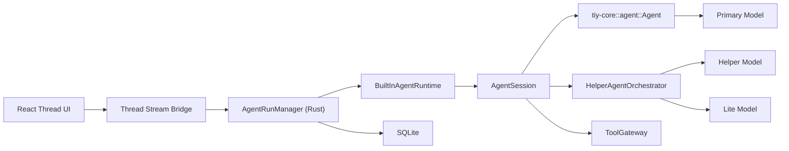
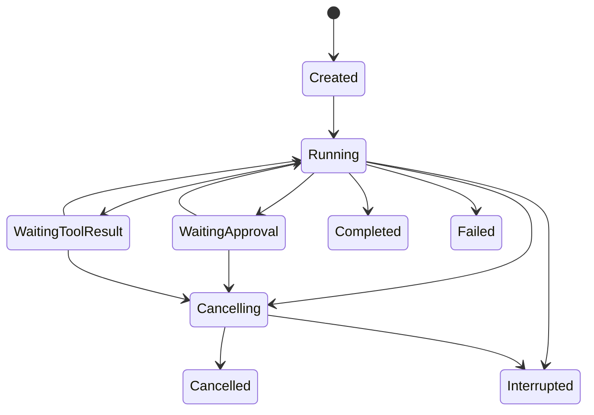

# Agent Run Design

## Summary

This document defines the `AgentRun` subsystem for Tiy Agent after removing the
sidecar architecture.

An agent run is one parent execution attempt against a thread snapshot. It is
owned by Rust `AgentRunManager`, executed by the built-in Rust runtime layer,
and powered by `tiy-core::agent::Agent` as the single-agent kernel.

The runtime model is:

- `AgentRunManager` owns durable run lifecycle and persistence
- `BuiltInAgentRuntime` owns desktop-specific execution orchestration
- `AgentSession` owns one active parent run in memory
- `HelperAgentOrchestrator` runs internal helper tasks under the parent run
- `tiy-core` owns the single-agent loop, streaming, tool hooks, and queues

Helper-agent work is an internal orchestration capability. In v1 it is folded
back into the parent thread as collapsed status and result artifacts rather than
exposed as standalone visible child threads.

## Goals

- enforce at most one active parent run per thread
- keep Rust as the authoritative source of run truth
- stream parent run events to the frontend through one stable event model
- freeze the effective execution model plan at run start
- support helper-agent orchestration without creating additional thread runs
- keep `plan` mode as a first-class run mode
- make helper-task results auditable without polluting main thread history

## Non-Goals

- no sidecar process lifecycle
- no direct sidecar-to-frontend event bypass
- no helper-agent full transcript UI in v1
- no task-graph scheduler for arbitrary multi-agent DAGs in v1
- no automatic crash replay of interrupted runs in v1

## Core Decisions

### Rust Owns Run Truth

Only Rust may decide:

- whether a run exists
- whether it is active
- whether it is waiting for approval, tool result, or helper completion
- whether it is cancelling
- whether it completed, failed, was cancelled, or was interrupted

`tiy-core` events are runtime signals, not lifecycle truth.

### One Active Parent Run Per Thread

The thread invariant remains:

- one thread
- one active parent run
- zero or more internal helper tasks

Helper-agent work must not consume a second active-run slot for the same
thread.

### `AgentSession` Is The Runtime Session Boundary

Each parent run gets one in-memory `AgentSession` that owns:

- `run_id`, `thread_id`, `workspace_id`, `run_mode`
- the main `tiy-core::agent::Agent`
- the frozen execution config
- the active tool profile
- current thread snapshot and optional plan artifact
- helper orchestration state
- frontend stream sender

`AgentSession` is not a database entity. It is the runtime session container for
one parent run.

### Helper-Agent Is An Internal Child Execution Unit

Helper-agent work belongs inside the parent run, not beside it.

Rust should represent helper work as `HelperTask` records managed by
`HelperAgentOrchestrator`. The parent agent triggers helper work through
runtime-owned internal orchestration tools such as:

- `agent_research`
- `agent_plan`
- `agent_review`

These tools do not directly perform privileged system work. They hand execution
to the orchestrator, which spins up a helper `tiy-core` agent or standalone loop
with a scoped prompt, model, and tool profile.

### Effective Model Plan Is Frozen At Run Start

The `Agent Profile` model mapping is still resolved and frozen when a run
starts. The persisted runtime model plan is:

- `primary_model` for the parent agent
- `helper_default_model` for helper-agent tasks
- `lite_model` for lightweight internal tasks when needed
- `thinking_level`
- `transport`
- `security_profile`
- `tool_profile_by_mode`

The runtime creates one concrete `Model` per concrete agent execution. It does
not rely on sidecar-style multi-role routing inside a single loop.

### `Plan` Mode Is A Runtime-Owned Constraint Profile

`plan` is implemented by Rust runtime configuration, not by a special sidecar
behavior.

When `run_mode = plan`, `AgentSession` changes:

- the visible tool set
- the hidden runtime context instructions
- the helper-agent tool ceiling

`tiy-core` still sees a normal agent loop, but the loop receives a read-only
planning-oriented runtime configuration.

## High-Level Architecture



## Data Model

### Parent Run Table

`thread_runs` remains the parent-run source of truth:

```text
thread_runs
  id
  thread_id
  profile_id
  run_mode
  provider_id
  model_id
  effective_model_plan_json
  status
  started_at
  finished_at
  error_message
```

Notes:

- `provider_id` and `model_id` should continue to represent the primary model
  path for quick lookup
- `effective_model_plan_json` now stores Rust runtime execution configuration,
  not a payload for a sidecar session

### Helper Run Summary Table

Add `run_helpers` for collapsed helper-task persistence:

```text
run_helpers
  id
  run_id
  thread_id
  helper_kind
  parent_tool_call_id nullable
  status
  model_role
  provider_id
  model_id
  input_summary
  output_summary
  error_summary
  started_at
  finished_at
```

This table stores helper execution summaries, not full helper transcripts.

### Recommended Runtime Fields

```rust
pub struct ActiveRun {
    pub run_id: String,
    pub thread_id: String,
    pub workspace_id: String,
    pub run_mode: RunMode,
    pub status: RunStatus,
    pub started_at: DateTime<Utc>,
    pub waiting_state: WaitingState,
    pub active_helper_count: u32,
    pub cancel_requested: bool,
}

pub enum RunMode {
    Default,
    Plan,
}

pub enum WaitingState {
    None,
    Streaming,
    ToolResult,
    Approval,
    Helper,
}

pub enum RunStatus {
    Created,
    Running,
    WaitingApproval,
    WaitingToolResult,
    Cancelling,
    Completed,
    Failed,
    Cancelled,
    Interrupted,
}
```

## Parent Run State Machine



Helper execution is an internal sub-state of `Running`, not a top-level
`RunStatus`.

## Helper Execution Model

Helper execution rules:

- helper tasks run under one parent run
- helper tasks inherit the parent `run_mode` ceiling
- helper tasks do not create new thread-level active runs
- helper results are folded into the parent thread as collapsed status artifacts
- helper full transcripts stay out of `messages` in v1

Recommended helper event surface for the frontend:

- `helper_started`
- `helper_progress`
- `helper_completed`
- `helper_failed`

## Tool Executor Bridge

`AgentSession` should register `ToolGateway` as the `tiy-core` tool executor
bridge through `set_tool_executor(...)`.

Recommended execution contract:

1. `tiy-core` selects a tool call
2. `AgentSession` executor callback resolves the runtime tool profile
3. privileged tools are forwarded to `ToolGateway`
4. `ToolGateway` may execute immediately, deny, or wait for approval
5. the callback maps the final outcome into `AgentToolResult`
6. `tiy-core` resumes the same loop with the resulting `ToolResultMessage`

### Approval wait semantics

Approval waits should suspend the loop by suspending the tool executor future.

That means:

- parent run status becomes `WaitingApproval`
- no separate side-channel resume protocol is required
- approval resolution fulfills the pending executor future
- the same loop turn then continues normally

This makes approval a Rust runtime concern rather than a custom protocol concern.

## Run Modes

### `default`

- full tool surface, subject to normal policy and approval
- helper-agent orchestration allowed
- execution-oriented collaboration

### `plan`

- read-only planning-oriented tool profile
- planning context injected by `AgentSession`
- helper tasks inherit read-only limits
- mutating tools denied or explicitly escalated through policy

### Helper Profile Constraints

Recommended v1 helper profiles:

- `helper_scout`
- `helper_planner`
- `helper_reviewer`

Rules:

- all helper profiles remain read-only in `plan` mode
- helpers must not open independent approval UI in v1
- if a helper reaches an approval-required or mutating path, the runtime should
  terminate that helper step and fold back an escalation-needed summary to the
  parent run
- helper concurrency must be capped at the session layer independently of
  `tiy-core` per-agent `max_parallel_tool_calls`

### Plan To Execution Transitions

Support two launch strategies:

- `continue_in_thread`
- `clean_context_from_plan`

Important rule:

- "clean context" only rebuilds the execution input window
- it does not delete or rewrite persisted thread history

## End-To-End Flow

### Normal Run

1. frontend submits prompt with `run_mode`
2. Rust persists the user message and creates a parent run
3. `AgentRunManager` freezes the effective runtime model plan
4. `BuiltInAgentRuntime` creates an `AgentSession`
5. `AgentSession` starts the main `tiy-core` loop
6. tool requests go through `ToolGateway` and `PolicyEngine`
7. helper requests go through `HelperAgentOrchestrator`
8. final run state is persisted by `AgentRunManager`

### Helper Task Within A Parent Run

1. parent agent invokes an internal orchestration tool
2. `AgentSession` asks `HelperAgentOrchestrator` to start a helper task
3. orchestrator resolves helper model and tool profile from the frozen plan
4. helper executes as a scoped `tiy-core` agent or standalone loop
5. helper summary is persisted in `run_helpers`
6. helper status and result are folded into the parent thread stream
7. parent agent continues with the folded helper result as context

### Cancellation

1. frontend requests cancellation
2. Rust marks the parent run as `Cancelling`
3. `AgentSession` aborts the main `tiy-core` agent
4. helper orchestrator propagates the same cancellation signal to active helpers
5. run settles as `Cancelled` or `Interrupted`

### Cancellation Contract

`tiy-core` already provides:

- `Agent.abort()`
- `AbortSignal`
- abort-aware provider requests
- abort-aware tool execution and tool timeout handling

Tiy Desktop must add:

- `ToolGateway` executor cancellation handling
- cancellation propagation to active helpers
- timeout and cleanup policy while a run remains in `Cancelling`

## Failure Recovery

The recovery unit is now the built-in runtime session, not a sidecar process.

Recommended v1 behavior:

- if app shutdown or runtime failure interrupts a run, mark it `Interrupted`
- active helper tasks are marked `Interrupted` or `Failed`
- do not attempt automatic replay
- let the user retry from thread history or a persisted plan artifact

## Testing

Recommended coverage:

- runtime event translation from `tiy-core` events to `ThreadStreamEvent`
- parent run lifecycle and idempotent persistence
- helper orchestration and folded result behavior
- plan mode inheritance and policy ceilings
- cancellation propagation from parent run to helper tasks

## ADR

### ADR-AR1: Build Tiy Agent Run On `tiy-core` With A Rust-Owned Runtime Layer

#### Status

Accepted

#### Context

The old design depended on a sidecar to host the agent loop and helper-task
orchestration. Current `tiy-core` capabilities already cover the single-agent
kernel concerns needed by the desktop product.

#### Decision

Use `tiy-core` as the single-agent kernel and add a Rust-owned built-in runtime
layer for session orchestration, helper delegation, event folding, and run-mode
enforcement.

#### Consequences

Positive:

- simpler lifecycle ownership
- fewer protocol boundaries
- helper orchestration becomes auditable inside Rust
- sidecar-specific failure modes disappear

Negative:

- Tiy must own helper orchestration logic directly
- multi-agent DAG scheduling remains a future design concern
