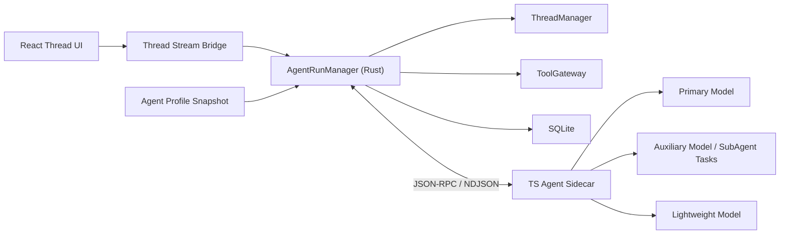
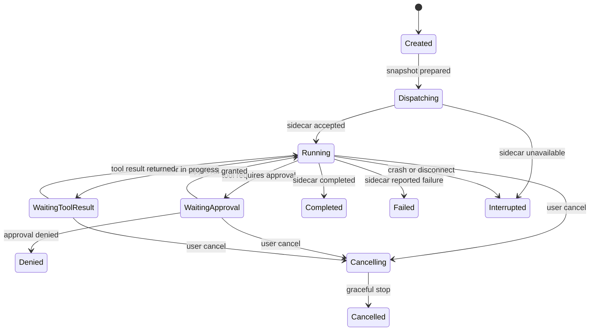

# Agent Run Design

## Summary

This document defines the `AgentRun` subsystem for Tiy Agent.

An agent run is one execution attempt of the agent against a thread snapshot. It starts when the user submits work and ends when the agent completes, fails, is denied by policy, or is interrupted.

Within one parent run, the sidecar may orchestrate one or more `SubAgent` helper tasks using the `Agent Profile` model plan:

- the primary model handles the main task loop
- the auxiliary model handles `SubAgent`-style helper work
- the lightweight model handles cheap classification, routing, or formatting steps

Each run also carries an explicit `run_mode`:

- `default` for normal execution-oriented collaboration
- `plan` for planning-first collaboration

The run subsystem exists to coordinate:

- run creation and cancellation
- sidecar session dispatch
- tool and approval pauses
- event ordering and persistence
- frontend streaming updates

The run subsystem is owned by Rust `AgentRunManager`. The sidecar executes the agent loop, but Rust remains the source of truth for lifecycle and status.

## Goals

- enforce at most one active run per thread
- allow concurrent runs across different threads
- make run lifecycle explicit and durable
- support streaming events from sidecar to frontend through Rust
- support cancellation and interruption recovery
- keep tool and approval pauses inside one coherent run state machine
- support `SubAgent` helper execution without breaking the one-active-run-per-thread rule
- freeze the effective `Agent Profile` model plan at run start for reproducibility
- support `Plan` mode as a first-class run behavior

## Non-Goals

- no multiple active runs for the same thread in v1
- no cross-thread orchestration DAG in v1
- no frontend-owned run lifecycle
- no direct sidecar-to-frontend event bypass

## Context

The broader architecture separates:

- `Thread`: durable task history
- `Run`: one execution attempt
- `ToolCall`: one concrete tool execution inside a run

The PRD also defines `Agent Profile` as a mapping of:

- primary model
- auxiliary model
- lightweight model

This means one run is not necessarily a single-model loop. It is a parent execution container that may include internal `SubAgent` child work driven by the profile's auxiliary model.

This separation matters because a user may:

- ask follow-up questions in the same thread
- retry after a failed run
- interrupt a run and start a new one later
- review prior run traces without rewriting thread history

## Requirements

### Functional

- create a new run from the latest thread snapshot
- dispatch run start to the sidecar
- ingest sidecar events in order
- persist run status transitions
- expose thread stream events to the frontend
- support tool approval pauses without losing run context
- support user-driven cancel and system-driven interrupt
- detect and mark sidecar crash impact on active runs
- persist the effective model plan chosen from `Agent Profile`
- track `SubAgent` child execution spans under the parent run
- persist the selected `run_mode`

### Non-Functional

- local transition to `running` should appear quickly in the UI
- cancellation should be cooperative first and forceful on timeout
- event processing must be idempotent
- one broken run must not block unrelated threads
- restart recovery should identify incomplete runs deterministically

## Core Decisions

### Rust Owns Run Truth

The sidecar may know that a run is executing, but Rust owns:

- whether a run exists
- whether it is currently active
- whether it is waiting for approval
- whether it has been cancelled, failed, or interrupted

This prevents lifecycle ambiguity when:

- the sidecar crashes
- a channel disconnects
- a tool execution outlives a sidecar step
- the frontend reconnects and needs current truth

### One Active Run per Thread

This is the simplest model that preserves conversational coherence.

If multiple runs were allowed in the same thread, the system would need:

- interleaved message ownership rules
- multiple simultaneous approval queues
- conflicting assistant deltas in one visible thread

That added complexity is not justified for v1.

### Event Ingestion Must Be Idempotent

Sidecar and IPC retries can produce duplicate events. Rust should attach a monotonic `event_seq` or stable `event_id` to each persisted run event and ignore duplicates.

### `SubAgent` Is a Child Execution Unit, Not Another Thread Run

`SubAgent` work belongs inside one parent run.

That means:

- a `SubAgent` does not create a second active run for the same thread
- a `SubAgent` is tracked as a child execution span or subtask under the parent run
- `SubAgent` output may surface in the thread stream, but lifecycle authority remains on the parent run

This preserves the main thread-level invariant:

- one thread
- one active parent run
- zero or more child `SubAgent` spans inside that run

### Effective Model Plan Is Frozen at Run Start

The user may edit `Agent Profile` later, but a running execution should not drift halfway through.

At run creation time, Rust should persist a snapshot of the effective model plan:

- primary model mapping
- auxiliary model mapping
- lightweight model mapping

The sidecar consumes that plan for the lifetime of the run. A later follow-up prompt may use a different plan in a new run.

### `Plan` Mode Is a Real Run Mode

`Plan` should not exist only as an AI Elements rendering block.

Recommended v1 meaning:

- `default` mode is the normal execution-oriented agent behavior
- `plan` mode focuses on plan generation, refinement, and decomposition
- `plan` mode may inspect context and use internal tools
- mutating system tools should be blocked or explicitly escalated while the run remains in `plan` mode

From `plan` to execution, the product should support two explicit launch strategies:

- `continue_in_thread`: directly start a new `default` run in the current thread
- `clean_context_from_plan`: keep history durable, but build a reduced execution snapshot from the approved plan before starting a new `default` run

Important rule:

- "clean context" means cleaning the execution prompt window, not deleting persisted thread history

## High-Level Architecture



## Data Model

### Primary Table

```text
thread_runs
  id
  thread_id
  profile_id
  run_mode
  provider_id
  model_id
  effective_model_plan_json
  status
  started_at
  finished_at
  error_message
```

`provider_id` and `model_id` may represent the primary model path for quick lookup, while `effective_model_plan_json` stores the frozen primary/auxiliary/lightweight routing used by that run.

Recommended additional run metadata:

- `execution_strategy nullable`
- `source_plan_run_id nullable`
- `plan_artifact_ref nullable`

### Child Execution Table

```text
run_subtasks
  id
  run_id
  thread_id
  subtask_type
  role
  provider_id
  model_id
  status
  started_at
  finished_at
  summary
  error_message
```

### Recommended Runtime Fields

```rust
pub struct ActiveRun {
    pub run_id: String,
    pub thread_id: String,
    pub profile_id: String,
    pub run_mode: RunMode,
    pub execution_strategy: Option<ExecutionStrategy>,
    pub session_key: String,
    pub status: RunStatus,
    pub started_at: DateTime<Utc>,
    pub primary_model_id: String,
    pub last_event_seq: u64,
    pub pending_tool_call_id: Option<String>,
    pub active_subagent_count: u32,
    pub cancel_requested: bool,
}

pub enum RunMode {
    Default,
    Plan,
}

pub enum ExecutionStrategy {
    ContinueInThread,
    CleanContextFromPlan,
}

pub enum RunStatus {
    Created,
    Dispatching,
    Running,
    WaitingApproval,
    WaitingToolResult,
    Cancelling,
    Completed,
    Failed,
    Denied,
    Interrupted,
    Cancelled,
}
```

## State Machine



## `SubAgent` Execution Model

`SubAgent` execution is a child workflow inside `Running`, not a new top-level `RunStatus`.

Recommended rules:

- the parent run remains `Running` while child `SubAgent` spans execute
- each child span is recorded in `run_subtasks`
- the sidecar may emit `subagent_started`, `subagent_completed`, and `subagent_failed`
- `SubAgent` recursion should be bounded by policy or runtime configuration
- child failures may be either recoverable or terminal, depending on the parent planner's intent

This gives visibility into helper-model work without exploding the main run state machine.

## `Plan` Mode Model

`Plan` mode is orthogonal to `RunStatus`.

That means:

- a run may be `run_mode = Plan` and `status = Running`
- tool waits and approval waits still use the same lifecycle states
- mode changes allowed behavior and expected output shape, not whether a run exists

Recommended v1 expectations:

- `plan_updated` and `queue_updated` become the primary structured outputs
- read-only inspection tools may be used when policy allows
- mutating tools should be denied or escalated while still in `Plan` mode
- the user may launch execution either with full current-thread context or with a clean execution snapshot derived from the approved plan

### Plan-to-Execute Strategies

#### 1. Continue in Current Thread

Use when:

- the planning conversation remains useful execution context
- the user wants continuity in one thread

Behavior:

- start a new `default` run in the same thread
- keep normal thread snapshot rules
- include the approved or latest plan artifact in execution context

#### 2. Clean Context From Plan

Use when:

- the planning conversation is noisy
- the user wants execution to start from the plan itself, not from all exploratory discussion

Behavior:

- start a new `default` run
- do not delete any persisted thread history
- derive a reduced execution snapshot centered on:
  - approved plan artifact
  - selected task queue
  - essential constraints
  - workspace context
  - optional execution brief distilled from the planning run

This is context compaction, not destructive reset.

## Plan Artifact and Execution Seed

To support reliable transition from planning to execution, Rust should persist or derive a stable plan artifact from the `plan` run.

Recommended contents:

- ordered task list
- assumptions and constraints
- selected scope or file hints
- unresolved risks
- execution notes generated by the planner

When the user chooses `clean_context_from_plan`, Rust should derive an `execution_seed` from this artifact and use that as the main input for the next `default` run.

Recommended structure:

```rust
pub struct ExecutionSeed {
    pub goal: String,
    pub ordered_tasks: Vec<String>,
    pub constraints: Vec<String>,
    pub scope_hints: Vec<String>,
    pub unresolved_risks: Vec<String>,
    pub execution_brief: Option<String>,
}
```

Rules:

- `execution_seed` is a Rust-owned structured artifact, not a sidecar-only prompt string
- sidecar may help synthesize the seed, but Rust must validate shape before persisting
- if structured derivation fails, `clean_context_from_plan` must fall back to `continue_in_thread` or an explicit degraded truncation path
- execution startup must never block indefinitely on summarization or plan post-processing

## Run Ownership Boundaries

### Frontend Owns

- visible rendering of run state
- subscribe and unsubscribe behavior for thread stream
- user actions such as cancel and approval response
- mode selection when starting a run
- execution-start strategy selection when launching from a plan

### Rust Owns

- run creation
- active-run exclusivity checks
- `run_mode` persistence
- plan-artifact and execution-seed persistence or derivation
- event ingestion and persistence
- transition validation
- crash recovery
- cancellation orchestration

### Sidecar Owns

- agent loop execution
- main-agent and `SubAgent` orchestration inside one parent run
- plan-generation behavior when `run_mode = Plan`
- reduced-context execution behavior when `execution_strategy = CleanContextFromPlan`
- provider invocation
- tool selection
- structured event emission

The sidecar does not own authoritative run state.

## Key Flows

### Start Run

1. frontend submits user prompt
2. Rust persists the user message
3. `AgentRunManager` checks no active run exists for the thread
4. frontend or backend selects `run_mode`
5. Rust resolves the effective `Agent Profile` model plan and snapshots it
6. Rust creates `thread_runs` record with `Created`
7. Rust builds thread snapshot
8. Rust sends `agent.run.start`
9. sidecar acknowledges and emits `agent.run.started`
10. Rust marks the run `Running` and opens thread stream updates

### `Plan` Mode Run

1. frontend starts a run with `run_mode = Plan`
2. Rust persists the run mode on the run record
3. sidecar enters planning-first behavior
4. sidecar emits `plan_updated`, `queue_updated`, and reasoning events as primary outputs
5. if a mutating tool is requested, policy checks the run mode before execution
6. the user may continue refining the plan or later start a new `default` mode run for execution

### Execute Plan in Current Thread

1. user confirms execution from an existing plan
2. frontend starts a new `default` run with `execution_strategy = ContinueInThread`
3. Rust reuses the normal thread snapshot rules
4. Rust ensures the approved plan artifact is included in the next execution context
5. sidecar starts normal execution in the same thread

### Execute From Plan With Clean Context

1. user confirms execution with clean context
2. frontend starts a new `default` run with `execution_strategy = CleanContextFromPlan`
3. Rust derives an `execution_seed` from the plan artifact
4. Rust builds a reduced execution snapshot instead of the normal recent-message window
5. sidecar starts execution from the reduced plan-centric context
6. full thread history remains durable and queryable, but is not injected wholesale into the new execution prompt

### `SubAgent` Helper Task Within a Run

1. the sidecar determines the parent run needs helper work
2. the sidecar selects the auxiliary model from the frozen model plan
3. the sidecar emits `agent.subagent.started`
4. Rust persists a `run_subtasks` child span
5. helper output returns to the parent agent loop
6. the sidecar emits `agent.subagent.completed` or `agent.subagent.failed`
7. Rust updates the child span and forwards the event to the frontend thread stream if relevant

### Tool Pause and Resume

1. sidecar emits `agent.tool.requested`
2. Rust routes the request through `ToolGateway`
3. if approval is required, run becomes `WaitingApproval`
4. frontend shows approval UI
5. user approves or denies
6. Rust resumes the run with tool result or denial result

### Cancel Run

1. frontend calls `thread_cancel_run`
2. Rust marks `Cancelling`
3. Rust sends cancel to sidecar
4. running executors are asked to stop if cancellable
5. if sidecar exits gracefully, mark `Cancelled`
6. if timeout expires, mark `Interrupted` or `Cancelled` according to final outcome

### Crash Recovery

1. app boots and checks `thread_runs` without `finished_at`
2. if sidecar session is gone, mark these runs `Interrupted`
3. affected threads surface retry affordance in UI

## Event Processing Rules

- every event must include `thread_id`, `run_id`, and event identity
- Rust must reject events for unknown or already-finished runs
- message deltas should write to a staged assistant message buffer before completion
- terminal and tool execution updates should be forwarded as typed thread stream events
- `SubAgent` child events must include child identity and parent `run_id`
- events inherit the persisted parent `run_mode`
- execution-strategy choice is resolved at run start and should not drift mid-run
- completion is final: once a run is terminal, later duplicate events are ignored

## Failure Modes

| Failure | Impact | Mitigation |
|---|---|---|
| duplicate sidecar event | duplicate UI records | idempotent event ingestion keyed by event identity |
| sidecar crash mid-run | hanging active state | boot-time and runtime interruption detection |
| tool executor stalls | frozen run | timeout + cancellation path + surfaced error |
| frontend disconnect | user loses live updates | Rust keeps processing and UI resubscribes from persisted state |
| approval never answered | run appears stuck | explicit `WaitingApproval` with visible timeout or reminder strategy later |
| auxiliary model unavailable | helper work cannot start | fail or degrade child span according to parent planner policy |
| runaway subagent fan-out | latency and cost spike | enforce per-run child span count and recursion limits |
| profile edited mid-run | inconsistent model routing | freeze effective model plan at run creation |
| plan mode silently mutates workspace | planning contract broken | mode-aware policy restrictions on mutating tools |
| clean-context launch drops critical constraints | execution starts from incomplete plan | build `execution_seed` from structured plan artifact, not free text alone |
| users think clean context deletes history | audit and thread continuity confusion | define clean context as snapshot compaction only |

## ADR

### ADR-R1: Rust is the lifecycle authority for runs

#### Status

Accepted

#### Context

Runs cross multiple boundaries: frontend interactions, sidecar agent loop, tool execution, approvals, and persistence. A single authority is needed to prevent split-brain state.

#### Decision

Make `AgentRunManager` in Rust the authoritative run lifecycle owner. The sidecar becomes an execution engine that emits structured events, not the lifecycle database.

#### Consequences

##### Positive

- better crash recovery
- stable UI resubscription behavior
- clearer cancellation and approval handling

##### Negative

- Rust event handling layer becomes more complex
- more transition validation is required in the core

##### Alternatives Considered

- lifecycle owned by the sidecar
- lifecycle derived entirely in the frontend

Both were rejected because they weaken recovery and make policy-driven execution harder to reason about.

## Implementation Notes

- place lifecycle logic in `src-tauri/src/core/agent_run_manager.rs`
- persist status transitions before emitting external stream changes
- keep active-run registry in memory but rebuild terminal states from SQLite on boot
- add protocol version checks before accepting sidecar events
- persist `effective_model_plan_json` and `run_subtasks` for replay and observability
- persist `run_mode` so planning runs are auditable and replayable
- add explicit plan-to-execute launch strategy support instead of inferring it from prompt text
