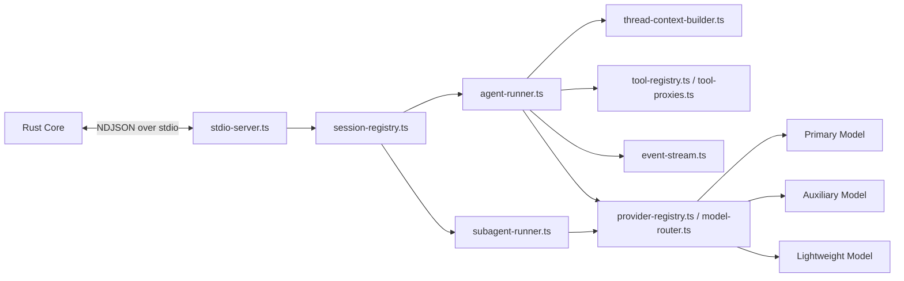

# Agent Sidecar Design

## Summary

This document defines the `TS Agent Sidecar` subsystem for Tiy Agent.

The sidecar is a long-lived TypeScript process that hosts `pi-agent` runtime capabilities, model routing, internal tool descriptions, and structured event emission. It is the decision layer of the system, not the trusted execution layer.

Its responsibilities are intentionally narrow:

- run agent loops
- route model requests by role
- orchestrate `SubAgent` helper tasks under one parent run
- expose tool descriptions
- build prompt context from Rust-provided snapshots
- return structured events to Rust

It must not directly access local files, Git, PTY, or privileged system resources.

## Goals

- host `pi-agent` in a reusable long-lived process
- multiplex many thread runs through one sidecar process
- isolate sessions by `thread_id + run_id`
- support role-based provider routing and model selection
- execute `SubAgent` helper tasks with the auxiliary model defined by `Agent Profile`
- support explicit `default` and `plan` run modes
- emit stable structured events over a versioned protocol
- keep all privileged execution delegated to Rust

## Non-Goals

- no direct filesystem access
- no direct Git or terminal execution
- no local database ownership
- no per-request process spawn model
- no direct event stream from sidecar to frontend

## Context

The system deliberately avoids two extremes:

- running the full agent loop in the frontend
- rebuilding the agent runtime entirely in Rust

The sidecar exists as the pragmatic middle layer:

- close enough to reuse `pi-agent` and provider SDKs
- separated enough to keep UI smooth and permission boundaries clean
- replaceable enough that Rust remains the stable system core

## Requirements

### Functional

- accept run start and cancel requests from Rust
- construct execution context from Rust-provided thread snapshots
- route model calls based on provider and `Agent Profile` role settings
- select primary, auxiliary, and lightweight models from the frozen run model plan
- alter agent-loop behavior according to `run_mode`
- describe available tools to the agent
- emit structured message, reasoning, plan, queue, and tool request events
- emit child `SubAgent` lifecycle events when helper tasks are used
- accept tool results from Rust and continue the loop
- respond to settings changes without process restart where practical

### Non-Functional

- cold start happens once at app boot, not once per run
- many thread runs should coexist without leaking session state
- protocol framing must be streaming-friendly and cross-platform
- sidecar failure must be detectable and recoverable by Rust
- secrets and privileged resources should remain minimized inside sidecar scope

## Core Decisions

### Single Long-Lived Sidecar Process

Use one persistent sidecar process per desktop app instance.

Benefits:

- avoids repeated cold start cost
- allows provider client reuse
- keeps runtime diagnostics centralized
- simplifies versioning and lifecycle management

Trade-off:

- requires robust session isolation and crash handling
- requires explicit health measurement and restart policy

### `Agent Profile` Supplies a Role-Based Model Plan

The sidecar should not assume "one run equals one model."

Instead, each run receives a frozen model plan derived from `Agent Profile`, typically including:

- primary model for the main task loop
- auxiliary model for `SubAgent` helper work
- lightweight model for cheap routing, classification, or formatting steps

The sidecar consumes that plan for the lifetime of the run.

### `SubAgent` Uses the Auxiliary Model by Default

When the planner determines that helper work should be delegated, the sidecar should use the auxiliary model unless the run's effective model plan explicitly overrides that choice.

This keeps:

- main reasoning on the primary model
- helper exploration and delegated tasks on the auxiliary model
- cheap support work on the lightweight model

### `Plan` Mode Is Evaluated in the Sidecar but Enforced by Rust

When `run_mode = Plan`, the sidecar should bias toward:

- planning
- decomposition
- sequencing
- option analysis

But final execution constraints still belong to Rust policy and gateway layers.

When transitioning from planning to execution, the sidecar should also respect the execution-start strategy chosen by Rust:

- `ContinueInThread`: consume the normal thread snapshot
- `CleanContextFromPlan`: consume the reduced execution snapshot derived from the approved plan artifact

### Session Isolation Key Is `thread_id + run_id`

`thread_id` alone is insufficient because one thread can have many runs over time. `run_id` alone is insufficient because tooling and UI often reason from the thread outward.

Use both to isolate:

- prompt assembly state
- internal tool loop state
- output buffers
- cancellation routing

### Protocol Uses JSON-RPC Style Messages Over NDJSON Framing

This matches the main architecture choice because it:

- avoids opening local HTTP ports
- works well with stdio-managed sidecars
- supports multiplexed requests and events
- stays portable across desktop targets

## High-Level Architecture



## Recommended Structure

```text
agent-sidecar/
  src/
    main.ts
    transport/
      stdio-server.ts
      protocol.ts
    runtime/
      session-registry.ts
      agent-runner.ts
      subagent-runner.ts
      thread-context-builder.ts
    providers/
      provider-registry.ts
      model-router.ts
    tools/
      tool-registry.ts
      tool-proxies.ts
    output/
      event-stream.ts
```

## Runtime Model

### Process Lifecycle

1. Rust starts sidecar during app setup
2. sidecar performs boot checks and reports protocol version
3. Rust marks sidecar healthy
4. runs are multiplexed through the same process
5. if process exits unexpectedly, Rust restarts it and marks active runs interrupted

### Health Contract

Rust should treat sidecar health as an explicit protocol concern rather than inferring it only from process liveness.

Recommended health signals:

- `rss_bytes`
- `event_loop_lag_ms`
- `active_run_count`
- `uptime_ms`

Recovery rules:

- stop admitting new runs before restart begins
- mark active runs as `Interrupted` before tearing down the process
- restart gracefully when thresholds are exceeded, not only after a hard crash
- keep multi-sidecar support out of v1, but avoid protocol assumptions that make it impossible later

### Session Lifecycle

1. Rust sends `agent.run.start`
2. sidecar creates session context for `thread_id + run_id`
3. sidecar loads the frozen model plan, `run_mode`, and execution-start strategy for that run
4. main agent loop executes and may invoke `SubAgent` child tasks
5. sidecar waits for tool results or approval outcomes when needed
6. session is cleaned up on completion, failure, or cancel

## Role-Based Model Routing

Each run should receive a resolved model plan from Rust rather than lazily querying mutable profile state.

Recommended shape:

- `primary`: main task execution
- `auxiliary`: `SubAgent` helper tasks
- `lightweight`: cheap classification, summarization, or formatting support

`model-router.ts` should select provider clients by role instead of by one global default.

Important rule:

- `SubAgent` orchestration is internal to the sidecar, but model-role selection must still be deterministic and observable from the parent run metadata.

## Run Modes

Recommended run modes:

- `default`
- `plan`

### `default`

- normal task execution loop
- standard tool-selection behavior subject to policy

### `plan`

- plan-first loop
- should prefer internal tools and read-only retrieval tools
- should treat mutating actions as exceptional and policy-gated

## Execution-Start Strategies

These only apply to `default` execution runs launched from a prior plan.

### `ContinueInThread`

- normal thread snapshot semantics
- prior planning context may remain visible to the agent

### `CleanContextFromPlan`

- reduced execution snapshot
- execution begins from approved plan artifact and execution seed
- historical planning messages remain durable in storage but are not injected wholesale into the prompt window

## Context Building

The sidecar should not query storage directly.

Instead, Rust sends a normalized thread snapshot containing:

- thread metadata
- recent messages
- historical summary segments
- pending approvals if relevant
- workspace metadata safe for prompt construction
- frozen model-plan inputs derived from `Agent Profile`
- `run_mode`
- `execution_strategy`

The `thread-context-builder` is responsible for:

- assembling the prompt window
- trimming oversized context
- injecting tool descriptions
- preserving ordering between summaries and recent messages
- preparing scoped context for child `SubAgent` tasks when helper delegation is used

## Tool Model

### Internal Tools

These remain sidecar-local because they do not cross system boundaries:

- `summarize_context`
- `rewrite_plan`
- `rank_candidates`
- `format_final_response`

### System Tools

These are described in TypeScript but executed in Rust:

- `read_file`
- `list_dir`
- `search_repo`
- `write_file`
- `apply_patch`
- `git_*`
- `run_command`
- `create_terminal`
- `terminal_write`
- `marketplace_install`
- `mcp_call`

The sidecar's job is to translate model-selected tool calls into structured requests and to continue the loop when Rust returns a result.

## Protocol

### Requests from Rust

- `agent.run.start`
- `agent.run.cancel`
- `agent.tool.result`
- `agent.thread.snapshot`
- `agent.auxiliary.task`
- `agent.settings.changed`

`agent.auxiliary.task` is the generic helper-task entry point for Rust-initiated sidecar assistance that does not start or resume a normal run loop.

Recommended v1 task types:

- `summarize_thread_window`
- `derive_execution_seed`

This keeps the protocol compact while still covering:

- thread compaction requests from Rust
- plan-to-execution seed derivation from a persisted plan artifact

Recommended payload shape:

- `auxiliary_task_id`
- `task_type`
- `workspace_id`
- task-specific structured payload

Response semantics:

- `agent.auxiliary.task` uses normal JSON-RPC request-response semantics on the same `id`
- successful auxiliary-task results should return in the response payload rather than through the event stream
- auxiliary-task failures should also return as structured response errors rather than emitting ad hoc failure events

### Events to Rust

- `agent.run.started`
- `agent.message.delta`
- `agent.message.completed`
- `agent.plan.updated`
- `agent.reasoning.updated`
- `agent.queue.updated`
- `agent.subagent.started`
- `agent.subagent.completed`
- `agent.subagent.failed`
- `agent.tool.requested`
- `agent.run.completed`
- `agent.run.failed`

### Protocol Rules

- every request and event must include protocol version
- every run-scoped payload must include `thread_id` and `run_id`
- every child `SubAgent` event must also include child task identity
- `agent.run.start` payload should include `run_mode`
- `agent.run.start` payload should include execution-start strategy when launching from a plan
- `agent.auxiliary.task` should resolve by response on the same request `id`, not by a separate event
- sidecar must not emit undeclared event names
- recoverable provider errors should surface as structured failures, not process exits

## Error Handling

### Recoverable Errors

- provider rate limit
- malformed tool arguments from model output
- prompt context overflow
- transient network errors
- auxiliary model unavailable for `SubAgent`
- lightweight model fallback selection failure
- invalid or unsupported `run_mode`
- invalid execution-start strategy

These should become structured run failures or tool-request corrections rather than crashing the process.

### Fatal Errors

- protocol version mismatch
- unrecoverable boot failure
- corrupted in-memory registry state

These should cause fast process exit so Rust can restart and surface interruption clearly.

## Security Boundaries

- the sidecar receives only the data needed for the current run
- privileged execution remains in Rust
- the sidecar must not inherit unconstrained filesystem authority
- settings updates should be validated by Rust before forwarding
- secrets should be passed minimally and rotated by replacing runtime config, not by requiring sidecar-owned persistence

## Failure Modes

| Failure | Impact | Mitigation |
|---|---|---|
| sidecar crash | active runs stop | Rust restart + mark runs interrupted |
| memory leak across sessions | degraded long-lived process | explicit session cleanup + health metrics |
| protocol drift | broken communication | protocol version handshake at startup |
| provider SDK hang | blocked run | per-request timeout and abort strategy |
| tool schema mismatch | agent loop confusion | schema validation on both Rust and TS sides |
| helper-model recursion explosion | cost and latency spike | enforce `SubAgent` depth and fan-out limits |
| profile drift during active run | inconsistent model use | consume frozen model plan only |

## ADR

### ADR-S1: Use one long-lived TypeScript sidecar with stdio protocol

#### Status

Accepted

#### Context

The product needs `pi-agent` reuse and modern provider SDK support, while preserving strong local-system permission boundaries and responsive UI behavior.

#### Decision

Host the agent runtime in a single long-lived TypeScript sidecar, communicate with Rust over JSON-RPC style NDJSON messages on stdio, and forbid direct privileged system access from the sidecar.

#### Consequences

##### Positive

- reuses mature agent runtime components
- avoids UI thread contention
- keeps Rust as the trusted execution layer

##### Negative

- requires protocol and lifecycle management
- introduces one more process boundary

##### Alternatives Considered

- run agent in the frontend
- reimplement agent runtime in Rust

The frontend option weakens isolation and responsiveness. The pure-Rust option increases delivery cost and delays productization.

## Implementation Notes

- keep sidecar logs structured as JSON
- expose health metrics to Rust for observability
- clear session state aggressively on terminal run states
- avoid hidden local caches that can diverge from Rust truth
- keep `SubAgent` context isolated from sibling child tasks except through explicit parent aggregation
- make `plan` behavior a deterministic runner configuration, not a prompt-only convention
- keep reduced execution snapshots explicit so "clean context" is never mistaken for deleted history
