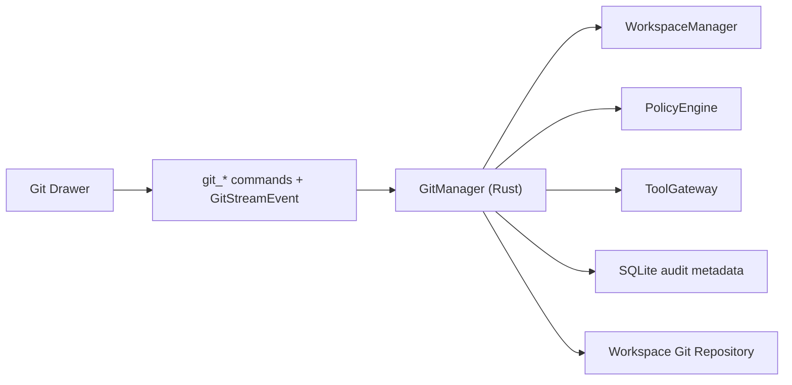

# Git Design

## Summary

This document defines the `Git` subsystem for Tiy Agent.

The Git subsystem exists to provide repository awareness and controlled source-control actions inside the workbench. It should support the product goal of “thread + project + Git + terminal” collaboration without turning Git into an unrelated mini-application.

In this architecture:

- Git computation and execution belong in Rust
- Git UI rendering belongs in React
- dangerous Git mutations must pass through policy and approval

The subsystem therefore needs to balance fast local inspection with controlled mutation.

## Goals

- provide fast repository snapshot loading for the Git drawer
- support status, staged state, diff, and history browsing
- support selected Git mutations with policy control
- stream incremental Git refresh results to the frontend
- keep large diff and history loading scalable for medium repositories
- tie Git actions cleanly back to thread and tool history when invoked by the agent

## Non-Goals

- no full Git client parity in v1
- no branch conflict resolution UI in v1
- no direct Git execution in the frontend or sidecar
- no uncontrolled remote network actions bypassing policy

## Context

The PRD positions Git as an auxiliary panel serving the active thread workflow. The technical architecture requires:

1. Git operations run in Rust for performance and trust reasons
2. Git results should prefer incremental refresh
3. dangerous actions must route through `PolicyEngine`

That means the Git subsystem must handle two very different workloads:

- frequent read-heavy repository inspection
- lower-frequency but higher-risk mutations and remote operations

## Requirements

### Functional

- detect whether the current workspace is backed by Git
- load repository status snapshot
- load staged and unstaged file groups
- load commit history
- load single-file diff content
- support stage, unstage, commit, fetch, pull, and push
- emit incremental refresh events to the frontend
- integrate with tool execution when the agent performs Git actions

### Non-Functional

- initial Git drawer open should feel fast on medium repositories
- large diff payloads should avoid full eager materialization
- refresh should prefer event-triggered snapshot recomputation over blind polling loops
- remote actions must remain policy-gated and auditable
- Git failures should be surfaced structurally, not as opaque shell text only

## Core Decisions

### Use a Git-Native Backend in Rust

Rust should own Git operations either through a Git library, controlled command execution, or a hybrid strategy where needed for compatibility.

The key requirement is that the Git subsystem exposes typed results, not raw unstructured command blobs, to the rest of the app.

### Separate Snapshot Reads from Mutating Actions

Read flows such as:

- status
- diff preview
- history load

should be optimized for responsiveness.

Mutating flows such as:

- stage
- unstage
- commit
- fetch
- pull
- push

should route through explicit policy handling and audit.

### Event-Triggered Snapshot Refresh Is Preferred Over Polling Loops

The frontend should receive:

- one initial Git snapshot
- later snapshot refreshes when Git-relevant actions occur
- optional derived UI diff events where practical

This keeps the backend honest about Git's real cost model while still allowing the UI to optimize rendering.

## High-Level Architecture



## Repository Model

### Git Scope

Git state should be keyed by:

- `workspace_id`
- `repo_root`

This allows a workspace to determine whether Git features are available and where repository-relative actions should anchor.

### Recommended Snapshot Shape

```rust
pub struct GitSnapshot {
    pub workspace_id: String,
    pub repo_root: PathBuf,
    pub head_ref: Option<String>,
    pub ahead_count: u32,
    pub behind_count: u32,
    pub staged_files: Vec<GitFileEntry>,
    pub unstaged_files: Vec<GitFileEntry>,
    pub untracked_files: Vec<GitFileEntry>,
    pub recent_commits: Vec<GitCommitSummary>,
    pub last_refreshed_at: DateTime<Utc>,
}
```

### Recommended Diff Model

```rust
pub struct GitDiffChunk {
    pub file_path: PathBuf,
    pub section_kind: DiffSectionKind,
    pub text: String,
    pub chunk_index: u32,
    pub is_last: bool,
}
```

Diff should be chunkable so the UI can render progressively for large files.

## Action Classification

### Read-Only Actions

- `git_get_snapshot`
- `git_get_diff`
- `git_get_history`
- `git_get_file_status`

These may often be auto-allowed within the current workspace.

### Mutating Local Actions

- `git_stage`
- `git_unstage`
- `git_commit`

These may be auto-allowed or approval-gated depending on policy.

### Mutating Remote Actions

- `git_fetch`
- `git_pull`
- `git_push`

These should always consider network policy in addition to Git mutation risk.

## Refresh Model

### Initial Snapshot

When the Git drawer opens:

1. frontend requests snapshot
2. Rust resolves workspace repository root
3. Rust loads status, staged groups, and recent history in parallel where possible
4. Rust returns one typed snapshot

### Event-Triggered Refresh

Later changes should emit:

- `refresh_started`
- `snapshot_updated`
- `refresh_completed`

If needed later, Rust may also emit derived `file_delta` or `history_delta` events based on diffing old and new snapshots, but those are UI optimizations rather than Git-native incremental reads.

## Integration with Thread and Tool Systems

### User-Initiated Git Actions

- read actions from the Git drawer may call `GitManager` commands directly
- mutating actions should reuse the same policy primitives and audit schema that agent-initiated actions use
- the UI entry path may differ, but the backend execution and audit model should stay aligned

Recommended implementation rule:

- user-triggered mutations should emit a shared `AuditRecord` into durable audit storage even when they do not create a `tool_calls` row

### Agent-Initiated Git Actions

- sidecar requests Git tool calls through `ToolGateway`
- `GitManager` executes the typed action
- results are returned to sidecar and surfaced in thread history

This keeps one Git execution model, even if the UI entry points differ.

## Error Model

### Structured Errors Should Distinguish

- not a Git repository
- repository inaccessible
- merge or rebase state blocks action
- remote authentication failed
- network disabled by policy
- commit message invalid

The UI should be able to render these without scraping raw CLI stderr.

## Key Flows

### Open Git Drawer

1. frontend requests `git_get_snapshot`
2. Rust validates workspace and repo availability
3. Rust gathers status and history
4. snapshot is returned
5. follow-up refreshes arrive as `snapshot_updated` events, with optional derived UI diffs

### View Single-File Diff

1. user selects file
2. frontend requests diff for that file
3. Rust generates diff in chunks or paged sections
4. frontend renders progressively

### Commit Changes

1. user enters commit message
2. frontend requests commit action
3. Rust validates policy and repository state
4. commit executes
5. audit and Git snapshot refresh are emitted

### Agent Push Request

1. sidecar requests `git_push`
2. `ToolGateway` asks `PolicyEngine` for verdict
3. if allowed, `GitManager` performs push
4. result and audit metadata return to sidecar and frontend

## Failure Modes

| Failure | Impact | Mitigation |
|---|---|---|
| large repository snapshot too slow | sluggish drawer open | parallel load + cached snapshot + event-triggered refresh |
| oversized diff payload | UI freeze risk | chunked diff loading |
| repo state changes during action | stale snapshot | refresh after mutation and return structured warning |
| remote blocked by policy | push/pull/fetch unavailable | explicit policy error surfaced to UI |
| detached or unusual HEAD state | confusing UX | include head metadata and structured state indicator |

## ADR

### ADR-G1: Git reads optimize for snapshots, Git writes route through policy-aware execution

#### Status

Accepted

#### Context

The product needs Git inspection to feel lightweight, but Git mutations and remote actions are privileged and potentially destructive.

#### Decision

Implement Git as a Rust-owned typed subsystem with fast snapshot reads and policy-gated mutations. Prefer event-triggered snapshot recomputation, with optional derived UI diffs, over pretending Git offers a cheap native delta stream.

#### Consequences

##### Positive

- responsive Git drawer behavior
- consistent audit and permission handling
- clear separation between browsing and mutating

##### Negative

- more backend modeling effort than shelling out ad hoc
- snapshot diff derivation still needs careful state handling

##### Alternatives Considered

- treat every Git action as generic command execution
- keep Git logic mostly in frontend state

Both were rejected because they weaken structure, observability, and performance.

## Implementation Notes

- place logic in `src-tauri/src/core/git_manager.rs`
- prefer typed repository results over raw command text
- keep diff loading lazy and chunk-aware
- route remote actions through network-aware policy checks
