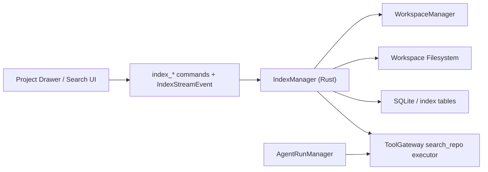

# Index Design

## Summary

This document defines the `Index` subsystem for Tiy Agent.

The index subsystem exists to accelerate repository search and context retrieval without making the frontend or sidecar scan the filesystem directly. It is the backend read-optimization layer for workspace-aware discovery.

In v1, the index focuses on practical local developer workflows:

- file tree caching
- text search
- rebuildable workspace metadata

It is not yet a semantic vector platform. That can come later.

## Goals

- provide fast workspace-scoped file discovery
- avoid overbuilding a custom indexing engine before product demand exists
- support `search_repo` and related context retrieval tools
- provide a cached project tree view for UI consumers
- leave a clean extension path for semantic retrieval later

## Non-Goals

- no embeddings requirement in v1
- no remote indexing service
- no frontend-side repository scanning
- no sidecar-owned search index

## Context

The technical architecture explicitly assigns index construction and repository search to Rust. The system needs indexing for three reasons:

1. the project drawer should not repeatedly walk large directories from the UI
2. tool calls such as `search_repo` need efficient repository search
3. future context selection should not rely on brute-force file reads

This makes `IndexManager` a shared internal service for both product UI and agent tooling.

## Requirements

### Functional

- build and update workspace-scoped file tree cache
- expose text search through a controlled `ripgrep`-style backend
- expose `rg`-style search semantics for agent and UI flows
- emit indexing progress events for long-running scans

### Non-Functional

- initial index bootstrapping should not block the whole workbench
- refresh behavior should stay simple and explainable in v1
- indexing should tolerate large repositories reasonably
- hot search queries should be low-latency
- index rebuild should be possible from source of truth without data loss

## Core Decisions

### Index Is a Derived Cache, Not a Source of Truth

The filesystem remains the truth. The index is a rebuildable optimization layer.

This means:

- stale index state should never silently overwrite files
- index corruption can be handled by rebuild
- project tree rendering and search can rely on index data, but execution tools should still validate against current filesystem state

### One Workspace, One Logical Index Scope

Index entries should be keyed by workspace. This keeps search results, project tree cache, and recent-file ranking aligned with the workspace boundary already used elsewhere in the product.

### Favor File Tree Cache Plus `ripgrep` Search in v1

V1 should optimize for:

- file tree cache
- path and filename search
- `ripgrep`-backed text search

This is the lowest-risk path with the highest immediate product value.

## High-Level Architecture



## Index Layers

### Layer 1: File Tree Cache

Stores:

- normalized paths
- directory structure
- file type hints
- modified timestamps

Used by:

- project drawer rendering
- quick file lookup

### Layer 2: Text Search Backend

Implementation direction:

- invoke `ripgrep` with workspace scoping and ignore rules
- normalize results into typed snippets for UI and tools
- cache hot search metadata only where it measurably helps

Used by:

- `search_repo`
- context discovery

### Layer 3: Activity Signals

Deferred to v2.

When introduced later, this layer may derive:

- recently opened files
- recently modified files
- thread-referenced files

## Recommended Types

```rust
pub struct SearchQuery {
    pub workspace_id: String,
    pub text: String,
    pub path_filter: Option<String>,
    pub limit: usize,
}

pub struct SearchResult {
    pub file_path: PathBuf,
    pub score: f32,
    pub snippet: Option<String>,
    pub line_number: Option<u32>,
}

pub enum IndexStatus {
    Idle,
    Scanning,
    Ready,
    Failed,
}
```

## Scan Model

### Initial Scan

1. workspace becomes active or newly added
2. Rust schedules scan
3. directory walk builds tree cache
4. progress events stream to frontend if relevant
5. index becomes `Ready`

### Incremental Update

Possible triggers:

- app-triggered refresh
- explicit user refresh
- file modification observation in future versions
- Git or tool activity that indicates file changes

V1 does not require a sophisticated watcher or a persistent content inverted index if simpler refresh triggers are enough to ship safely.

## Search Model

### Search Semantics

`search_repo` should support:

- plain text matching
- path filtering
- workspace scoping
- ranked results
- snippet preview

Ranking may combine:

- textual match quality
- filename/path relevance
- thread-local relevance heuristics later

### Project Tree Usage

The project drawer should prefer index-backed file tree data for responsiveness, while still allowing fallback rebuild when cache is cold or invalid.

## Storage Strategy

The architecture already adopts SQLite. Index data may use:

- dedicated cache tables for tree metadata
- FTS5 or custom indexing only when `ripgrep` proves insufficient
- rebuildable caches keyed by `workspace_id`

Important rule:

- raw file contents should not be duplicated unnecessarily outside what the indexing method requires

## Key Flows

### Open Project Drawer

1. frontend requests tree data
2. Rust returns cached tree if warm
3. if cold, Rust returns partial tree or loading state
4. background scan completes and sends updates

### `search_repo` Tool Call

1. sidecar requests repository search through `ToolGateway`
2. search executor queries `IndexManager`
3. ranked results return with snippets
4. sidecar uses results for context selection or answer synthesis

### Rebuild Index

1. user or system triggers rebuild
2. old index is marked stale
3. new scan runs from filesystem truth
4. successful rebuild atomically replaces stale read model

## Failure Modes

| Failure | Impact | Mitigation |
|---|---|---|
| tree cache stale after file changes | outdated project drawer | refresh triggers + staleness metadata |
| huge repo scan too heavy | poor startup responsiveness | background scan + partial readiness |
| binary or generated files pollute search | noisy results | file eligibility filters and ignore rules |
| `ripgrep` unavailable or fails | broken text search | surface structured error and keep file tree cache available |
| search result points to removed file | dead link | validate file existence on open |

## ADR

### ADR-I1: Index is a rebuildable workspace-scoped optimization layer

#### Status

Accepted

#### Context

The product needs faster project browsing and repository search than naive filesystem scans can provide, but it does not yet need full semantic retrieval complexity.

#### Decision

Implement `IndexManager` as a Rust-owned, workspace-scoped derived cache that provides file tree caching and `ripgrep`-backed text search in v1. Defer inverted indexing, activity signals, and semantic retrieval until product demand justifies the added complexity.

#### Consequences

##### Positive

- strong immediate value for UI and tools
- low-risk v1 scope
- clean future path to richer retrieval
- lower implementation and maintenance complexity for v1

##### Negative

- requires invalidation and rebuild logic
- can serve stale results if refresh discipline is weak
- `ripgrep` startup cost may need future optimization if usage becomes very frequent

##### Alternatives Considered

- brute-force scan the filesystem on every search
- jump straight to embeddings-first retrieval

The first is too slow for repeated use. The second adds complexity before the product needs it.

## Implementation Notes

- place logic in `src-tauri/src/core/index_manager.rs`
- keep file tree cache and text search abstraction conceptually separate
- start with a `ripgrep` wrapper and only add FTS5 or custom indexing when needed
- keep index optional for correctness but preferred for performance
