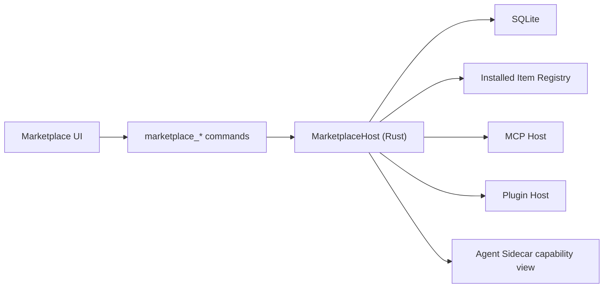

# Marketplace and Automation Design

## Summary

This document defines the `MarketplaceHost` design direction for Tiy Agent and records how `Automation Scheduler` is deferred beyond v1.

Marketplace is the product-facing extension management center. Automation is one extension category inside that ecosystem. The backend challenge is not just listing installable items. It is safely hosting, enabling, disabling, and observing extension-backed capabilities without breaking the app's permission boundary.

This subsystem therefore has two linked responsibilities:

- manage extension catalog state and local installation state
- host the runtime lifecycle of installable capabilities such as Skills, MCPs, and Plugins

## Goals

- make Marketplace the single management surface for installable capabilities
- separate catalog items from running extension instances
- support install, enable, disable, uninstall, and detail inspection flows
- safely host MCP and plugin lifecycles in Rust
- model automations as first-class marketplace items in Marketplace state
- expose enabled capabilities to agent tooling without weakening system boundaries

## Non-Goals

- no remote marketplace backend requirement in v1
- no multi-user extension permission system in v1
- no direct extension execution in the frontend
- no extension bypass around `ToolGateway` and `PolicyEngine`

## Context

The PRD defines Marketplace as a full-screen center managing:

- Skills
- MCP
- Plugins
- Automations

The technical architecture adds a critical implementation rule:

- marketplace item is only the directory or metadata entry
- actual running MCP or plugin processes are hosted by Rust

This matters because catalog state and runtime state are not the same thing.

Examples:

- an item may be installed but disabled
- an item may be enabled but temporarily unhealthy
- an automation may be installed and enabled even though no scheduler exists yet
- a plugin may be catalog-visible yet blocked from using privileged tools directly

## Requirements

### Functional

- list marketplace items by category and state
- persist install and enable state locally
- load item details including source and version metadata
- install and uninstall supported item types
- enable and disable supported item types
- host runtime processes for MCP and plugins
- register enabled capabilities with the agent tool surface
- reserve automation runtime state for a later phase without blocking current Marketplace design
- surface runtime health where applicable

### Non-Functional

- extension runtime failure should not crash the main app
- enable and disable actions should be observable and recoverable
- hosted capabilities must preserve the global permission boundary
- item state should survive app restart

## Core Decisions

### Separate Catalog State from Runtime State

Catalog state describes what the user sees in Marketplace:

- installed or not
- enabled or not
- version
- source
- category

Runtime state describes what the host is currently doing:

- process running or stopped
- unhealthy or healthy
- optional future scheduler metadata such as next run time or last result

Keeping these distinct avoids a common failure mode where UI labels lie about real runtime health.

### Rust Hosts Active Extension Lifecycles

Frontend may render management UI. Sidecar may consume enabled tool descriptors. But active extension runtime ownership belongs in Rust.

This applies especially to:

- MCP servers
- plugin processes

### Automations Are Marketplace Items, but Scheduler Is Deferred to Phase 3

Automation should not become a totally separate product line in v1. Instead:

- installation and enablement live in Marketplace
- scheduler tables and interfaces may be reserved
- real runtime scheduling and execution stay out of Phase 1-2 scope

## High-Level Architecture



## Item Model

### Primary Table

```text
marketplace_items
  item_id
  category
  source
  version
  installed
  enabled
  updated_at
```

### Automation Runtime Table

```text
automation_runs
  id
  automation_id
  status
  started_at
  finished_at
  result_summary
```

This table is reserved for Phase 3. V1 does not require the scheduler to populate it.

### Recommended Runtime Types

```rust
pub enum MarketplaceCategory {
    Skill,
    Mcp,
    Plugin,
    Automation,
}

pub enum RuntimeHealth {
    Unknown,
    Healthy,
    Degraded,
    Failed,
    Stopped,
}
```

## State Model

### Catalog State

- `NotInstalled`
- `InstalledDisabled`
- `InstalledEnabled`

### Runtime State

- `NotRunning`
- `Starting`
- `Running`
- `Stopping`
- `Failed`

Catalog state drives user intent. Runtime state reflects actual host status.

## Item-Type Responsibilities

### Skills

- mostly metadata-managed capability packages
- may expose prompts or tool descriptions
- do not imply separate privileged process ownership by default

### MCP

- hosted as controlled local processes or connections managed by Rust
- available tools must still respect gateway and policy rules

### Plugins

- hosted by Rust with explicit lifecycle control
- plugin capabilities must not gain unrestricted system access by virtue of being enabled

### Automations

- configured, installed, enabled, and displayed through Marketplace
- no scheduler-backed execution in v1
- runtime rows and execution history are reserved for a later phase

## Scheduler Model

### Phase 3 Direction

When the scheduler is eventually introduced, automation execution should reuse the existing execution model wherever possible instead of inventing a separate command universe.

That means an automation may:

- open or create a thread
- trigger agent execution
- invoke tools through normal policy paths
- write run records for audit and user review

### Scheduler Responsibilities

- persist automation definitions and active status
- calculate next run time
- trigger execution when due
- prevent overlapping runs for the same automation unless explicitly supported later
- persist result summary and timestamps

## Capability Exposure to the Agent

The sidecar should receive a derived view of enabled capabilities, not raw marketplace internals.

This derived view may include:

- enabled tool descriptors
- extension-provided schemas
- automation visibility metadata if needed

But final execution authority still remains in Rust.

## Key Flows

### Install Marketplace Item

1. frontend requests install
2. Rust validates item metadata and source
3. installation state is persisted
4. if runtime assets are needed, Rust prepares them
5. Marketplace UI refreshes item state

### Enable MCP or Plugin

1. user enables installed item
2. Rust persists enabled state
3. host attempts to start runtime
4. runtime health is tracked separately
5. enabled capabilities become visible to the agent view only after successful registration

### Run Automation

Deferred to Phase 3.

V1 only requires:

1. Marketplace 展示 automation 项
2. install / enable / disable 状态持久化
3. 为将来 scheduler 预留 schema 和 capability shape

### Disable or Uninstall Item

1. user disables or uninstalls item
2. Rust stops runtime if running
3. capability exposure is removed
4. catalog state is updated
5. history and audit remain queryable

## Failure Modes

| Failure | Impact | Mitigation |
|---|---|---|
| plugin crash | capability unavailable | isolate process, mark runtime failed, keep app alive |
| enabled item unhealthy | UI says enabled but feature unusable | separate catalog state from runtime health |
| extension tries to bypass system tools | security boundary erosion | all privileged execution still routed through ToolGateway |
| uninstall with existing history | broken audit references | keep immutable history separate from install state |

## ADR

### ADR-M1: Marketplace items are catalog entries, active runtimes are Rust-hosted capabilities

#### Status

Accepted

#### Context

The product needs an extensibility layer that feels user-manageable in Marketplace while preserving app stability and local permission safety.

#### Decision

Model Marketplace items as persisted catalog entries and host active MCP and plugin runtime behavior in Rust. Treat automations as Marketplace catalog items in v1, while deferring scheduler execution to a later phase. Keep agent-facing capability exposure derived from enabled runtime state rather than direct catalog state.

#### Consequences

##### Positive

- clear distinction between install state and runtime health
- safer extension lifecycle management
- easier observability and recovery
- avoids implementing unverifiable scheduler complexity too early

##### Negative

- runtime host implementation is more involved than static metadata management
- extension onboarding requires more explicit contracts
- automation execution is intentionally incomplete until Phase 3

##### Alternatives Considered

- treat enabled marketplace items as directly executable from frontend or sidecar
- make automations a separate subsystem unrelated to Marketplace

Both were rejected because they fragment management and weaken safety.

## Implementation Notes

- place host logic in `src-tauri/src/core/marketplace_host.rs`
- reserve `src-tauri/src/core/automation_scheduler.rs` for Phase 3
- keep runtime health separate from install state in storage or derived memory
- ensure extension-provided tools still enter through normal gateway and policy paths
