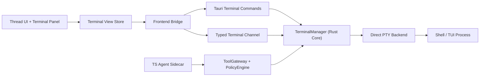

# Thread Terminal Design

## Summary

This document defines the terminal architecture for Tiy Agent's multi-thread workbench under the current:

- `Tauri 2 + Rust Core`
- `TypeScript + React`
- `TS Agent Sidecar (pi-agent)`
- `AI Elements`

architecture.

The original terminal direction remains correct, but the terminal subsystem now needs to align with the larger system design:

- terminal ownership belongs entirely to Rust Core
- the TS Agent Sidecar must not own or directly manage PTY sessions
- terminal data should flow to the frontend through typed Rust channels, not ad hoc event names
- agent-triggered terminal actions must go through the same Rust `ToolGateway` and `PolicyEngine` used by other system tools
- terminal persistence should focus on session metadata and bounded replay buffers, not full transcript mirroring in React or SQLite

## Goals

- each thread owns an independent terminal session
- multiple thread terminals can stay active at the same time
- switching the visible thread must not interrupt hidden thread terminal state
- terminal interaction should feel close to a native system terminal
- terminal design must fit the new `Rust Core + TS Agent Sidecar` architecture without introducing split ownership
- terminal execution must respect the same policy and approval model as other high-risk tools

## Non-Goals

- no multi-tab terminals inside one thread in v1
- no app-restart terminal restoration in v1
- no full terminal transcript persistence to the primary database in v1
- no direct terminal ownership inside the agent sidecar

## Updated Design Decisions

- allow each thread to create zero or one PTY-backed shell session on demand in v1
- keep PTY lifecycle in Rust Core, independent from React lifecycle and sidecar lifecycle
- let the frontend own only terminal presentation and lightweight session metadata
- do not route raw terminal output through the TS Agent Sidecar
- expose terminal to the agent only through structured terminal tools proxied by Rust
- use typed Tauri channels for terminal streams
- defer `tmux` or other persistence-oriented backends until session restore becomes a real product requirement

## Context

The current app already has a bottom terminal panel in the workbench shell, but it is still a UI placeholder.

The broader application architecture now makes three boundaries explicit:

1. React is the presentation layer.
2. Rust Core is the trusted execution layer.
3. The TS Agent Sidecar is the decision layer.

Under this model, terminal is not just a UI panel. It is a privileged subsystem that touches:

- local shell processes
- PTY state
- filesystem context
- command execution risk
- thread-scoped execution history

That means terminal must be designed as a first-class Rust subsystem, not as a frontend widget and not as a sidecar-managed runtime.

## Requirements

### Functional

- create a terminal session on demand for a thread
- keep at most one isolated terminal session per thread in v1
- allow many thread terminals to run concurrently
- keep hidden thread terminals alive when the user switches threads
- support standard shell workflows and full-screen TUI tools
- support resize, input, exit detection, restart, and close
- show per-thread terminal metadata such as running state and unread output
- allow the agent to inspect or act on a terminal only through approved structured terminal tools

### Non-functional

- terminal rendering must stay smooth while background threads continue producing output
- frontend updates should stay scoped to the affected thread
- raw terminal output must not be mirrored into React state
- the backend must be able to reclaim closed sessions cleanly
- design should be cross-platform friendly even if macOS is the primary dev target
- the architecture must preserve a single policy and security boundary for all command execution

## Decision

### Chosen Runtime Model

Use a direct PTY backend managed by Rust Core:

- `1 thread = 0..1 terminal session = 1 PTY = 1 shell process`
- Rust Core owns PTY creation, IO, resize, exit tracking, replay buffer, and cleanup
- React owns terminal presentation and panel interaction
- the TS Agent Sidecar may request terminal-related actions, but only through Rust tools

This keeps runtime ownership unambiguous and preserves the most native-feeling path:

- `xterm` in the UI
- PTY in Rust
- shell or TUI process inside that PTY

### Deferred Runtime Model

Do not introduce a `tmux` backend in v1.

We may add a backend abstraction later if product requirements explicitly include:

- terminal restore after app restart
- long-lived detached shell sessions
- cross-window reattach

Until then, keep the implementation optimized for one direct PTY backend rather than abstracting too early.

## High-Level Architecture



## Ownership Model

### React Owns

- terminal panel visibility
- terminal focus state
- active thread selection
- visible `xterm` instance lifecycle
- lightweight session metadata used for rendering

### Rust Owns

- PTY sessions
- shell process lifecycle
- input/write routing
- resize routing
- replay buffers
- unread output flags
- session metadata persistence
- policy enforcement

### TS Agent Sidecar Owns

- no PTY or shell state
- only terminal tool descriptions and terminal tool requests

## Backend Design

### Main Responsibility

Rust `TerminalManager` is the source of truth for terminal runtime state.

A thread terminal continues running even if:

- its UI is hidden
- the user switches to another thread
- the sidecar is idle
- the thread panel is collapsed

### Core Types

```rust
pub struct TerminalManager {
    sessions_by_thread: HashMap<String, TerminalSession>,
}

pub struct TerminalSession {
    pub session_id: String,
    pub thread_id: String,
    pub workspace_id: String,
    pub shell: String,
    pub cwd: PathBuf,
    pub env: BTreeMap<String, String>,
    pub cols: u16,
    pub rows: u16,
    pub status: TerminalStatus,
    pub started_at: SystemTime,
    pub last_active_at: SystemTime,
    pub unread_output: bool,
}

pub enum TerminalStatus {
    Starting,
    Running,
    Exited { code: Option<i32>, signal: Option<String> },
}
```

Runtime-only handles such as PTY master, writer, reader task, replay ring buffer, and kill handle should stay outside serializable DTOs.

### Recommended Rust Structure

- `src-tauri/src/commands/terminal.rs`
- `src-tauri/src/core/terminal_manager.rs`
- `src-tauri/src/core/policy_engine.rs`
- `src-tauri/src/core/tool_gateway.rs`
- `src-tauri/src/ipc/frontend_channels.rs`
- `src-tauri/src/model/errors.rs`

### TerminalManager Responsibilities

- ensure one session per thread
- resolve shell and cwd
- spawn PTY sessions
- stream output to frontend
- keep a bounded replay buffer per session
- expose restart and close
- emit state changes for unread/output/status

### Replay Buffer Strategy

Rust should maintain a bounded in-memory replay buffer per session.

Purpose:

- allow terminal UI reattach without storing the whole transcript in React
- support fast redraw when a visible terminal host remounts
- avoid database bloat from raw terminal output

V1 recommendation:

- bounded by bytes or lines per session
- not persisted across app restart
- used only for terminal view recovery, not auditing

## Session Lifecycle

1. User activates a thread.
2. Frontend calls `terminal_create_or_attach(threadId)`.
3. Rust returns an existing session if present.
4. Otherwise, Rust resolves the workspace cwd and spawns a PTY shell.
5. Reader task streams output through a typed terminal channel.
6. Switching away from the thread does not stop the PTY.
7. Closing the terminal explicitly kills the session.
8. If the thread is removed, the terminal session is also removed.

## Shell and CWD Resolution

Shell resolution order:

1. thread-specific override, if added later
2. app-level configured shell, if added later
3. user environment shell
4. platform fallback

CWD resolution order:

1. thread workspace root
2. explicit terminal override, if future product requires it

V1 decision:

- terminal cwd follows the owning thread's workspace root
- agent-triggered terminal operations cannot escape workspace policy boundaries

## Policy and Security

Terminal is a privileged subsystem and must align with the product's `Permissions` model.

### User-Initiated Terminal Input

If a user explicitly opens and types into their own terminal session:

- no extra approval prompt is required per keystroke
- execution is still constrained by terminal session cwd and environment policy

### Agent-Initiated Terminal Actions

If the agent wants to:

- create a terminal
- write commands into a terminal
- restart a terminal
- inspect terminal output

it must go through:

- `ToolGateway`
- `PolicyEngine`
- approval flow when required

### Hard Rules

- the sidecar never owns a PTY
- the sidecar never writes directly to shell stdin
- one thread terminal can never write into another thread terminal
- terminal tools must obey the same approval and sandbox decisions as other high-risk tools

## Frontend Design

### Store Strategy

Use a lightweight external store that matches the main frontend architecture.

It may be `Zustand` or an equivalent selector-based store, but the architectural requirement is:

- narrow subscriptions
- no whole-workbench rerenders
- no raw scrollback stored in React state

### Store Shape

```ts
type TerminalSessionMeta = {
  threadId: string;
  sessionId: string;
  status: "starting" | "running" | "exited";
  shell: string;
  cwd: string;
  cols: number;
  rows: number;
  hasUnreadOutput: boolean;
  lastOutputAt: number | null;
  exitCode: number | null;
};

type TerminalUiState = {
  activeThreadId: string | null;
  panelHeight: number;
  isPanelCollapsed: boolean;
  sessionsByThreadId: Record<string, TerminalSessionMeta>;
};
```

Suggested actions:

- `setActiveThread(threadId)`
- `attachTerminal(threadId)`
- `setSessionMeta(threadId, patch)`
- `markThreadRead(threadId)`
- `markThreadUnread(threadId)`
- `setPanelCollapsed(value)`
- `setPanelHeight(height)`

### View Strategy

Recommended files:

- `src/features/terminal/api/terminal-client.ts`
- `src/features/terminal/model/terminal-store.ts`
- `src/features/terminal/model/use-thread-terminal.ts`
- `src/features/terminal/ui/terminal-host.tsx`
- `src/features/terminal/ui/thread-terminal-panel.tsx`

Responsibilities:

- `terminal-client.ts`: typed command and channel bridge
- `terminal-store.ts`: metadata and panel UI state
- `use-thread-terminal.ts`: command/channel orchestration
- `terminal-host.tsx`: owns visible `xterm` mount and attach logic
- `thread-terminal-panel.tsx`: bottom panel chrome, status, toolbar

### xterm Strategy

Under the current performance-oriented architecture, do not eagerly mount one visible `xterm` tree for every terminal session.

V1 recommendation:

- keep PTY sessions alive in Rust for all active thread terminals
- keep `xterm` mounted for the current visible thread
- allow a very small warm cache of recently viewed hosts only if testing proves it materially improves TUI continuity
- use Rust replay buffers to repopulate the terminal on reattach

This reduces renderer memory pressure while keeping session ownership fully in Rust.

Note:

- if full-screen TUI continuity proves insufficient with replay-only recovery, introduce a bounded warm-host cache before considering a more complex backend abstraction

## Stream Model

Do not use ad hoc Tauri event names such as `terminal:data:{threadId}`.

Use typed channels with a unified payload:

```ts
type TerminalStreamEvent =
  | { type: "session_created"; threadId: string; session: TerminalSessionMeta }
  | { type: "stdout_chunk"; threadId: string; data: string }
  | { type: "stderr_chunk"; threadId: string; data: string }
  | { type: "status_changed"; threadId: string; status: TerminalSessionMeta["status"] }
  | { type: "session_exited"; threadId: string; exitCode: number | null };
```

Design notes:

- the frontend subscribes only to threads it needs to render metadata for
- the visible terminal host consumes stream chunks imperatively
- output chunks should not be copied into React state

## Agent Access Model

Agent access to terminal is structured, not raw.

Recommended terminal tool surface:

- `terminal_get_status`
- `terminal_get_recent_output`
- `terminal_write_input`
- `terminal_restart`

Do not expose:

- direct PTY ownership
- unrestricted raw output streaming into sidecar
- unrestricted shell access without approval

Reason:

- terminal is both a user-facing runtime and a privileged execution boundary
- the agent should reason over terminal state, not become the owner of the terminal subsystem

## Command Surface

Recommended frontend-facing Tauri commands:

```ts
terminal_create_or_attach(threadId: string): Promise<TerminalSessionMeta>
terminal_write_input(threadId: string, data: string): Promise<void>
terminal_resize(threadId: string, cols: number, rows: number): Promise<void>
terminal_restart(threadId: string): Promise<TerminalSessionMeta>
terminal_close(threadId: string): Promise<void>
terminal_list(): Promise<TerminalSessionMeta[]>
```

Recommended agent-facing tools:

- `terminal_get_status`
- `terminal_get_recent_output`
- `terminal_write_input`
- `terminal_restart`

All agent-facing terminal tools are implemented in Rust and exposed to the sidecar via `ToolGateway`.

## Interaction Design

### Thread Switching

- switching threads changes the visible terminal immediately
- hidden thread PTY sessions keep running
- unread output flags belong to the owning thread
- returning to a thread reattaches the terminal host and replays recent output if needed

### Keyboard Behavior

When terminal focus is active, terminal input wins over most app shortcuts.

Rules:

- pass standard key events through to the terminal session
- only intercept copy when terminal selection exists
- always support paste into terminal
- do not let global shortcuts steal TUI control keys when terminal is focused

### Resize Behavior

- bottom panel resize model remains intact
- resizing recalculates rows and cols
- visible terminal must be fitted after thread switch
- hidden PTY sessions keep their last known geometry until visible again

## Error Handling

Expected failure cases:

- shell executable not found
- PTY spawn failure
- resize/write after session exit
- frontend channel disconnected
- sidecar requests a terminal action for a missing thread
- thread removed while terminal still running

Frontend behavior:

- show inline session status rather than generic toast spam
- preserve last visible output on abnormal exit
- offer explicit restart action

Backend behavior:

- convert runtime failures into typed terminal errors
- emit terminal status and exit events even on abnormal exits
- never let one failed session crash `TerminalManager`
- treat sidecar failure as independent from terminal session failure

## Cleanup Policy

### V1

- keep thread PTY alive while its thread remains open in the app
- destroy the PTY when the user explicitly closes the terminal or the thread is removed
- destroy all PTY sessions on app exit
- persist only terminal metadata if needed later, not full raw output

### Future Extension

If restart restore becomes a product requirement, add:

- persisted terminal session metadata
- optional backend abstraction
- reattach flow on startup

## Performance Notes

- Rust owns process state and replay buffers
- frontend stores only metadata and unread markers
- do not mirror terminal text buffer into React state
- do not stream raw terminal output through the TS Agent Sidecar
- do not write every terminal chunk into SQLite
- consume visible output imperatively in `xterm`
- use typed channels instead of generic event fan-out

Important:

- let `xterm` own the visible scrollback
- let Rust own session state and short replay history
- let SQLite store metadata, not the live terminal transcript

## Implementation Plan

### Phase 1: Rust terminal foundation

- add `commands/terminal.rs`
- add `core/terminal_manager.rs`
- add typed terminal channel DTOs
- implement direct PTY session lifecycle
- wire shell and cwd resolution

### Phase 2: frontend terminal integration

- add terminal bridge client
- add terminal store
- integrate `xterm`
- replace the static terminal placeholder in `dashboard-workbench`
- support active thread switching and unread indicators

### Phase 3: agent and policy integration

- expose terminal tools through `ToolGateway`
- route agent terminal actions through `PolicyEngine`
- add approval UI for agent-initiated high-risk terminal actions

### Phase 4: hardening

- keyboard shortcut boundary handling
- replay buffer tuning
- resize and fit correctness
- manual validation with common TUI tools

## Recommended v1 Scope

Ship this first:

- one terminal session per thread
- direct PTY backend only
- Rust-owned session lifecycle
- typed terminal channels
- one visible terminal host at a time
- hidden thread PTYs stay alive
- restart and close actions
- agent terminal access through structured tools only

Defer this:

- app restart recovery
- `tmux` backend
- multiple terminals per thread
- full transcript persistence
- remote terminal synchronization

## File Targets

Current relevant files:

- `/src-tauri/src/lib.rs`
- `/src-tauri/src/commands/mod.rs`
- `/src/modules/workbench-shell/ui/dashboard-workbench.tsx`
- `/docs/technical-architecture-20260316.md`

Proposed additions:

- `/src-tauri/src/commands/terminal.rs`
- `/src-tauri/src/core/terminal_manager.rs`
- `/src/features/terminal/*`
- `/docs/plans/2026-03-12-thread-terminal-design.md`

## Final Recommendation

Keep the original core idea:

- one PTY-backed terminal session per thread
- Rust-owned lifecycle
- hidden sessions stay alive

But update the implementation shape to match the current product architecture:

- terminal is a Rust subsystem, not a frontend widget
- terminal streams use typed channels, not scattered event names
- the sidecar never owns terminal runtime
- agent terminal access is tool-based and policy-gated
- performance optimization focuses on Rust session ownership plus bounded replay, not React-side transcript storage
