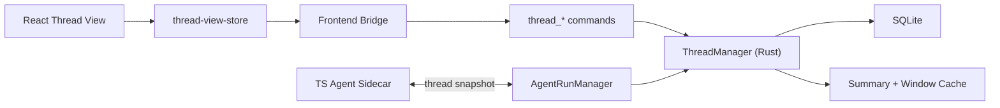
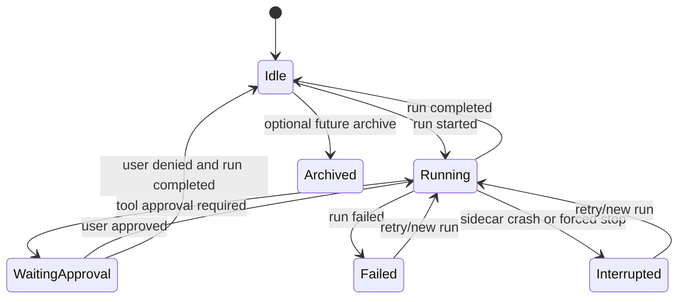

# Thread Design

## Summary

This document defines the `Thread` subsystem for Tiy Agent under the current:

- `Tauri 2 + Rust Core`
- `TypeScript + React`
- `TS Agent Sidecar (pi-agent)`
- `AI Elements`

architecture.

In this architecture, a thread is the durable collaboration container for one task inside one workspace. It is not the same thing as an agent run, a UI page, or a transient chat session.

The thread subsystem exists to make task collaboration recoverable, queryable, and stable across:

- repeated follow-up prompts
- multiple agent runs over time
- structured tool execution history
- thread switching in the UI
- app restarts

## Goals

- make thread the durable source of task collaboration history
- keep thread independent from any single agent run
- support append-only message persistence with structured message types
- load thread snapshots quickly enough for an active workbench experience
- support thread summaries and context compaction without losing traceability
- allow the frontend to reconstruct thread UI from Rust-owned persisted state

## Non-Goals

- no cross-workspace thread sharing in v1
- no thread branching or alternate history trees in v1
- no in-place rewriting of persisted historical messages
- no frontend-owned thread source of truth
- no direct sidecar access to thread persistence

## Context

The PRD defines thread as the primary unit for ongoing collaboration around a developer task. The technical architecture further clarifies that:

1. a thread belongs to exactly one workspace
2. a thread may contain many runs over its lifetime
3. Rust owns persistence and fast recovery
4. the frontend renders thread state but does not own it
5. the sidecar consumes thread snapshots but must not become the thread database

This means the thread subsystem must act as a durable aggregate that can survive partial executions, interrupted runs, approval pauses, and long message histories.

## Requirements

### Functional

- create a thread under a specific workspace
- persist user, assistant, system, tool, plan, reasoning, and approval-related messages
- support many runs over one thread lifetime
- return a thread snapshot for run startup and UI recovery
- support paged history loading for long threads
- maintain derived summary data for old messages
- preserve traceability from summarized content back to original records
- recover the current visible thread state after app restart

### Non-Functional

- thread list queries should stay lightweight even with long message histories
- loading an active thread should avoid replaying the entire history into memory
- message writes must be durable and ordered
- partial run failures must not corrupt prior thread history
- summary generation must reduce context size without losing critical tool outcomes

## Core Decisions

### Thread Is a Durable Aggregate

A thread is the long-lived task container. A run is a single execution attempt inside that container.

That means:

- thread identity is stable across follow-up prompts
- run identity changes every time the agent executes
- the thread remains meaningful even when no run is active
- the UI should recover thread state from persisted messages and run metadata, not from frontend caches

### Message History Is Append-Only

Historical records are append-only. We do not mutate prior conversational facts in place. If the product later supports regeneration or retry, that should create new records linked by metadata rather than rewrite history.

This keeps:

- auditing straightforward
- sidecar event ingestion simpler
- failure recovery safer
- summary generation deterministic

### Snapshot Is Derived, Not Primary

The persisted message log is primary. A thread snapshot is a derived read model assembled by Rust for:

- the frontend thread page
- run startup context
- partial history loads
- summary-based context compaction

This avoids storing multiple competing "current state" documents that can drift.

## High-Level Architecture



## Data Model

### Primary Tables

- `threads`
- `messages`
- `thread_runs`
- `tool_calls`

### Recommended `threads` Fields

```text
id
workspace_id
title
status
last_active_at
summary
created_at
updated_at
```

### Recommended `messages` Fields

```text
id
thread_id
run_id nullable
role
content_markdown
message_type
status
metadata_json
created_at
```

### Derived Read Models

Rust should maintain derived structures for fast reads:

- `thread_summary`
- `message_window_cache`
- `tool_result_digest`
- `last_run_status`

These may live partly in SQLite and partly in memory, but they must always be rebuildable from durable records.

## Recommended Types

```rust
pub struct ThreadRecord {
    pub id: String,
    pub workspace_id: String,
    pub title: String,
    pub status: ThreadStatus,
    pub summary: Option<String>,
    pub last_active_at: DateTime<Utc>,
}

pub struct ThreadSnapshot {
    pub thread: ThreadRecord,
    pub recent_messages: Vec<MessageRecord>,
    pub historical_summary: Option<ThreadSummary>,
    pub active_run: Option<RunSummary>,
    pub pending_tool_calls: Vec<ToolCallSummary>,
}

pub enum ThreadStatus {
    Idle,
    Running,
    WaitingApproval,
    Interrupted,
    Failed,
    Archived,
}
```

`ThreadStatus` is derived from the latest run and pending approvals rather than treated as a fully independent workflow.

## Message Model

### Roles

- `user`
- `assistant`
- `system`

### Message Types

- `plain_message`
- `plan`
- `reasoning`
- `tool_request`
- `tool_result`
- `approval_prompt`
- `sources`
- `summary_marker`

The `role` field explains authorship. The `message_type` field explains how the frontend should interpret the payload.

This separation is important because a tool result may still be presented as an assistant-owned event in the thread flow while needing a specialized renderer.

## Thread Lifecycle



### ThreadStatus Derivation

`ThreadStatus` 必须由最新 run 状态和待处理 approval 明确推导，而不是留给前端自行猜测。

推荐规则：

| latest run state | pending approvals | derived `ThreadStatus` |
|---|---|---|
| no run | no | `Idle` |
| `Created` / `Dispatching` / `Running` / `WaitingToolResult` / `Cancelling` | no | `Running` |
| any non-terminal run | yes | `WaitingApproval` |
| `Completed` / `Cancelled` / `Denied` | no | `Idle` |
| `Failed` | no | `Failed` |
| `Interrupted` | no | `Interrupted` |

补充规则：

- 若存在未解决 approval，线程状态优先显示为 `WaitingApproval`
- `Failed` 和 `Interrupted` 在线程启动新 run 后自动回到 `Running`
- 前端输入框是否聚焦不改变 `ThreadStatus`，那属于纯视图态

## Snapshot Construction

When Rust builds a thread snapshot for either the frontend or the sidecar, it should assemble:

1. base thread metadata
2. recent message window
3. historical summary block if history exceeds threshold
4. latest run summary
5. pending approvals and relevant tool digests
6. workspace binding metadata needed for context display

### Windowing Strategy

- keep the most recent `N` messages in full text
- replace older spans with summary segments
- preserve original message ids in summary metadata
- always include unresolved approvals and recent tool outputs even if older than the default window

### Compaction Pipeline

Context compaction is a backend pipeline, not an ad hoc frontend truncation trick.

Recommended v1 model:

1. Rust checks history size after a run completes or when loading an oversized thread
2. if thresholds are exceeded, Rust asks sidecar for a structured summary candidate using the lightweight model
3. Rust validates summary shape, stores source message ranges, and rebuilds derived snapshot artifacts
4. future snapshots inject the summary block plus recent window instead of replaying the whole history

Required fallback:

- if summarization fails, Rust still builds a safe reduced snapshot from:
  - first user goal message
  - latest `N` messages
  - unresolved approvals
  - tool digests for recent high-signal tool calls
  - workspace metadata

This preserves continuity without making compaction a hard dependency for run startup.

This prevents large tool outputs or long reasoning chains from exploding prompt size and UI recovery cost.

## Key Flows

### Thread Creation

1. frontend calls `thread_create`
2. Rust validates `workspace_id`
3. Rust creates thread row
4. Rust appends first user message
5. Rust returns `thread_id` and minimal snapshot

### Thread Load

1. frontend calls `thread_load`
2. Rust loads base thread metadata
3. Rust loads recent messages with pagination cursor
4. Rust attaches historical summary if needed
5. Rust attaches active run state and pending approvals
6. frontend reconstructs the thread UI from the snapshot

### Follow-Up Prompt

1. frontend appends a new user message through Rust
2. Rust persists the message before starting a new run
3. Rust updates `last_active_at`
4. `AgentRunManager` starts a new run against the updated thread snapshot

### Summary Refresh

1. Rust detects that the thread exceeded message or token thresholds
2. Rust selects older message spans that are no longer in the hot window
3. sidecar generates a structured summary candidate for those spans
4. Rust persists the summary plus source references transactionally
5. future snapshots use the summary instead of replaying the entire range
6. if the summary step fails, Rust falls back to deterministic truncation rules and records the degraded state

## Failure Modes

| Failure | Impact | Mitigation |
|---|---|---|
| duplicate sidecar events | duplicated assistant/tool messages | dedupe by `run_id + event_id` before append |
| partial run failure | incomplete latest activity | mark run failed or interrupted without touching earlier history |
| oversized tool output | slow snapshot and prompt building | store digest in thread window, keep raw output outside hot path |
| long thread history | slow UI recovery | summary + message pagination + window cache |
| app crash during append | possible missing tail record | use transactional append for each event batch |
| summary generation unavailable | snapshot cannot compact | deterministic fallback window with approvals + tool digests |

## ADR

### ADR-T1: Thread log is append-only and run-independent

#### Status

Accepted

#### Context

The system needs durable task history, resumable collaboration, safe recovery after crashes, and support for multiple runs over time within one thread.

#### Decision

Use an append-only thread message log owned by Rust. Keep `thread` and `run` as separate aggregates. Build snapshots as derived read models instead of mutating a single conversation document.

#### Consequences

##### Positive

- easier auditing and recovery
- clearer separation between persistent task history and transient execution
- simpler sidecar event ingestion

##### Negative

- snapshot building becomes a first-class backend responsibility
- summary logic is required earlier than in a naive chat app

##### Alternatives Considered

- single mutable conversation blob in SQLite
- frontend-owned thread state with periodic persistence

Both were rejected because they create drift, weaken recovery, and make long-thread performance worse.

## Implementation Notes

- place primary logic in `src-tauri/src/core/thread_manager.rs`
- persist only durable thread facts in SQLite
- keep hot caches rebuildable and disposable
- do not let the sidecar fetch thread data directly from storage
