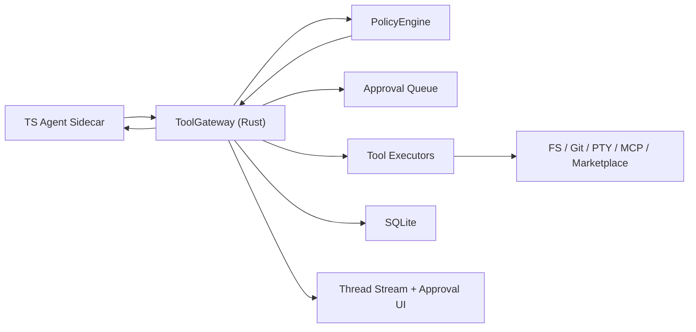
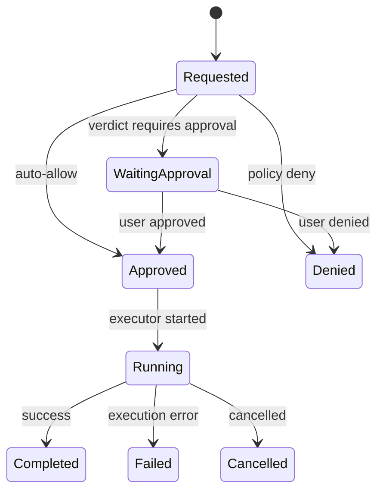

# Tool Gateway and Policy Design

## Summary

This document defines the combined `ToolGateway` and `PolicyEngine` subsystem for Tiy Agent.

The purpose of this subsystem is to make every privileged tool call pass through one trusted decision and execution path. It is the control plane for local safety, user approval, and tool execution observability.

The key principle is simple:

- tools may be defined in TypeScript
- privileged tools are always decided and executed in Rust

No sidecar path, frontend path, plugin path, or marketplace-installed capability may bypass this gateway.

## Goals

- provide one entry point for all system tool requests
- validate tool schema and normalize tool requests
- evaluate policy deterministically
- support auto-allow, require-approval, and deny outcomes
- execute approved tools and stream status updates
- persist auditable tool-call history
- shield the rest of the system from per-tool execution details

## Non-Goals

- no direct privileged tool execution in the sidecar
- no frontend-owned approval truth
- no ad hoc per-tool bypasses for "trusted" internal features
- no untyped command execution path hidden behind generic payloads

## Context

Tiy Agent combines:

- local file access
- Git operations
- shell and terminal execution
- marketplace lifecycle actions
- MCP and extension calls

These are high-value capabilities, but they are also the highest-risk system boundary in the product.

Without one gateway:

- approval logic becomes inconsistent
- audit trails fragment
- plugins can create hidden execution paths
- policy settings become advisory instead of authoritative

## Requirements

### Functional

- receive tool requests from the sidecar
- validate tool name, input schema, and target workspace context
- evaluate request against user policy and runtime constraints
- support approval workflow with user-visible context
- dispatch approved tools to concrete executors
- stream tool state changes to frontend and sidecar
- persist request, approval, execution, and final outcome
- support cancellation when executor allows it

### Non-Functional

- policy evaluation should be fast and deterministic
- dangerous tools must never execute before approval verdict exists
- audit records must remain queryable by thread and run
- output handling must protect UI and prompt window from oversized results
- decision logic must be explainable enough for debugging

## Core Decisions

### All Privileged Tool Requests Enter Through `ToolGateway`

`ToolGateway` is the orchestration boundary.

It is responsible for:

1. receiving structured tool requests
2. validating schema
3. asking `PolicyEngine` for a verdict
4. opening approval workflow when needed
5. dispatching to the correct executor
6. recording status transitions
7. returning structured results to sidecar and frontend

Clarification:

- sidecar-initiated privileged actions must always enter through `ToolGateway`
- user-initiated product mutations may enter via direct Rust commands for UX reasons, but they should still reuse the same policy primitives, normalized request model, and audit schema
- raw user terminal typing is not modeled as a tool call and is governed by terminal session policy instead of per-command approval prompts

### `PolicyEngine` Is the Single Permission Source of Truth

Policy inputs include:

- `approvalPolicy`
- `sandboxPolicy`
- `networkAccess`
- `allowList`
- `denyList`
- `writableRoots`

No other subsystem may reinterpret these independently.

### Policy Evaluation Must Happen Before Execution Allocation

The system should deny or pause before allocating expensive or risky resources whenever possible.

For example:

- reject invalid paths before executor spawn
- deny blocked commands before opening PTY or subprocess handles
- request approval before mutating filesystem or Git state

### Approval Is a Persisted State, Not a UI Suggestion

If approval is required, Rust persists:

- the normalized tool request
- the policy reason
- the approval state
- the pending run association

This allows app restarts and UI reconnects to recover pending approvals cleanly.

## High-Level Architecture



## Tool Classification

### Class A: Internal Agent Tools

Examples:

- `summarize_context`
- `rewrite_plan`
- `rank_candidates`
- `format_final_response`

These do not cross privileged boundaries and may stay inside the sidecar.

### Class B: System Tools

Examples:

- `read`
- `list`
- `grep`
- `write`
- `patch`
- `git_status`
- `git_diff`
- `git_log`
- `shell`
- `create_terminal`
- `term_write`
- `market_install`
- `mcp_call`

These always go through `ToolGateway`.

### `shell` Is a Special System Tool

`shell` expands into arbitrary subprocess execution and therefore needs stricter handling than typed Git or filesystem tools.

V1 rules:

- treat it as non-interactive, one-shot command execution
- do not use it as a proxy for writing to an existing terminal session
- require normalized request fields such as `command`, `args`, `cwd`, `timeoutMs`, and output limits
- default to `RequireApproval` unless a specific allow rule matches
- run command-pattern deny checks before normal allow/deny matching completes

Dangerous-pattern handling in v1:

- evaluate against normalized argv rather than raw shell text whenever possible
- apply a built-in deny set for clearly dangerous patterns such as:
  - destructive filesystem wipes like `rm -rf /`
  - privilege escalation commands such as `sudo`
  - disk formatting tools such as `mkfs`
  - shell-pipe bootstrap patterns such as `curl ... | sh`, `curl ... | bash`, `wget ... | sh`
- allow user policy to extend denial through `denyList`, but not weaken the built-in hard denials
- user-configured pattern matching may use simple glob or regex semantics, but built-in denials should be implemented as explicit normalized predicates rather than fragile substring matching

## Decision Pipeline

```text
tool request
  -> schema validation
  -> workspace boundary validation
  -> policy evaluation
  -> auto-allow | require-approval | deny
  -> executor dispatch
  -> streaming status updates
  -> structured result + audit persistence
```

### Recommended Evaluation Order

1. request well-formedness
2. tool existence and schema validity
3. run-mode restrictions
4. workspace path normalization and sandbox checks
5. command normalization and command-specific safety checks for `shell`
6. explicit deny rules
7. explicit allow rules
8. approval policy decision
9. executor dispatch

This order keeps the system predictable and easier to reason about.

## Data Model

### Core Table

```text
tool_calls
  id
  run_id
  thread_id
  tool_name
  tool_input_json
  tool_output_json
  status
  approval_status
  started_at
  finished_at
```

### Recommended Runtime Types

```rust
pub struct ToolExecutionRequest {
    pub tool_call_id: String,
    pub thread_id: String,
    pub run_id: String,
    pub run_mode: String,
    pub workspace_id: String,
    pub tool_name: String,
    pub input: serde_json::Value,
}

pub enum PolicyVerdict {
    AutoAllow { reason: String },
    RequireApproval { reason: String },
    Deny { reason: String },
}

pub enum ToolCallStatus {
    Requested,
    WaitingApproval,
    Approved,
    Denied,
    Running,
    Completed,
    Failed,
    Cancelled,
}
```

## Mode-Aware Policy

`Plan` mode should affect policy evaluation, not just prompt wording.

Recommended v1 behavior:

- internal agent tools remain allowed
- read-only system tools may be auto-allowed according to normal policy
- mutating system tools should be denied or explicitly escalated while `run_mode = Plan`
- planning and execution should preferably be separated into different runs

Once the user explicitly transitions to a new `default` execution run, normal policy semantics resume for that new run, regardless of whether execution starts with:

- `ContinueInThread`
- `CleanContextFromPlan`

## Tool State Machine



## Approval Model

### Approval Payload Should Include

- tool name
- normalized arguments
- target workspace or path scope
- policy reason
- estimated risk category
- calling thread and run

### Approval Semantics

- approval is scoped to the specific tool call, not the whole run
- approval should use normalized request data to avoid display/execution mismatch
- if policy settings change while approval is pending, Rust should re-evaluate before execution

This avoids time-of-check versus time-of-use drift.

## Execution Model

`ToolGateway` should dispatch to executor modules rather than inline tool logic.

Suggested executor groups:

- filesystem executor
- Git executor
- terminal executor
- process executor
- marketplace executor
- MCP executor

Each executor should return:

- structured output for sidecar continuation
- UI-facing progress status
- audit metadata

Large outputs should be summarized for hot paths and persisted in raw form only where necessary.

### `shell` Execution Contract

The process executor should enforce extra guardrails for `shell`:

- enforce timeout and cancellation even if the child process hangs
- cap stdout and stderr capture size
- mark truncation explicitly in the result payload
- record command, cwd, exit code, timeout, and truncation in audit metadata
- return structured failures such as `policy_denied`, `timeout`, `spawn_failed`, and `non_zero_exit`

## Key Flows

### Auto-Allow Read Tool

1. sidecar requests `read`
2. Rust validates path under workspace boundary
3. `PolicyEngine` returns `AutoAllow`
4. executor reads file
5. result is stored and returned to sidecar
6. frontend receives tool status updates

### Approval-Gated Write Tool

1. sidecar requests `patch`
2. Rust validates target path
3. `PolicyEngine` returns `RequireApproval`
4. tool call is persisted as pending
5. frontend shows approval UI
6. user approves
7. Rust rechecks policy and executes
8. result returns to sidecar and frontend

### `Plan` Mode Mutation Attempt

1. sidecar in `plan` mode requests `patch` or another mutating tool
2. Rust sees `run_mode = Plan`
3. `PolicyEngine` returns `Deny` or a special escalation verdict
4. the run stays in planning flow and surfaces the blocked action clearly

### Denied Dangerous Command

1. sidecar requests `shell`
2. command hits deny rule or sandbox violation
3. Rust marks tool call denied
4. sidecar receives structured denial result
5. run continues or fails according to agent logic

## Audit Model

Every system tool call should produce durable audit facts:

- request received
- policy verdict
- approval response if any
- executor start
- executor completion or failure

Audit keys should include:

- `thread_id`
- `run_id`
- `tool_call_id`
- `workspace_id`

### Shared Policy and Audit Primitives

To avoid split behavior between agent-triggered and user-triggered mutations, backend subsystems should share two reusable primitives:

- `PolicyCheck`: normalized policy evaluation input and verdict contract
- `AuditRecord`: normalized mutation audit payload written to durable audit storage

Managers such as Git or Marketplace may expose direct user-facing commands, but mutating actions should still build these shared primitives instead of inventing subsystem-specific policy or audit formats.

## Failure Modes

| Failure | Impact | Mitigation |
|---|---|---|
| malformed tool input | executor misuse risk | strict schema validation before policy |
| plan mode bypasses mutation guard | planning flow mutates local state unexpectedly | evaluate run-mode restrictions before dispatch |
| stale approval | wrong execution after settings change | re-evaluate policy immediately before dispatch |
| oversized output | UI and prompt bloat | output digest + pagination or chunking |
| dangerous shell pattern hidden in `shell` | unintended arbitrary execution | command normalization + deny matching before dispatch |
| plugin attempts bypass | hidden privileged path | all extension tools routed through gateway |
| executor crash | incomplete tool state | mark failed and return structured error |

## ADR

### ADR-P1: Policy is centralized in Rust and enforced before execution

#### Status

Accepted

#### Context

The product allows AI-chosen tools to mutate local files, run commands, inspect repositories, and manage extensions. A fragmented permission model would be unsafe and hard to debug.

#### Decision

Centralize all privileged tool requests in `ToolGateway` and all permission decisions in `PolicyEngine`, both in Rust. Require execution to wait for a verdict before any privileged resource is touched.

#### Consequences

##### Positive

- one security boundary
- one approval flow
- consistent auditability
- easier reasoning about extension behavior

##### Negative

- more Rust implementation work up front
- more explicit executor interfaces required

##### Alternatives Considered

- allow sidecar to execute some trusted tools directly
- allow each subsystem to own its own policy checks

Both were rejected because they fragment safety and create inconsistent user expectations.

## Implementation Notes

- place orchestration in `src-tauri/src/core/tool_gateway.rs`
- place policy logic in `src-tauri/src/core/policy_engine.rs`
- store normalized request data before approval prompt emission
- keep executor interfaces narrow and typed
- pass `run_mode` into policy evaluation instead of treating planning as UI-only state
