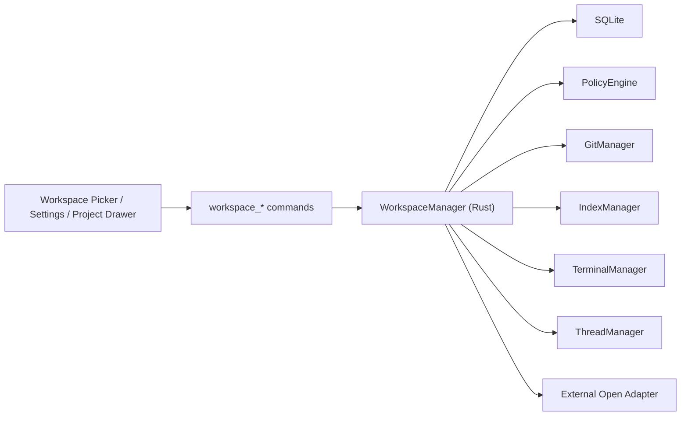
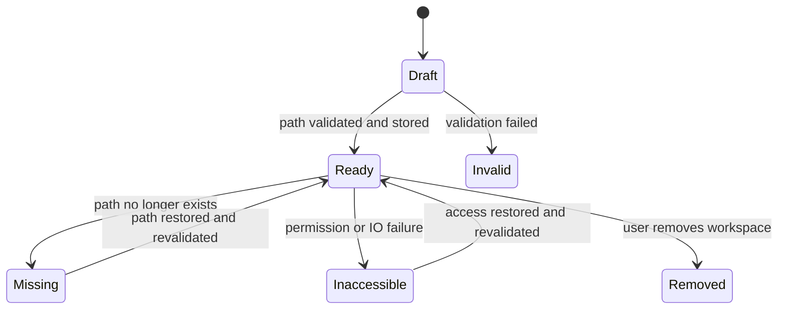

# Workspace Design

## Summary

This document defines the `Workspace` subsystem for Tiy Agent.

In Tiy Agent, a workspace is the root local context for a developer task. It is the boundary that binds:

- thread ownership
- project tree browsing
- Git context
- terminal working directory
- tool access scope
- writable roots and policy checks

The workspace subsystem exists to make local context explicit, durable, and safe. It is not just a UI picker for folders. It is the canonical boundary object that every local capability depends on.

## Goals

- make workspace the authoritative local context boundary
- support stable workspace identity independent from UI state
- validate and normalize local paths before they enter the system
- provide consistent workspace metadata to thread, Git, terminal, index, and tool subsystems
- support opening a workspace in external apps through a controlled Rust path
- align workspace writable scope with policy evaluation

## Non-Goals

- no nested workspace inheritance model in v1
- no cloud-synced workspace registry in v1
- no frontend-owned workspace truth
- no implicit tool access outside declared workspace boundaries

## Context

The PRD defines workspace as the base context for threads, project tree, terminal, and tool execution. The technical architecture adds two critical constraints:

1. workspace is the path boundary for privileged local access
2. path normalization and symlink safety must be handled in Rust

That means workspace cannot remain a cosmetic list item. It must become a trusted boundary contract reused by:

- `ThreadManager`
- `TerminalManager`
- `GitManager`
- `IndexManager`
- `ToolGateway`
- `PolicyEngine`

## Requirements

### Functional

- create, list, update, and remove workspaces
- maintain a default workspace
- store workspace metadata such as name, path, and Git capability flags
- normalize and validate workspace path on create and load
- surface whether a workspace is a Git repository
- support recent workspace selection for new thread flow
- support opening the workspace in external applications
- expose a consistent workspace descriptor to other backend subsystems

### Non-Functional

- path checks must be deterministic across app restarts
- invalid or inaccessible paths must fail clearly without corrupting registry state
- workspace lookups must be cheap because they are on many hot paths
- path boundary checks must remain safe against symlink-based escapes
- workspace updates must not silently widen write access without policy re-evaluation

## Core Decisions

### Workspace Is a First-Class Boundary Object

A workspace is not just `name + path`.

It is the object that defines:

- the default root for thread-scoped tools
- the visible project tree context
- the default cwd for terminal sessions
- the Git repository anchor
- the allowed root set for path-based operations

This makes workspace identity stable even if the frontend reloads or the user moves between threads.

### Canonical Paths Are Resolved in Rust

All workspace paths should be canonicalized in Rust before persistence and before execution-time checks.

Canonicalization should include:

- absolute path resolution
- path normalization
- symlink handling strategy
- duplicate path detection after normalization

The frontend may show friendly paths, but canonical path truth belongs in Rust.

### Workspace Scope Must Be Reused by Policy

`PolicyEngine` should not recompute ad hoc path meaning from raw tool input. Instead, it should consume the workspace's normalized path boundary and any derived writable roots.

This keeps:

- tool policy consistent
- audit trails easier to interpret
- workspace-specific permissions understandable to users

## High-Level Architecture



## Data Model

### Primary Table

```text
workspaces
  id
  name
  path
  is_default
  is_git
  auto_work_tree
  created_at
  updated_at
```

### Recommended Derived Metadata

- `canonical_path`
- `display_path`
- `path_hash`
- `git_root_path`
- `availability_status`
- `last_validated_at`

`canonical_path` should be the execution truth. `display_path` is what the UI may render.

## Recommended Types

```rust
pub struct WorkspaceRecord {
    pub id: String,
    pub name: String,
    pub canonical_path: PathBuf,
    pub display_path: String,
    pub is_default: bool,
    pub is_git: bool,
    pub auto_work_tree: bool,
    pub status: WorkspaceStatus,
}

pub enum WorkspaceStatus {
    Ready,
    Missing,
    Inaccessible,
    Invalid,
}
```

## Boundary Rules

### Path Validation Rules

- reject empty or relative paths
- canonicalize before persistence
- reject duplicates after canonicalization
- resolve symlink policy before final accept
- detect whether the path currently exists and is accessible

### Tool Boundary Rules

- path-based tool inputs should be resolved relative to workspace root unless explicitly absolute
- absolute paths must still be checked against workspace boundary and writable roots
- tools must not assume the current thread workspace from frontend-only state

### External Open Rules

- open requests should always target a validated workspace record
- Rust should map to OS-specific open behavior
- failures should surface as structured backend errors rather than silent no-ops

## Workspace Lifecycle



## Key Flows

### Add Workspace

1. frontend submits a folder path
2. Rust canonicalizes and validates the path
3. Rust detects duplicate workspace or overlapping policy concerns
4. Rust computes metadata such as `is_git`
5. Rust stores the workspace record
6. Rust returns normalized workspace descriptor to frontend

### Select Workspace for New Thread

1. frontend asks for recent or default workspaces
2. Rust returns validated workspace descriptors
3. user chooses one workspace
4. new thread creation references `workspace_id`, not raw path

### Open Workspace in External App

1. frontend calls `workspace_open_external`
2. Rust resolves workspace by id
3. Rust verifies current accessibility
4. Rust dispatches OS-specific open behavior
5. Rust returns structured success or failure

### Background Revalidation

1. app startup or periodic check loads workspace registry
2. Rust revalidates path existence and access
3. changed workspace status is persisted
4. frontend updates badges or warning states without mutating the registry shape

## Interaction with Other Subsystems

### Thread

- every thread belongs to exactly one workspace
- thread snapshot includes workspace metadata for context display

### Git

- GitManager derives repository anchor from workspace
- Git capability is a workspace property, not a frontend assumption

### Terminal

- terminal session cwd defaults to workspace root
- terminal lifetime does not change workspace identity

### Index

- index scope is bound to workspace root
- index records should reference `workspace_id`

### Tool Gateway and Policy

- all path-based tools should resolve within workspace context
- writable roots may be derived partly from workspace root and user settings

## Failure Modes

| Failure | Impact | Mitigation |
|---|---|---|
| path deleted after registration | workspace becomes unusable | persist `Missing` status and block risky actions |
| symlink escape risk | tools access unintended files | canonicalize and check against normalized boundaries |
| duplicate path under different display strings | conflicting workspace registry | dedupe by canonical path hash |
| Git repo state changed | stale `is_git` metadata | lazy refresh or revalidation on Git feature entry |
| invalid default workspace | broken new-thread UX | fallback to next valid recent workspace |

## ADR

### ADR-W1: Workspace is the canonical local boundary for tool and project context

#### Status

Accepted

#### Context

The product needs a durable local context object that can safely scope thread collaboration, project browsing, Git access, terminal cwd, and tool execution.

#### Decision

Make `WorkspaceManager` the authority for normalized workspace identity and path boundary metadata. Other subsystems consume `workspace_id` and normalized paths instead of trusting raw frontend paths.

#### Consequences

##### Positive

- one local context contract reused everywhere
- safer path handling
- less duplicated boundary logic across subsystems

##### Negative

- more upfront validation logic in Rust
- path and status refresh becomes a backend responsibility

##### Alternatives Considered

- store raw paths directly in each subsystem
- let frontend keep current workspace path in view state only

Both were rejected because they create drift and weaken path safety.

## Implementation Notes

- place logic in `src-tauri/src/core/workspace_manager.rs`
- keep canonical path as execution truth
- persist only normalized workspace facts and recomputable derived metadata
- avoid implicit widening of writable roots on workspace update
