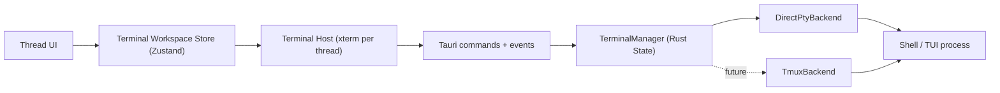

# Thread Terminal Design

## Summary

This document defines the terminal architecture for Tiy Agent's multi-thread workbench.

Goals:

- each thread owns an independent terminal session
- multiple threads can stay active at the same time
- switching the visible thread must not interrupt the hidden thread's terminal state
- terminal interaction should feel as close to a native system terminal as possible
- the design should fit the current `Tauri 2 + React` codebase with minimal architectural churn

Key decisions:

- use one PTY-backed shell session per thread
- keep PTY lifecycle in the Rust backend, independent from the React view lifecycle
- use `Zustand` for workbench-level terminal state in the frontend
- start with a direct PTY backend and reserve a backend abstraction for a future `tmux` mode

## Context

The current app already has a bottom terminal panel in the workbench shell, but it is still a UI placeholder. The shell layout, terminal height behavior, and visual language are already defined in the existing dashboard implementation and design spec.

This design extends that shell into a real terminal system without changing the interaction model of the workbench:

- thread switching remains a top-level navigation concern
- the terminal remains a persistent bottom panel
- terminal state belongs to the backend session, not to the currently rendered page subtree

## Requirements

### Functional

- create a terminal session on demand for a thread
- keep one isolated terminal session per thread
- allow many thread terminals to run concurrently
- keep hidden thread terminals alive when the user switches threads
- support standard shell workflows and full-screen TUI tools
- support resize, input, exit detection, restart, and close
- show per-thread terminal metadata such as running state and unread output

### Non-functional

- interaction should feel native enough for tools like `vim`, `less`, `top`, `lazygit`, `fzf`, and shells with custom keybindings
- terminal rendering must stay smooth while background threads continue producing output
- frontend updates should stay scoped to the affected thread
- the backend should be able to cleanly reclaim idle or closed sessions
- the design should be cross-platform friendly even if macOS is the primary dev target

## Decision

### Chosen architecture

Use a direct PTY backend as the default runtime model:

- `1 thread = 1 terminal session = 1 PTY = 1 shell process`
- the Rust backend owns PTY creation, IO, resize, exit tracking, and cleanup
- the React frontend owns terminal presentation and thread-level UI state
- each live thread keeps its own `xterm` instance while active in the workspace

This is the most native-feeling path because the runtime chain stays short:

- `xterm` in the UI
- PTY in the backend
- shell or TUI process inside that PTY

### Deferred option

Reserve a backend abstraction so a future `tmux` implementation can be added for session persistence across app restarts. This is not the default path for v1 because it adds another interaction layer and is not as close to a plain terminal as a direct PTY session.

## High-Level Architecture



## Backend Design

### Main responsibility

The backend is the source of truth for terminal runtime state. A thread terminal continues running even when its UI is hidden or temporarily detached.

### Core types

```rust
pub struct TerminalManager {
    sessions: HashMap<String, TerminalSession>,
}

pub struct TerminalSession {
    pub session_id: String,
    pub thread_id: String,
    pub backend_kind: TerminalBackendKind,
    pub shell: String,
    pub cwd: PathBuf,
    pub env: BTreeMap<String, String>,
    pub cols: u16,
    pub rows: u16,
    pub status: TerminalStatus,
    pub started_at: SystemTime,
    pub last_active_at: SystemTime,
    pub unread_output: bool,
}

pub enum TerminalStatus {
    Starting,
    Running,
    Exited { code: Option<i32>, signal: Option<String> },
}
```

Runtime handles such as the PTY master, writer, reader task, and kill handle should stay outside the serializable payload returned to the frontend.

### Backend modules

Recommended Rust structure:

- `src-tauri/src/commands/terminal.rs`
- `src-tauri/src/terminal/manager.rs`
- `src-tauri/src/terminal/session.rs`
- `src-tauri/src/terminal/backend.rs`
- `src-tauri/src/terminal/types.rs`

### Backend abstraction

Define a backend trait early, even if only one implementation exists at first:

```rust
pub trait TerminalBackend: Send + Sync {
    fn spawn(&self, request: SpawnTerminalRequest) -> Result<BackendSessionHandle, TerminalError>;
    fn write(&self, session_id: &str, data: &[u8]) -> Result<(), TerminalError>;
    fn resize(&self, session_id: &str, cols: u16, rows: u16) -> Result<(), TerminalError>;
    fn close(&self, session_id: &str) -> Result<(), TerminalError>;
}
```

Implementations:

- `DirectPtyBackend` for v1
- `TmuxBackend` reserved for a future persistence mode

### Session lifecycle

1. User opens or activates a thread.
2. Frontend calls `ensure_thread_terminal(threadId, cwd?)`.
3. Backend returns an existing session if one already exists.
4. Otherwise, backend spawns a PTY and the default shell for that thread.
5. Reader task emits terminal output events tagged with `threadId`.
6. Switching away from the thread does not stop the PTY.
7. Closing the thread terminal explicitly kills the session and emits a final status event.

### Shell selection

The backend should resolve the shell in this order:

1. thread-specific override, if product later supports it
2. app-level configured shell, if added later
3. current user environment shell
4. platform fallback

The shell resolution logic should live in one backend utility so the policy stays consistent.

### Event model

Emit thread-scoped events to the frontend:

- `terminal:data:{threadId}`
- `terminal:status:{threadId}`
- `terminal:exit:{threadId}`
- `terminal:title:{threadId}`

The backend should not emit one giant shared output stream. Thread-scoped events make the frontend cheaper to update and simpler to reason about.

## Frontend Design

### Store strategy

Use `Zustand` for workbench-level terminal state. Keep transient component-local UI details in React local state.

Why `Zustand`:

- no provider boilerplate
- simple selector-based subscriptions
- easy to model `threadId -> session`
- fits a desktop workbench better than a large reducer tree
- easy to evolve into slices as the feature grows

### Store shape

```ts
type TerminalSessionMeta = {
  threadId: string;
  sessionId: string;
  status: "starting" | "running" | "exited";
  shell: string;
  cwd: string;
  cols: number;
  rows: number;
  hasUnreadOutput: boolean;
  lastOutputAt: number | null;
  exitCode: number | null;
};

type TerminalUiState = {
  activeThreadId: string | null;
  panelHeight: number;
  isPanelCollapsed: boolean;
  sessionsByThreadId: Record<string, TerminalSessionMeta>;
  terminalRefsByThreadId: Record<string, TerminalRef>;
};
```

Suggested actions:

- `setActiveThread(threadId)`
- `ensureTerminal(threadId)`
- `attachTerminalRef(threadId, ref)`
- `setSessionMeta(threadId, patch)`
- `appendOutput(threadId, chunk)`
- `markThreadRead(threadId)`
- `markThreadUnread(threadId)`
- `removeTerminal(threadId)`
- `setPanelCollapsed(value)`
- `setPanelHeight(height)`

### View strategy

Keep a dedicated terminal host layer in the UI.

Recommended files:

- `src/features/terminal/api/*`
- `src/features/terminal/model/terminal-store.ts`
- `src/features/terminal/model/use-thread-terminal.ts`
- `src/features/terminal/ui/terminal-host.tsx`
- `src/features/terminal/ui/thread-terminal-panel.tsx`

Responsibilities:

- `terminal-store.ts`: workbench state and actions
- `use-thread-terminal.ts`: command and event wiring
- `terminal-host.tsx`: owns `xterm` instance creation and mount logic
- `thread-terminal-panel.tsx`: bottom panel chrome, tabs, status, toolbar

### xterm instance strategy

Each live thread should keep its own `xterm` instance while it remains open in the workspace.

Why:

- hidden thread state stays visually stable when the user returns
- fewer edge cases for full-screen TUI tools
- easier per-thread scrollback and selection handling

Do not rebuild the `xterm` instance on every thread switch. Instead:

- mount all live terminal containers under the panel
- only one thread is visible at a time
- hidden terminals use CSS visibility or layout hiding rather than full disposal

## Interaction Design

### Thread switching

- switching threads changes visible terminal content immediately
- hidden threads remain attached to their backend session
- background output can set an unread badge on the owning thread

### Keyboard behavior

When terminal focus is active, terminal input wins over most app shortcuts.

Rules:

- pass standard key events through to the terminal session
- only intercept copy when terminal selection exists
- always support paste into the terminal
- avoid global shortcuts stealing `Ctrl`, `Alt`, arrow keys, function keys, or escape-driven TUI controls when terminal is focused

This boundary is critical for native-feeling terminal behavior.

### Resize behavior

- the existing bottom panel resize model stays intact
- when panel height changes, recompute rows and cols for the active terminal
- on thread switch, fit the newly visible terminal before resuming interaction
- hidden terminals keep their last known geometry until shown again

## Command Surface

Suggested Tauri commands:

```ts
ensure_thread_terminal(threadId: string, cwd?: string): Promise<TerminalSessionMeta>
write_terminal_input(threadId: string, data: string): Promise<void>
resize_terminal(threadId: string, cols: number, rows: number): Promise<void>
restart_terminal(threadId: string): Promise<TerminalSessionMeta>
close_terminal(threadId: string): Promise<void>
list_terminals(): Promise<TerminalSessionMeta[]>
```

Design notes:

- the frontend should address sessions by `threadId`
- `sessionId` remains backend-owned implementation detail for runtime tracking
- `ensure_thread_terminal` should be idempotent

## Error Handling

Expected failure cases:

- shell executable not found
- PTY spawn failure
- resize/write after session exit
- backend event listener disconnected
- thread closed while terminal still running

Frontend behavior:

- show inline terminal status instead of generic toast spam
- preserve last visible output when a session exits
- offer explicit restart action after failure

Backend behavior:

- convert runtime errors into typed command errors
- emit terminal exit/status events even for abnormal exits
- never crash the whole manager because one thread session fails

## Cleanup Policy

### V1

- keep thread PTY alive while its thread remains open in the app
- destroy PTY when the user explicitly closes the thread terminal or the thread itself is removed
- destroy all PTY sessions when the app exits

### Future extension

If product requirements later include restoration after app restart, add:

- optional persisted session metadata
- `TmuxBackend`
- session reattach flow on app startup

## Performance Notes

- use per-thread event channels instead of one shared event stream
- subscribe to `Zustand` state with selectors to avoid broad rerenders
- keep terminal output writes imperative where possible instead of storing full scrollback in React state
- only store metadata and unread markers in the main store

Important:

- do not mirror the entire terminal text buffer into React state
- let `xterm` own visual scrollback
- let the backend own process state

## Security and Isolation

- each thread terminal is isolated at the process/session level
- shell env should be intentionally constructed, not blindly inherited forever
- future command presets should be validated before being injected into a running shell
- do not allow one thread session to write into another thread session

## Implementation Plan

### Phase 1: backend foundation

- add terminal modules and `TerminalManager` to Tauri state
- implement `DirectPtyBackend`
- expose terminal commands and event emission
- wire shell resolution and PTY lifecycle

### Phase 2: frontend terminal feature

- add `Zustand` store and terminal API client
- integrate `xterm` terminal host
- replace the static terminal placeholder in the dashboard workbench
- support active thread switching and unread indicators

### Phase 3: interaction hardening

- keyboard shortcut boundary handling
- resize and fit correctness
- exit and restart flows
- test common TUI tools manually

### Phase 4: optional persistence mode

- add backend trait implementation for `tmux`
- add feature flag or config for terminal backend selection
- support session restore across app restart if product requires it

## Open Questions

- whether thread closure should always kill the terminal, or whether thread terminal state should be recoverable for a grace period
- whether terminal cwd should always follow thread workspace context
- whether multiple terminal tabs inside one thread are in scope later
- whether terminal output unread state should sync into the thread list, top bar, or both

## Recommended v1 Scope

Ship this first:

- one terminal session per thread
- direct PTY backend only
- `Zustand` store for session metadata and panel UI state
- one visible terminal at a time in the bottom panel
- hidden thread terminals stay alive
- restart and close actions

Defer this:

- app restart recovery
- `tmux` backend
- multiple terminals per thread
- terminal transcript persistence

## File Targets

Current relevant files:

- `/src-tauri/src/lib.rs`
- `/src-tauri/src/commands/mod.rs`
- `/src/widgets/dashboard-overview/ui/dashboard-overview.tsx`
- `/docs/design-spec.md`

Proposed additions:

- `/src-tauri/src/commands/terminal.rs`
- `/src-tauri/src/terminal/*`
- `/src/features/terminal/*`
- `/docs/plans/2026-03-12-thread-terminal-design.md`

