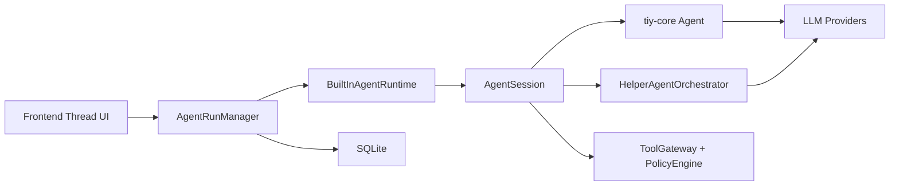

# Built-In Agent Runtime on `tiy-core`

## Summary

This design replaces the abandoned sidecar architecture with a built-in Rust
runtime that uses `tiy-core` as the single-agent kernel.

The new split is:

- `tiy-core` provides the stateful single-agent loop, streaming events, tool
  hooks, context transforms, steering/follow-up queues, and security/resource
  limits
- Tiy Desktop provides the desktop orchestration layer through
  `BuiltInAgentRuntime`, `AgentSession`, and `HelperAgentOrchestrator`
- Rust remains the sole authority for policy, tool execution, persistence, and
  frontend event delivery

This design also keeps helper-agent capability, but as an internal orchestration
feature folded into the parent thread rather than a visible child-thread model.

## Goals

- remove the TypeScript sidecar from the desktop architecture
- adopt `tiy-core` as the built-in agent kernel
- preserve one active parent run per thread
- keep `plan` mode as a real run mode
- support helper-agent orchestration for research, review, and planning tasks
- keep helper activity folded into the main thread in v1
- align the runtime design with the already-adopted `tiy-core` provider and
  model settings direction

## Non-Goals

- this spec does not expose helper agents as user-visible independent threads
- this spec does not define a general multi-agent DAG scheduler
- this spec does not add automatic replay of interrupted runs
- this spec does not require `tiy-core` to gain native subagent support

## Why The Sidecar Design Is Rejected

The old architecture assumed a long-lived TypeScript sidecar because the product
needed a reusable agent runtime and helper orchestration layer outside the
frontend. That assumption no longer holds.

After reviewing the current `tiy-core` agent surface:

- `Agent` already provides the autonomous loop
- `subscribe()` already provides streaming lifecycle events
- `set_tool_executor`, `before_tool_call`, and `after_tool_call` already cover
  tool execution interception
- `set_transform_context` and `set_convert_to_llm` already cover context shaping
- `steer()` and `follow_up()` already cover queued message delivery
- `SecurityConfig` already covers max parallel tool calls, validation, and
  execution timeouts

After reviewing `pi-mono` `coding-agent`:

- its `plan mode` is primarily a tool-profile and context-injection strategy
- its `subagent` model is an orchestration pattern above the core loop, not a
  native agent-kernel primitive

That means the desktop product no longer needs a sidecar just to host the
runtime.

## Architecture

### Layered Model

1. `Frontend Thread UI`
   - renders thread history, approvals, helper summaries, and status
   - consumes one Rust-owned `ThreadStreamEvent` model

2. `Rust BuiltInAgentRuntime`
   - prepares execution context from thread/workspace state
   - chooses tool profiles based on `run_mode`
   - translates `tiy-core` events into product events
   - orchestrates helper-agent execution
   - folds helper results back into the parent run

3. `tiy-core Agent Kernel`
   - executes a single agent loop with streaming and tool calls
   - knows nothing about Tiy thread persistence or helper-task UX

### High-Level Diagram

## Runtime Components

### `AgentRunManager`

Responsibilities:

- create and persist parent runs
- enforce one active parent run per thread
- freeze the effective runtime model plan
- own run status truth
- deliver frontend stream events
- settle completion, failure, cancellation, and interruption

### `BuiltInAgentRuntime`

Responsibilities:

- create and destroy `AgentSession`
- map persisted run configuration into runtime configuration
- wire `tiy-core` callbacks to desktop subsystems
- provide helper orchestration entry points
- report runtime/session health

### `AgentSession`

Responsibilities:

- own one in-memory parent run session
- hold the main `tiy-core::agent::Agent`
- manage active tool profile and hidden runtime context
- track helper state for folded UI/status output
- manage cancellation propagation to tools and helpers
- register `ToolGateway` as the `tiy-core` tool executor bridge

### `HelperAgentOrchestrator`

Responsibilities:

- accept internal helper delegation requests from the parent session
- resolve helper kind, model, and tool profile
- execute helper work using a scoped `tiy-core` agent or standalone loop
- persist summary results in `run_helpers`
- return folded helper summaries to the parent session

## Tool Execution Integration

The most important runtime integration point is the bridge between
`tiy-core::agent::Agent` and `ToolGateway`.

### Bridge shape

`AgentSession` should register one `set_tool_executor(...)` callback on the main
agent. That callback is the single adapter from `tiy-core` tool calls into the
desktop execution plane.

Recommended flow:

1. `tiy-core` emits a tool call inside the main loop
2. the registered tool executor callback resolves the active runtime tool
   profile
3. privileged tools are forwarded to `ToolGateway`
4. `ToolGateway` returns one of:
   - executed
   - approval required
   - denied
   - failed
5. the callback converts the outcome into `AgentToolResult`
6. `tiy-core` continues the loop with the resulting `ToolResultMessage`

### Approval suspend semantics

Approval waits should suspend the main loop by suspending the tool executor
future itself.

That means:

- the `tiy-core` loop does not need a side-channel callback to resume
- `AgentSession` moves the parent run to `waiting_approval`
- the tool executor future awaits approval resolution from `ToolGateway`
- once the user approves or denies, the same future resolves and the main loop
  continues normally

This is the v1 contract. We are not modeling approval waits as a separate
`tiy-core` queue primitive.

## Run Model

### Parent Run

The user-visible run remains the parent run.

The invariant stays:

- one thread
- one active parent run
- zero or more internal helper tasks under that run

### Helper Task

Helper tasks are internal child execution units with:

- `helper_kind`
- `status`
- `effective_model`
- `tool_profile`
- `input_summary`
- `output_summary`
- `error_summary`

They are not top-level runs and do not get direct thread ownership in v1.

## Model Plan

The `Agent Profile` three-layer model mapping remains, but with new runtime
semantics:

- `primary` -> parent agent default model
- `assistant` -> helper-agent default model
- `lite` -> cheap internal utility tasks, compression, or helper preprocessing

The runtime freezes these choices at run start in
`effective_model_plan_json`.

The runtime then instantiates one concrete `Model` per concrete agent execution:

- one for the parent session
- one for each helper task
- optionally one for lightweight utility work

This replaces the old sidecar idea of dynamic role routing inside one shared
process.

## Run Modes

### `default`

- normal execution-oriented collaboration
- full tool profile, subject to normal policy and approvals
- helper delegation allowed

### `plan`

- planning-first collaboration
- read-only tool profile
- explicit hidden plan-mode context injected by `AgentSession`
- helper tasks inherit read-only restrictions
- transition to execution happens by starting a new `default` run

### Plan Execution Strategies

Support:

- `continue_in_thread`
- `clean_context_from_plan`

`clean_context_from_plan` rebuilds the execution prompt window from a plan
artifact. It does not delete persisted history.

## Tool Strategy

Tool selection is owned by `AgentSession` via named tool profiles.

Recommended v1 profiles:

- `default_full`
- `plan_read_only`
- `helper_scout`
- `helper_planner`
- `helper_reviewer`

Tool categories:

- runtime orchestration tools
- workspace/file tools
- Git tools
- terminal tools
- marketplace/MCP tools

All privileged tools continue to execute through `ToolGateway`.

### Helper profile constraints

Helper profiles need explicit constraints so they do not drift into an
unbounded second runtime tier.

Recommended v1 rules:

| Profile | Default tool posture | Allowed in `plan` mode | Approval behavior |
|---|---|---|---|
| `helper_scout` | read-only | yes | no independent approvals |
| `helper_planner` | read-only | yes | no independent approvals |
| `helper_reviewer` | read-only + optional read-only terminal inspection | yes | no independent approvals |

Rules:

- helpers inherit the parent `run_mode` ceiling
- helpers must not trigger their own user-facing approval UI in v1
- if a helper reaches an approval-required or mutating tool path, runtime
  should stop that helper step and return a folded summary indicating escalation
  is required from the parent run
- helper concurrency is a runtime-owned `AgentSession` limit, separate from
  `tiy-core` `max_parallel_tool_calls`

Recommended v1 helper concurrency:

- default `max_concurrent_helpers = 1`
- optional future increase to `2-4` after telemetry validates cost and UX

## Data Model

### Parent Run

Keep `thread_runs` as the source of truth for parent run lifecycle.

### Helper Summary

Add `run_helpers` to store folded helper execution summaries instead of full
helper transcripts.

### Thread History

Helper work should not dump full child transcripts into the main `messages`
table. Instead:

- persist helper summaries in `run_helpers`
- emit collapsed helper status/result messages into the thread stream
- optionally inject helper summary text back into parent agent context

## Event Model

Replace sidecar-derived events with runtime-derived events:

- `run_started`
- `message_start`
- `message_delta`
- `message_end`
- `tool_started`
- `tool_progress`
- `tool_finished`
- `approval_required`
- `approval_resolved`
- `helper_started`
- `helper_progress`
- `helper_finished`
- `helper_failed`
- `plan_artifact_updated`
- `run_finished`
- `run_failed`
- `run_cancelled`
- `run_interrupted`

The frontend should no longer care whether an event originally came from a child
process protocol.

## Failure Recovery

The recovery boundary moves from "sidecar process" to "runtime session".

Recommended v1 behavior:

- interrupted parent runs become `Interrupted`
- active helper tasks become `Interrupted` or `Failed`
- no automatic replay
- users retry from thread history or a persisted plan artifact

## Cancellation Contract

`tiy-core` already provides cooperative cancellation primitives:

- `Agent.abort()`
- per-run `AbortSignal`
- provider-level cancel propagation
- abort-aware tool execution and timeout handling

Tiy Desktop must add the missing cross-subsystem contract:

- parent cancellation calls `Agent.abort()` on the main session
- `AgentSession` also cancels all active helper tasks
- `ToolGateway` executors must observe cancellation and stop work when possible
- if a tool cannot be stopped immediately, the parent run remains in
  `Cancelling` until executor cleanup or timeout settles
- helper agents blocked in LLM calls must receive the same cancellation signal
  and resolve promptly as `Interrupted` or `Failed`

## Observability

Replace sidecar health metrics with runtime metrics:

- active parent run count
- active helper count
- waiting state (`streaming`, `waiting_tool`, `waiting_approval`,
  `waiting_helper`)
- tool execution latency
- helper execution latency
- per-run model identity
- recent error summaries
- context usage snapshot

## Testing

Recommended coverage:

- adapter tests from `tiy-core` events to Tiy thread events
- parent run lifecycle tests
- helper orchestration tests
- plan-mode tool ceiling tests
- cancellation propagation tests

## Consequences

### Positive

- one fewer runtime boundary
- fewer protocol/versioning problems
- simpler lifecycle ownership
- clearer auditing for helper work
- tighter alignment with current `tiy-core` capabilities

### Negative

- Tiy must own helper orchestration itself
- helper-agent abstractions need to be designed in Rust
- future multi-agent DAG work remains a separate design effort

## Superseded Designs

This spec supersedes the sidecar-centered assumptions in:

- `docs/module/agent-sidecar-design-20260316.md`
- `docs/module/agent-run-design-20260316.md` (old version)
- `docs/module/agent-tools-design-20260316.md` (old version)
- `docs/technical-architecture-20260316.md` (sidecar-specific sections)
- `docs/implementation-plan-20260316.md` M1.5 sidecar milestone
