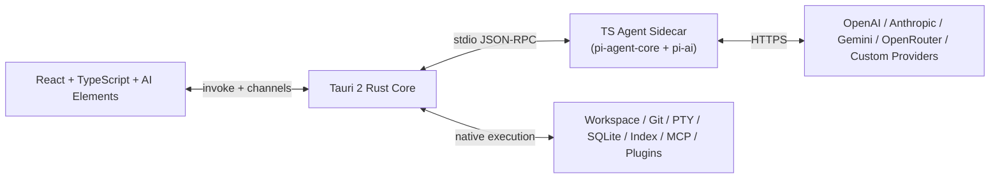

# Tiy Agent 技术架构设计文档

## 1. 文档信息

- 文档名称：Tiy Agent 技术架构设计文档
- 日期：2026-03-16
- 状态：Approved for implementation planning
- 对应产品文档：`docs/product-story-20260316.md`
- 适用阶段：Alpha 原型向正式产品演进的第一阶段到第三阶段

## 2. 架构目标

本方案用于支撑 Tiy Agent 的正式产品化落地，目标是在保留现有桌面工作台交互形态的前提下，建立一套高性能、可扩展、可控权限的桌面 Agent 技术架构。

核心目标如下：

- 以线程为中心，承载持续任务对话、工具执行、推理反馈和结果沉淀。
- 以 Workspace 为上下文边界，统一项目树、Git、终端和工具访问范围。
- 充分发挥 Rust 在本地 IO、并发、进程控制和权限治理上的性能优势。
- 使用 `pi-agent` 作为 Agent Runtime 能力层，避免从零自研 Agent Loop。
- 使用 `AI Elements` 作为线程型 AI UI 的主要组件基础，减少前端基础设施重复建设。
- 保证架构可以平滑从当前原型态演进到真实执行态，而不是推倒重来。

## 3. 设计原则

### 3.1 Rust First

所有高吞吐、强本地、强权限、强系统耦合能力统一下沉 Rust Core，包括：

- 文件系统访问
- Git 计算与执行
- PTY / 终端会话
- 进程与 sidecar 生命周期
- 工作区索引与检索
- 权限判断与沙箱策略
- Marketplace 宿主与扩展生命周期
- 本地持久化

### 3.2 UI 只做展示与交互编排

React 只负责：

- 工作台与浮层 UI 渲染
- AI Elements 线程组件组装
- 输入采集与局部视图状态
- 消费 Rust/sidecar 的流式数据并渲染

React 不直接承担本地重计算、仓库扫描、Git 计算和工具执行。

### 3.3 Agent 决策与系统执行解耦

`pi-agent` 负责：

- 模型调用
- Agent Loop
- Tool 选择
- 会话上下文编排
- 结构化执行流推进

Rust 负责：

- Tool 权限审核
- Tool 真实执行
- 结果流式返回
- 终端、Git、文件、索引等系统能力

### 3.4 单一权限真源

所有审批模式、沙箱模式、网络权限、allow/deny 规则、writable roots 必须由 Rust `PolicyEngine` 统一裁决。TS sidecar 不能绕过 Rust 直接访问系统。

### 3.5 长任务流式化

线程响应、Tool 执行、Git 刷新、终端输出、索引构建等高时延任务全部采用流式更新，不等待“全量结果完成”后一次性返回。

## 4. 技术选型与职责分配

### 4.1 核心技术栈

- Desktop Shell：Tauri 2
- Native Core：Rust
- Frontend：TypeScript + React
- Agent Runtime：`pi-agent`（基于 `pi-mono` 的 TypeScript agent runtime）
- AI UI：AI Elements
- 本地数据库：SQLite（WAL 模式）

### 4.2 选型结论

最终采用：

**Rust Core + TS Agent Sidecar**

该方案的核心分层如下：

1. `React + AI Elements`
   负责工作台 UI、线程渲染和用户交互。
2. `Tauri Rust Core`
   负责系统真源、状态、工具执行、性能敏感任务和权限治理。
3. `TS Agent Sidecar`
   负责 `pi-agent` Agent Loop、模型调用、Tool 选择与执行编排。

### 4.3 不采用的方案

#### 方案 1：React Renderer 直接运行 agent

不采用原因：

- Agent Loop 与 UI 渲染共用同一 JS 运行时，容易造成输入、滚动、长线程更新卡顿。
- 系统权限边界难以收敛。
- 文件、Git、终端等本地能力需要通过前端继续桥接，分层不清晰。

#### 方案 3：纯 Rust 自研 Agent Runtime

当前不采用原因：

- 性能上限最高，但研发成本显著增大。
- 无法直接复用 `pi-agent` 现有 runtime、provider 和工具调用能力。
- 会延长首版落地周期，不符合当前产品阶段。

## 5. 总体架构



### 5.1 进程模型

- 主进程：Tauri App（Rust）
- 渲染进程：WebView（React）
- Sidecar 进程：独立 TS Agent Runtime 可执行程序

### 5.2 运行边界

- React 不直接访问本地系统能力。
- Sidecar 不直接访问本地系统能力。
- Rust Core 是唯一可信执行层。

## 6. 逻辑分层设计

## 6.1 Frontend 层

### 职责

- 渲染主工作台、Settings、Marketplace、线程页、项目树、Git 面板和终端视图。
- 通过 AI Elements 构建线程型交互组件。
- 维护视图态与局部交互态。
- 通过统一 bridge 调用 Rust 命令和订阅流。

### 推荐模块结构

```text
src/
  app/
  pages/
  modules/
  components/ai-elements/
  shared/
  services/
    bridge/
    thread-stream/
    terminal-stream/
    settings/
    marketplace/
```

### Frontend Store 原则

前端只保留视图所需状态，不保存系统真源。

建议最少拆分为：

- `workbench-store`
- `thread-view-store`
- `settings-store`
- `marketplace-store`
- `terminal-view-store`

补充约束：

- store 之间只共享视图编排状态，不复制 Rust 真源数据
- workspace 切换时，`thread-view-store` 必须重置当前线程选择和分页游标，`terminal-view-store` 必须解除旧线程 attach
- 线程删除或归档时，终端元数据、Git 抽屉临时状态和未读标记需要联动清理
- app 启动顺序建议为：`settings/workspaces` bootstrap -> workbench 基础骨架 -> 当前线程按需加载 -> Git / Terminal / Index 面板懒加载
- 流式订阅与视图生命周期绑定：线程流跟随当前线程，终端流跟随当前附着 session，Git / Index 流只在对应面板打开时建立
- 断线或 Rust 重连后，前端应重新拉取 snapshot，而不是假设自己持有完整事件历史

### AI Elements 使用原则

AI Elements 仅用于线程体验表达层，负责：

- `Conversation`
- `PromptInput`
- `Plan`
- `Queue`
- `Reasoning`
- `ChainOfThought`
- `Tool`
- `Sources`
- `Suggestion`

线程消息和工具状态的真源仍然来自 Rust 持久层与线程流。

补充约束：

- `Plan` 是一类真实的 Agent 运行模式，不只是 AI Elements 的展示组件。
- 前端可以发起 `default` 或 `plan` 两类 run，但模式真源必须保存在 Rust `run` 记录中。

## 6.2 Rust Core 层

### 职责

- 作为整个应用的系统真源和可信后端。
- 管理工作区、线程、消息、执行记录、终端、Git、索引、扩展和设置。
- 管理 sidecar 生命周期与通信。
- 对所有系统能力执行权限与策略判断。

### 推荐模块结构

```text
src-tauri/src/
  main.rs
  lib.rs
  commands/
    mod.rs
    system.rs
    thread.rs
    workspace.rs
    settings.rs
    terminal.rs
    git.rs
    marketplace.rs
    agent.rs
  core/
    app_state.rs
    thread_manager.rs
    workspace_manager.rs
    settings_manager.rs
    sidecar_manager.rs
    agent_run_manager.rs
    tool_gateway.rs
    policy_engine.rs
    terminal_manager.rs
    git_manager.rs
    index_manager.rs
    marketplace_host.rs
    automation_scheduler.rs
  persistence/
    sqlite/
      mod.rs
      schema.rs
      thread_repo.rs
      settings_repo.rs
      workspace_repo.rs
      marketplace_repo.rs
  ipc/
    dto.rs
    frontend_channels.rs
    sidecar_protocol.rs
  model/
    thread.rs
    workspace.rs
    tool.rs
    settings.rs
    errors.rs
```

## 6.3 TS Agent Sidecar 层

### 职责

- 运行 `pi-agent` Agent Loop。
- 根据 `Agent Profile` 的主模型 / 辅助模型 / 轻量模型映射管理 Provider 路由和模型请求。
- 在 sidecar 内编排 `SubAgent` 辅助任务，但不突破父 `run` 的生命周期边界。
- 管理 Tool registry 的描述层。
- 根据线程快照和上下文拼装 prompt / tool context。
- 将模型输出和工具请求以结构化协议发回 Rust。

### 推荐模块结构

```text
agent-sidecar/
  src/
    main.ts
    transport/
      stdio-server.ts
      protocol.ts
    runtime/
      session-registry.ts
      agent-runner.ts
      subagent-runner.ts
      thread-context-builder.ts
    providers/
      provider-registry.ts
      model-router.ts
    tools/
      tool-registry.ts
      tool-proxies.ts
    output/
      event-stream.ts
```

### Sidecar 运行模式

- Sidecar 采用单实例常驻模式。
- Rust 在应用启动后的 `setup` 阶段拉起 sidecar。
- 所有线程运行通过单 sidecar 进程多路复用。
- Sidecar 以 `thread_id + run_id` 作为会话隔离主键。

健康治理要求：

- Rust 需要周期性读取 sidecar 健康指标，至少包括 `rss_bytes`、`event_loop_lag_ms`、`active_run_count`
- sidecar 对所有 provider 请求必须启用超时和 abort 机制，避免单个 hang 请求拖死整个事件循环
- 当健康度超过阈值时，Rust 先停止接收新 run，再将活跃 run 标记为 `interrupted`，最后执行 graceful restart
- 多 sidecar 实例不是 v1 范围，但协议和会话模型不能阻止后续横向扩展

不采用每次请求临时拉起 sidecar 的方式，避免冷启动成本和上下文损耗。

## 7. 数据真源与持久化

## 7.1 存储选型

使用 SQLite，开启：

- WAL
- prepared statements
- 分页读取
- 必要的索引与 FTS5

原因：

- 桌面端本地持久化足够轻量。
- 易于和 Rust 集成。
- 支持线程消息、执行记录、扩展状态与设置的统一存储。

## 7.2 建议核心表

### `workspaces`

- `id`
- `name`
- `path`
- `is_default`
- `is_git`
- `auto_work_tree`
- `created_at`
- `updated_at`

### `threads`

- `id`
- `workspace_id`
- `title`
- `status`
- `last_active_at`
- `summary`
- `created_at`
- `updated_at`

### `messages`

- `id`
- `thread_id`
- `role`
- `content_markdown`
- `message_type`
- `status`
- `metadata_json`
- `created_at`

### `thread_runs`

- `id`
- `thread_id`
- `profile_id`
- `run_mode`
- `provider_id`
- `model_id`
- `effective_model_plan_json`
- `status`
- `started_at`
- `finished_at`
- `error_message`

### `run_subtasks`

- `id`
- `run_id`
- `thread_id`
- `subtask_type`
- `role`
- `provider_id`
- `model_id`
- `status`
- `started_at`
- `finished_at`
- `summary`
- `error_message`

### `tool_calls`

- `id`
- `run_id`
- `thread_id`
- `tool_name`
- `tool_input_json`
- `tool_output_json`
- `status`
- `approval_status`
- `started_at`
- `finished_at`

说明：

- `tool_calls` 主要承载 run-bound 的 Agent tool lifecycle
- 用户直接发起的 Git、Marketplace 等变更操作不强行复用 `tool_calls`，避免为无 `run_id` 场景扭曲数据模型

### `settings`

- `key`
- `value_json`
- `updated_at`

### `marketplace_items`

- `item_id`
- `installed`
- `enabled`
- `updated_at`

### `audit_events`

- `id`
- `actor_type`
- `actor_id`
- `source`
- `workspace_id`
- `thread_id`
- `run_id`
- `action`
- `target_type`
- `target_id`
- `policy_check_json`
- `result_json`
- `created_at`

说明：

- `audit_events` 统一记录用户操作与 Agent 操作的变更审计
- `run_id` 在该表中允许为空，以覆盖非 Agent 来源的操作
- `tool_calls` 与 `audit_events` 通过关联键建立引用，而不是混成同一生命周期表

### `automation_runs`

- `id`
- `automation_id`
- `status`
- `started_at`
- `finished_at`
- `result_summary`

说明：

- 该表为 Phase 3 调度能力预留
- Phase 1-2 不要求真正实现 scheduler，只需保证 schema 预留不会反向约束当前实现

## 7.3 摘要与历史压缩

为避免线程上下文无限膨胀，采用“Rust 触发与持久化，sidecar 辅助生成摘要”的 compaction pipeline。

Rust 维护：

- `thread_summaries`
- `message_window_cache`
- `tool_result_digest`

策略：

- 最近 N 条消息保留全文
- run 结束后或线程加载时若超过阈值，Rust 发起历史压缩检查
- sidecar 使用 lightweight 模型生成结构化摘要，Rust 负责校验、持久化和回填引用区间
- 大 tool output 存摘要 + 可追溯原文引用
- unresolved approvals、最近 tool 结果摘要、首条用户目标消息始终保留

v1 建议初始阈值：

- 消息数超过 `50`
- 或估算上下文大小超过 `32k` tokens
- 或单次 tool 结果摘要超出热窗口预算

这些阈值属于建议初始值，应基于真实运行数据继续调优。

降级策略：

- 若摘要模型不可用或生成失败，退化为“首条用户消息 + 最近 N 条消息 + 所有待审批项 + tool digest”的裁剪窗口
- `clean_context_from_plan` 只能基于结构化 `execution_seed` 构造精简上下文，不能仅依赖自由文本摘要

## 7.4 统一错误模型（跨层契约）

所有跨模块可传播错误统一归一到 `AppError` 契约，避免前端针对 Git、Terminal、Tool、Sidecar 分别写特判。

建议标准字段：

- `errorCode`
- `category`：`fatal | recoverable | informational`
- `source`：`thread | tool | git | terminal | index | settings | sidecar`
- `userMessage`
- `detail`
- `retryable`
- `correlationId`

`errorCode` 建议格式：

- `<source>.<kind>.<detail>`

示例：

- `tool.policy.denied`
- `git.remote.auth_failed`
- `terminal.process.spawn_failed`
- `sidecar.provider.rate_limited`

展示原则：

- 线程内可见错误通过 `ThreadStreamEvent` 进入线程流
- 面板级错误通过对应面板状态或 toast 呈现
- 所有结构化错误都应保留原始调试信息，但前端默认展示 `userMessage`

## 8. IPC 与通信协议

## 8.1 Frontend -> Rust

### 类型

- 短请求：Tauri `invoke`
- 长流：Tauri `channels`

### Frontend / Rust 类型契约

- Rust DTO 建议使用 `tauri-specta` 统一生成 TypeScript 类型，减少手写 interface 漂移
- 所有对前端暴露的结构体统一使用 `#[serde(rename_all = "camelCase")]`
- channel 事件一律使用带 `type` 字段的 discriminated union，而不是让前端靠字段猜测事件种类
- DTO 需要显式 `schema_version` 或协议版本号，破坏性变更必须通过版本升级而不是静默修改字段
- 当前端检测到不兼容的 `schema_version` 时，v1 采用“阻断使用并提示升级应用”的策略，而不是尝试静默降级
- 所有 invoke / channel 失败返回都应复用 `AppError` 契约

### 原则

- 列表、详情、设置保存等走 `invoke`
- token 流、终端输出、索引进度、Git 增量刷新等走 `channels`

### 示例命令

- `thread_create`
- `thread_load`
- `thread_start_run`（需携带 `run_mode`）
- `thread_cancel_run`
- `settings_get`
- `settings_update`
- `workspace_list`
- `workspace_add`
- `git_get_snapshot`
- `terminal_create_or_attach`
- `tool_approval_respond`
- `marketplace_set_item_state`

当 `run_mode = plan` 转入执行时，建议支持两类启动方式：

- `continue_in_thread`：直接在当前线程开启新的 `default` 执行 run
- `clean_context_from_plan`：保留线程历史，但基于已确认方案生成精简执行上下文后再开启新的 `default` 执行 run

## 8.2 Rust -> Frontend 流事件

统一定义 channel payload，避免前端订阅多个异构事件格式。

### `ThreadStreamEvent`

- `run_started`
- `message_delta`
- `message_completed`
- `plan_updated`
- `queue_updated`
- `reasoning_updated`
- `subagent_started`
- `subagent_completed`
- `subagent_failed`
- `tool_requested`
- `approval_required`
- `approval_resolved`
- `tool_running`
- `tool_completed`
- `tool_failed`
- `run_completed`
- `run_failed`
- `run_interrupted`

前端通过一层 adapter 将事件映射到 AI Elements，而不是让组件直接消费底层协议事件。

建议映射：

- `plan_updated` -> `Plan`
- `queue_updated` -> `Queue`
- `reasoning_updated` -> `Reasoning` / `ChainOfThought`
- `tool_*` -> `Tool`
- `approval_required` -> `Confirmation`
- `message_*` -> `Conversation`

错误态与边界态：

- `tool_failed` -> `Tool` 的错误态展示，并在需要时附带一条 `Conversation` 系统消息总结失败原因
- `run_failed` -> `Conversation` 系统消息块，配合线程状态进入 `Failed`
- `run_interrupted` -> `Conversation` 系统消息块，明确为外部中断而非模型失败

### `TerminalStreamEvent`

- `session_created`
- `stdout_chunk`
- `stderr_chunk`
- `status_changed`
- `session_exited`

### `GitStreamEvent`

- `refresh_started`
- `snapshot_updated`
- `refresh_completed`

说明：

- v1 的 Git 刷新真相是“事件触发的全量 snapshot 重新计算”
- 若需要 `file_delta` / `history_delta`，它们应被视为 Rust 对比前后 snapshot 后生成的派生 UI 优化事件，而不是 Git 原生增量协议

### `IndexStreamEvent`

- `scan_started`
- `file_indexed`
- `batch_completed`
- `scan_completed`

## 8.3 Rust <-> Sidecar 协议

采用：

**JSON-RPC 风格消息 + NDJSON framing + stdio 传输**

### 选择原因

- 不依赖本地端口，默认更容易收敛安全边界。
- 易于跨平台管理。
- 便于 Rust 异步读写和消息多路复用。
- 便于后续替换 sidecar runtime，而不影响 Rust 内核。

### 消息格式

```json
{
  "id": "req_123",
  "type": "request",
  "method": "agent.run.start",
  "payload": {}
}
```

```json
{
  "id": "req_123",
  "type": "response",
  "ok": true,
  "payload": {}
}
```

```json
{
  "type": "event",
  "event": "agent.message.delta",
  "payload": {}
}
```

### Rust -> Sidecar 请求

- `agent.run.start`
- `agent.run.cancel`
- `agent.tool.result`
- `agent.thread.snapshot`
- `agent.auxiliary.task`
- `agent.settings.changed`

`agent.auxiliary.task` 用于 Rust 请求 sidecar 执行 lightweight 辅助任务，而不进入常规 run loop。

v1 建议任务类型：

- `summarize_thread_window`
- `derive_execution_seed`

### Sidecar -> Rust 事件

- `agent.run.started`
- `agent.message.delta`
- `agent.message.completed`
- `agent.plan.updated`
- `agent.reasoning.updated`
- `agent.queue.updated`
- `agent.subagent.started`
- `agent.subagent.completed`
- `agent.subagent.failed`
- `agent.tool.requested`
- `agent.run.completed`
- `agent.run.failed`

## 8.4 Settings 变更传播

Settings 不是单一路径即时广播，而是按配置类别定义生效范围。

| 配置类别 | 生效范围 | 传播方式 |
|---|---|---|
| Theme / Language | 仅前端 | 前端 store 直接更新 |
| Agent Profile | 仅新 run | Rust 持久化；活跃 run 不热更新 |
| Provider 配置 | 仅新 run | Rust 校验后通知 sidecar 刷新 provider registry |
| Policy 规则 | 所有新 tool 请求与待执行审批 | Rust `PolicyEngine` 读取最新配置；pending approval 在执行前重新评估 |
| Workspace 配置 | 立即影响相关 manager | Rust 重新校验 workspace、Git、Index、Terminal 边界 |

## 9. Tool 架构设计

## 9.1 基本原则

采用：

**Tool 定义在 TS，执行在 Rust**

### TS 负责

- 暴露 tool name
- 暴露 description
- 暴露 input schema
- 暴露 output schema
- 把模型选中的 tool call 转成执行请求

### Rust 负责

- 参数校验
- 权限判断
- 工具真实执行
- 执行状态流
- 审计日志
- 结果落库

## 9.2 Tool 分层

### A 类：纯 Agent 内部工具

允许放在 sidecar 内部实现：

- `summarize_context`
- `rewrite_plan`
- `rank_candidates`
- `format_final_response`

特点：

- 不触达系统边界
- 不依赖高吞吐本地 IO

### B 类：系统工具

必须由 Rust 实现：

- `read_file`
- `list_dir`
- `search_repo`
- `write_file`
- `apply_patch`
- `git_status`
- `git_diff`
- `git_log`
- `run_command`
- `create_terminal`
- `terminal_write`
- `open_workspace_in_app`
- `marketplace_install`
- `mcp_call`

### `run_command` 特殊约束

`run_command` 在 v1 中定义为“非交互式、一次性命令执行”，与线程终端的交互式 PTY 会话严格区分。

要求：

- 默认 `require-approval`
- 必须经过命令解析、allow/deny 规则匹配和 workspace 边界校验
- 必须带有默认超时，建议 60s，可被策略收紧但不可无限执行
- 必须限制输出大小，超出后截断并标记
- 禁止将其实现为对现有终端 session 的隐式写入；交互式场景应使用 terminal 工具族
- 对 `rm -rf /`、`sudo`、`mkfs`、`curl | sh`、`wget | bash` 等内置危险模式执行硬拒绝，用户 `denyList` 可扩展但不能削弱内置拒绝

## 9.3 Tool Gateway

Rust `ToolGateway` 统一作为入口：

1. 接收 sidecar 工具请求
2. 交给 `PolicyEngine`
3. 根据策略决定：
   - auto-allow
   - require-approval
   - deny
4. 调用对应 executor
5. 将结果流回 sidecar 与 frontend

共享原语要求：

- 所有 mutating manager 都应复用统一的 `PolicyCheck` 输入模型
- 所有需要留痕的变更操作都应写入统一的 `AuditRecord` / `audit_events`
- ToolGateway 是 Agent privileged tools 的统一入口，但不是唯一审计入口

## 9.4 Tool 状态机

```text
requested -> waiting_approval -> approved -> running -> completed
requested -> waiting_approval -> denied
requested -> approved -> running -> failed
```

## 10. 核心子系统设计

## 10.1 WorkspaceManager

职责：

- 维护工作区列表
- 维护默认工作区
- 校验路径合法性
- 管理工作区上下文边界
- 对接外部应用打开工作区

关键要求：

- path normalization
- symlink 安全处理
- 工作区可写范围与策略联动

## 10.2 ThreadManager

职责：

- 创建线程
- 加载线程快照
- 管理消息持久化
- 管理线程状态
- 管理线程摘要

关键要求：

- 保证消息按 append-only 写入
- 保证 run 与 thread 解耦
- 支持线程状态在 UI 中快速恢复

## 10.3 AgentRunManager

职责：

- 创建和跟踪运行中的 `run`
- 固化当前 `Agent Profile` 的有效模型方案并下发给 sidecar
- 将线程快照发给 sidecar
- 处理 sidecar 回传事件
- 聚合消息流、`SubAgent` 子执行流、工具流和状态流

关键要求：

- 同一线程同一时刻最多一个 active run
- 允许跨线程并发 run
- run cancel 必须可中断
- `SubAgent` 作为父 `run` 的子执行单元存在，不单独占用线程级 active run

## 10.4 TerminalManager

职责：

- 管理 PTY session
- 维护 `thread_id -> terminal_session` 关系
- 流式输出终端内容
- 处理 resize / input / exit

关键要求：

- 一个线程按需创建零或一个终端会话
- 切线程不销毁后台 PTY
- 终端状态在 Rust 保持，不依赖 React 生命周期

## 10.5 GitManager

职责：

- 获取仓库状态
- 获取 diff
- 获取 log
- 执行 add / commit / fetch / pull / push

关键要求：

- v1 采用事件触发的全量 snapshot 刷新，必要时再派生 UI diff 事件
- 大 diff 采用 chunk 或分页
- 所有危险动作必须接入 `PolicyEngine`

## 10.6 IndexManager

职责：

- 构建工作区文件树缓存
- 为 `search_repo` 和项目抽屉提供本地检索能力

首版建议能力：

- 文件树缓存
- 封装 `ripgrep` 风格文本检索
- 冷热状态感知和可重建缓存

二期可扩展：

- 内容倒排索引
- 最近活跃文件加权
- embedding 索引
- 语义召回

## 10.7 MarketplaceHost

职责：

- 管理 Skills、MCP、Plugins、Automations 的安装与启停状态
- 管理本地扩展进程生命周期
- 向 agent 暴露可用工具清单

关键要求：

- Marketplace Item 只是“目录项”
- 真正运行中的 MCP / 插件由 Rust 宿主管理
- Automation 在 v1 只要求目录展示和启停状态管理，调度器延后到 Phase 3

## 11. 关键业务流技术实现

## 11.1 新线程启动链路

1. Frontend 调用 `thread_create`
2. Rust 创建 thread 与首条 user message
3. Rust 创建 run，并向 sidecar 发送 `agent.run.start`
4. Sidecar 使用 `pi-agent` 启动 Agent Loop
5. Sidecar 流式回传消息与状态
6. Rust 将事件写库并通过 channel 推给 Frontend
7. Frontend 使用 AI Elements 增量渲染

## 11.2 Tool 调用链路

1. Sidecar 发出 `agent.tool.requested`
2. Rust `ToolGateway` 校验并进入 `PolicyEngine`
3. 若需审批，则 Frontend 展示确认组件
4. 用户确认结果发回 Rust
5. Rust 执行工具并流式返回结果
6. Rust 将结果回传 sidecar，继续 Agent Loop

## 11.3 终端链路

1. Frontend 选择线程后调用 `terminal_create_or_attach`
2. Rust 查询是否已有 PTY session
3. 若无，则创建 shell session
4. Rust 通过 channel 流式发送输出
5. Frontend 仅渲染终端内容

## 11.4 Git 面板链路

1. Frontend 打开 Git 抽屉并请求 snapshot
2. Rust `GitManager` 并发获取 `status + staged + history`
3. Rust 返回初始快照
4. 刷新行为采用事件触发的 snapshot 重算
5. 若前后差异较小，可由 Rust 额外派生 UI diff 事件优化渲染

## 12. 性能设计

## 12.1 性能目标

首版目标：

- 新线程提交到 UI 出现首个状态反馈：< 150ms（不含远端模型首 token）
- 本地工具调用发起到 UI 出现“running”：< 50ms
- 工作区树初次加载：中型仓库 < 300ms
- Git 快照加载：中型仓库 < 500ms
- 终端输出可持续流式渲染，不因后台线程切换中断

## 12.2 关键性能策略

### React 层

- 消息列表实体化存储
- 局部订阅，避免全量重渲染
- 大代码块延迟高亮
- 长线程列表按需虚拟化

### Rust 层

- 异步 IO 全面采用 Tokio
- Git、索引、终端、文件读取并发化
- 对大结果做分页、chunk、事件触发 snapshot 重算
- 使用 channel 代替大块 event payload

### Sidecar 层

- 常驻进程
- Provider client 复用
- 工具结果摘要优先
- 线程上下文窗口裁剪
- provider 请求超时与 abort
- 基于健康阈值的 graceful restart

### 数据层

- SQLite WAL
- 热数据索引
- 消息分页加载
- 历史消息摘要化

## 12.3 不允许的实现方式

- 不允许将大仓库扫描逻辑放在 React 中执行
- 不允许由 sidecar 直接读写本地文件系统
- 不允许使用前端事件总线传输大段终端输出或大 diff 文本
- 不允许对整个线程树做全量 JSON 重算后重新渲染

## 13. 安全与权限设计

## 13.1 权限真源

Rust `PolicyEngine` 是唯一真源。

### 输入来源

- Settings 中的 `approvalPolicy`
- `sandboxPolicy`
- `networkAccess`
- `allowList`
- `denyList`
- `writableRoots`

### 输出动作

- auto allow
- require user approval
- deny

## 13.2 Tauri 能力边界

- 前端 WebView 只授予最小必要 capability
- Rust Core 拥有系统级执行权限
- sidecar 作为受控外部进程，由 Rust 管理其输入输出和生命周期

## 13.3 审计能力

所有以下行为记录审计事件：

- tool request
- tool approval / deny
- command execution
- file write
- git mutation
- marketplace install / uninstall
- automation execution

审计落点：

- 统一写入 `audit_events`
- run-bound 的 Agent tool 调用额外保留在 `tool_calls`
- 审计记录需要区分 `actor_type = user | agent | system`

## 14. 可观测性与调试

建议统一日志层：

- Frontend：仅记录 UI 级调试日志
- Rust：结构化 tracing
- Sidecar：结构化 JSON 日志

关键指标：

- run latency
- first token latency
- tool approval wait time
- tool execution duration
- git snapshot latency
- terminal session count
- index queue lag

日志关联键：

- `thread_id`
- `run_id`
- `tool_call_id`
- `workspace_id`

## 15. 推荐目录落地顺序

### Phase 1：线程与 Agent 真链路

- 建立 SQLite 持久层
- 建立 ThreadManager / AgentRunManager / SidecarManager
- 接通 `pi-agent` sidecar
- 接通 Frontend ThreadStream

### Phase 2：本地能力真实化

- TerminalManager
- GitManager
- WorkspaceManager
- IndexManager（文件树缓存 + `ripgrep` 检索）

### Phase 3：扩展宿主与自动化

- MarketplaceHost
- MCP 生命周期管理
- 插件启停
- Automation Scheduler
- Index 深化能力（倒排索引、活动信号、语义召回）

## 16. 风险与应对

### 风险 1：sidecar 与 Rust 协议演进过快导致兼容问题

应对：

- 固定协议版本号
- 所有协议 payload 使用显式 schema
- 先实现最小事件集

### 风险 2：长线程消息与工具结果导致数据库和 UI 膨胀

应对：

- 历史摘要化
- 大结果 chunk 存储
- UI 分页与按需展开

### 风险 3：Marketplace 扩展破坏权限边界

应对：

- 统一由 Rust 宿主管理
- 不允许扩展直接进入前端执行域
- 扩展工具统一经 ToolGateway

### 风险 4：sidecar 崩溃影响正在运行的线程

应对：

- Rust 记录 run 状态
- sidecar crash 自动重启
- 未完成 run 标记为 interrupted 并允许 retry
- 健康指标超过阈值时执行 graceful restart，而不是等到进程完全失效

## 17. 最终结论

Tiy Agent 的正式技术架构采用：

**Tauri 2 + Rust Core + TypeScript/React Frontend + TS Agent Sidecar (`pi-agent`) + AI Elements**

其关键架构判断是：

- Rust 是系统真源、性能核心和权限控制层
- `pi-agent` 是智能决策层，不直接触达系统边界
- AI Elements 是线程型体验表达层，不承担业务真源
- Tools 采用“TS 定义、Rust 执行”的双层模式
- 所有高吞吐数据链路采用流式协议而不是全量返回

## 18. 重点模块专题设计拆分

为方便后续进入模块级方案设计，建议将本架构中的重点模块拆分为独立专题文档。拆分标准如下：

- 承担系统真源、执行真源或权限真源职责
- 需要单独定义生命周期、状态机或跨层协议
- 需要单独评估性能、持久化或安全边界
- 后续实现阶段可作为相对独立的里程碑推进

建议按以下模块继续展开详细设计：

| 模块 | 主要覆盖范围 | 对应专题文档 |
|---|---|---|
| Workspace | 工作区边界、路径校验、上下文范围、可写根与外部打开能力 | `docs/module/workspace-design-20260316.md` |
| Thread | 线程生命周期、消息模型、线程快照、摘要与恢复策略 | `docs/module/thread-design-20260316.md` |
| Agent Run | run 生命周期、并发约束、取消机制、线程事件聚合 | `docs/module/agent-run-design-20260316.md` |
| Agent Sidecar | sidecar 常驻模型、会话隔离、provider 路由、Rust 协议对接 | `docs/module/agent-sidecar-design-20260316.md` |
| Agent Tools | 内置 Tool 分类、首版工具面、模式约束与子系统映射 | `docs/module/agent-tools-design-20260316.md` |
| Tool Gateway + Policy | tool 请求入口、审批状态机、权限策略、审计与执行编排 | `docs/module/tool-gateway-policy-design-20260316.md` |
| Terminal | PTY session、线程绑定、输入输出流、会话存续与恢复边界 | `docs/module/terminal-design-20260316.md` |
| Git | 仓库状态快照、增量刷新、危险操作治理、diff/history 加载策略 | `docs/module/git-design-20260316.md` |
| Index | 文件树缓存、`ripgrep` 检索、重建策略与后续索引扩展边界 | `docs/module/index-design-20260316.md` |
| Marketplace + Automation | Skills / MCP / Plugins / Automations 宿主、安装启停与生命周期管理 | `docs/module/marketplace-automation-design-20260316.md` |

其中：

- `Terminal` 专题文档已存在，可继续沿用并逐步补齐到正式设计深度。
- `Thread`、`Agent Run`、`Agent Sidecar`、`Tool Gateway + Policy` 属于第一批优先细化模块。
- `Workspace`、`Git`、`Index` 属于第二批本地能力模块。
- `Marketplace + Automation` 属于第三批扩展宿主模块。

这套方案既能最大化 Rust 的性能优势，又能保留 `pi-agent` 与 AI Elements 的工程复用价值，是当前产品阶段最适合的正式架构方案。
