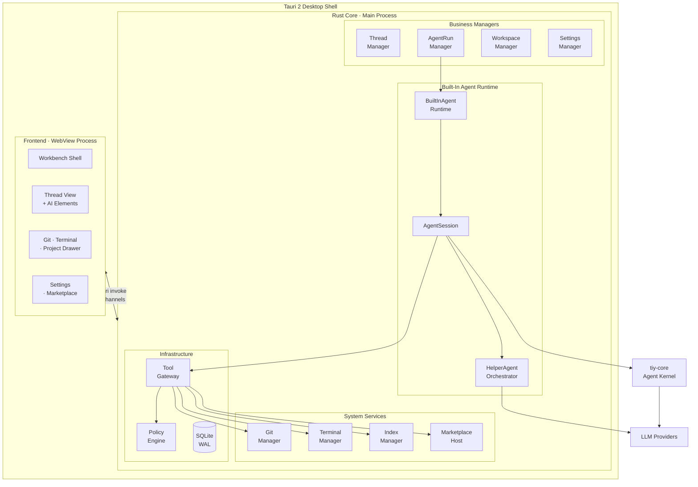
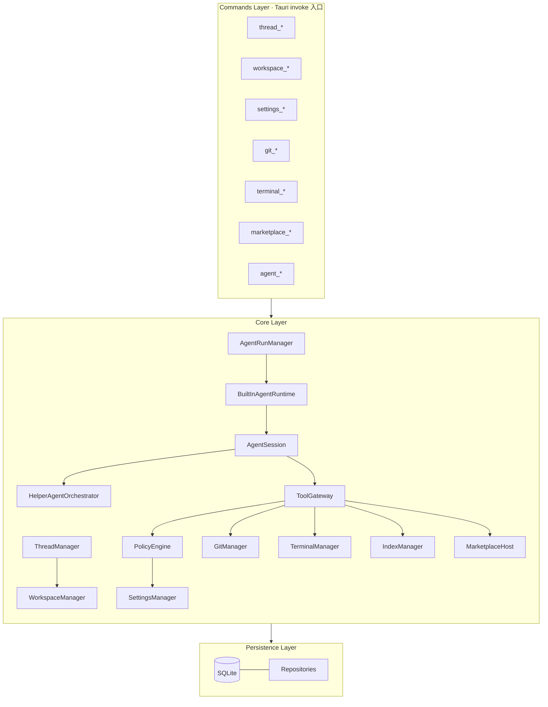
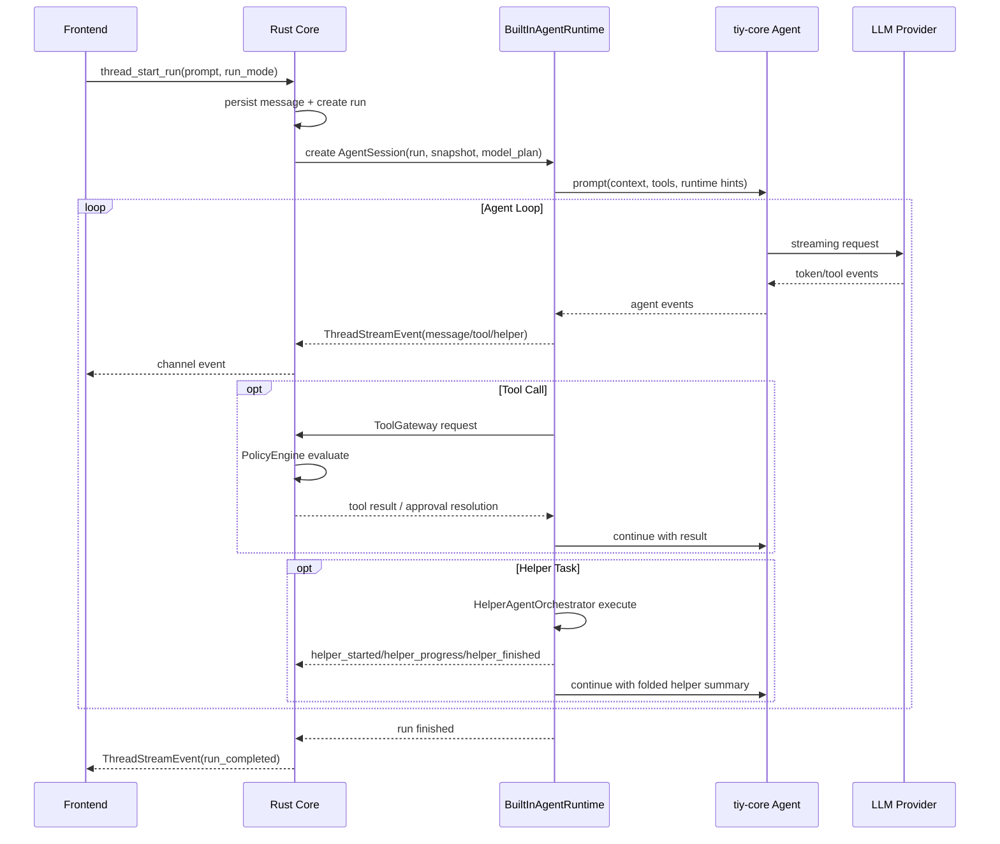

# TiyCode 技术架构设计文档

## 1. 文档信息

- 文档名称：TiyCode 技术架构设计文档
- 原始日期：2026-03-16
- 本次修订：2026-03-19
- 状态：Revised for implementation planning
- 对应产品文档：`docs/product-story-20260316.md`
- 对应运行时设计：`docs/superpowers/specs/2026-03-19-built-in-agent-runtime-tiy-core-design.md`

## 2. 架构目标

本方案用于支撑 TiyCode 从 Alpha 原型走向真实执行态，但不再采用
TypeScript sidecar 作为 Agent Runtime 主体。

修订后的核心目标如下：

- 以线程为中心承载持续任务对话、工具执行、计划生成和结果沉淀。
- 以 Workspace 为上下文边界，统一项目树、Git、终端和工具访问范围。
- 充分发挥 Rust 在本地 IO、并发、进程控制和权限治理上的优势。
- 使用 `tiy-core` 作为内建 agent kernel，避免额外维护 sidecar 协议层。
- 使用 `AI Elements` 作为线程型 AI UI 的主要组件基础。
- 通过 Rust 内建运行时承接 helper-agent 编排能力，并在主线程中折叠展示。

## 3. 设计原则

### 3.1 Rust First

所有高吞吐、强本地、强权限、强系统耦合能力统一下沉 Rust Core，包括：

- 文件系统访问
- Git 计算与执行
- PTY / 终端会话
- Agent Runtime 编排
- helper-agent 调度
- 工作区索引与检索
- 权限判断与沙箱策略
- Marketplace 宿主与扩展生命周期
- 本地持久化

### 3.2 UI 只做展示与交互编排

React 只负责：

- 工作台与浮层 UI 渲染
- AI Elements 线程组件组装
- 输入采集与局部视图状态
- 消费 Rust 发出的流式线程事件并渲染

React 不直接承担本地重计算、仓库扫描、Git 计算和工具执行。

### 3.3 Agent Kernel 与桌面编排分层

`tiy-core` 负责：

- 单个 agent loop
- 模型调用
- 流式 assistant 事件
- tool call 生命周期
- context transform
- steering / follow-up

Rust 内建运行时负责：

- 线程快照构建
- run_mode 约束
- 工具画像选择
- helper-agent 调度
- 事件折叠与前端流式输出
- 持久化与恢复边界

### 3.4 单一权限真源

所有审批模式、沙箱模式、网络权限、allow/deny 规则、writable roots 必须由
Rust `PolicyEngine` 统一裁决。Agent Runtime 不得绕过 Rust 工具边界直接访问
系统。

### 3.5 长任务流式化

线程响应、Tool 执行、Git 刷新、终端输出、helper-agent 结果、索引构建等高
时延任务全部采用流式更新，不等待“全量结果完成”后一次性返回。

### 3.6 统一应用数据目录

所有 TiyCode 的持久化数据统一存放在 `$HOME/.tiy/` 目录下，不使用 Tauri
默认的 `app_data_dir`。

```text
$HOME/.tiy/
  config.json
  db/
    tiy-agent.db
    tiy-agent.db-wal
    tiy-agent.db-shm
    backups/
  skills/
  prompts/
  plugins/
  automations/
  cache/
    index/
    thumbnails/
```

日志文件跟随操作系统惯例路径：

```text
macOS:    ~/Library/Logs/TiyAgent/
Windows:  %LOCALAPPDATA%/TiyAgent/logs/
Linux:    ~/.local/state/tiy-agent/logs/
```

```text
<log-dir>/
  app.log
  app.log.1 ... app.log.5
  runtime.log
  runtime.log.1 ...
```

说明：

- 不再维护 `sidecar.log`
- `runtime.log` 用于记录内建 agent runtime、helper orchestration、tool wait
  state 等结构化运行日志

## 4. 技术选型与职责分配

### 4.1 核心技术栈

- Desktop Shell：Tauri 2
- Native Core：Rust
- Frontend：TypeScript + React
- Agent Kernel：`tiy-core`
- AI UI：AI Elements
- 本地数据库：SQLite（WAL 模式）

### 4.2 选型结论

最终采用：

**React + Rust Core + Built-In Agent Runtime + `tiy-core`**

核心分层如下：

1. `React + AI Elements`
   - 工作台 UI、线程渲染和用户交互
2. `Tauri Rust Core`
   - 系统真源、状态、工具执行、性能敏感任务和权限治理
3. `BuiltInAgentRuntime`
   - 桌面 agent 编排层，负责 session、helper、tool profile、事件折叠
4. `tiy-core`
   - 单 agent kernel，负责 loop、流式输出、tool hooks、上下文转换

### 4.3 不采用的方案

#### 方案 1：React Renderer 直接运行 agent

不采用原因：

- Agent Loop 与 UI 渲染共用同一 JS 运行时，容易造成输入和滚动卡顿
- 权限边界难以收敛
- 本地能力仍需额外桥接

#### 方案 2：Rust Core + TS Agent Sidecar

不采用原因：

- `tiy-core` 已经覆盖单 agent kernel 所需主能力，sidecar 不再必要
- 额外协议层会增加生命周期、版本兼容和恢复复杂度
- helper 编排保留在 Rust 更容易审计和约束

#### 方案 3：纯 Rust 自研 Agent Runtime 内核

当前不采用原因：

- `tiy-core` 已经满足当前单 agent 内核需求
- 没有必要为首版落地重写 loop、stream、tool hooks、provider 接口

## 5. 总体架构

### 5.1 系统全景



### 5.2 进程模型

| 进程 | 技术 | 职责边界 |
|------|------|----------|
| 主进程 | Tauri App（Rust） | 系统真源、可信执行、运行时编排、权限治理、持久化 |
| 渲染进程 | WebView（React） | UI 渲染、交互采集、流式数据消费 |

不再存在独立 sidecar 进程。

### 5.3 运行边界

- React 不直接访问本地系统能力。
- `tiy-core` 不直接承担桌面持久化和权限真源职责。
- Rust Core 是唯一可信执行层。
- helper-agent 作为内部编排能力运行，不暴露为独立线程。

## 6. 核心模块关系

### 6.1 Core Layer



### 6.2 `tiy-core` 接入方式

`tiy-core` 在桌面架构中的定位是单 agent kernel：

- `AgentSession` 持有主 `tiy-core::agent::Agent`
- helper orchestration 为每个 helper task 创建 scoped `Agent` 或 standalone
  loop
- `AgentSession` 通过 `set_tool_executor`、`before_tool_call`、
  `after_tool_call`、`set_transform_context` 等接口接入桌面能力
- `subscribe()` 事件统一翻译为 `ThreadStreamEvent`

## 7. 运行数据流

### 7.1 Parent Run 数据流



### 7.2 Helper 数据流

helper 不创建独立线程 run，而是在 parent run 内部执行：

1. parent agent 触发内部 orchestration tool
2. `HelperAgentOrchestrator` 解析 helper kind、模型、工具画像
3. helper 以 scoped `tiy-core` agent 执行
4. helper 状态折叠为主线程事件
5. helper 摘要写入 `run_helpers`
6. parent agent 消费 helper 摘要继续推进

## 8. Run Mode 与工具策略

### 8.1 `default`

- 完整工具面
- 具体是否允许修改、是否需要审批由 `PolicyEngine` 决定

### 8.2 `plan`

- 只读规划模式
- `AgentSession` 注入 planning-oriented hidden context
- 激活 read-only tool profile
- helper 也继承只读上限

### 8.3 Plan 执行转换

支持两种后续执行入口：

- `continue_in_thread`
- `clean_context_from_plan`

说明：

- `clean_context_from_plan` 只重建执行输入窗口
- 不删除或篡改线程历史

## 9. 持久化模型

### 9.1 Parent Run

保留 `thread_runs` 作为 parent run 真源。

`effective_model_plan_json` 不再表示“发送给 sidecar 的模型计划”，而表示 Rust
Runtime 冻结后的执行配置：

- `primary_model`
- `helper_default_model`
- `lite_model`
- `thinking_level`
- `transport`
- `security_profile`
- `tool_profile_by_mode`

### 9.2 Helper 摘要

新增 `run_helpers` 表，字段建议包括：

- `id`
- `run_id`
- `thread_id`
- `helper_kind`
- `parent_tool_call_id`
- `status`
- `model_role`
- `provider_id`
- `model_id`
- `input_summary`
- `output_summary`
- `error_summary`
- `started_at`
- `finished_at`

### 9.3 Thread Message 策略

- helper 不写入完整子对话 transcript
- 主线程仅保存折叠型 helper 状态与结果 artifact
- 必要时再把 helper 摘要回注入 parent agent 上下文

## 10. 可观测性与恢复

### 10.1 可观测性

不再跟踪 sidecar 健康指标，改为跟踪：

- active parent run count
- active helper count
- current waiting state
- tool execution latency
- helper execution latency
- 当前模型与 context usage
- 最近错误摘要

### 10.2 恢复策略

恢复边界从 sidecar 进程切换为 runtime session：

- app 退出或 runtime 失败时，active run 标记为 `Interrupted`
- active helper 标记为 `Interrupted` 或 `Failed`
- v1 不做自动 replay
- 由用户从线程或 plan artifact 重新发起执行

## 11. 风险与缓解

### 风险 1：helper orchestration 逻辑转入 Rust 后实现复杂度上升

缓解：

- 只实现 v1 所需 helper kinds
- helper transcript 不做全量 UI 暴露
- 以 folded summary 为主，降低首版复杂度

### 风险 2：`plan` 模式被 helper 绕过

缓解：

- helper 强制继承 parent `run_mode`
- tool profile 和 `PolicyEngine` 双重约束

### 风险 3：`tiy-core` 与桌面事件模型适配层不稳定

缓解：

- 单独建立 runtime adapter tests
- 将 `tiy-core` 事件翻译层收口在 `AgentSession`

## 12. 结论

修订后的正式架构是：

**Tauri 2 + Rust Core + TypeScript/React Frontend + Built-In Agent Runtime + `tiy-core` + AI Elements**

关键结论：

- 不再建设 `TS Agent Sidecar`
- 不再以 `pi-agent` 为桌面运行时核心
- `tiy-core` 是单 agent kernel
- Rust 内建 `BuiltInAgentRuntime + AgentSession + HelperAgentOrchestrator` 是
  桌面运行时核心
- helper-agent 先作为内部编排能力存在，并在主线程里折叠呈现结果和状态
